---

title       : Machine Learning with R - Part II
author      : Ilan Man
job         : Strategy Operations  @ Squarespace
framework   : io2012        # {io2012, html5slides, shower, dzslides, ...}
highlighter : highlight.js  # {highlight.js, prettify, highlight}
hitheme     : tomorrow      # 
widgets     : mathjax       # {mathjax, quiz, bootstrap}
mode        : selfcontained # {standalone, draft}

----

## Objectives 
<space>

- Better understand particular details of popular ML algorithms and techniques
- Less code, more insight
- Familiarity with basic statistics and linear algebra concepts assumed

----

## Agenda 
<space>

1. Logistic Regression
2. Principal Component Analysis
3. Clustering

----

## Logistic Regression 
# Objectives
<space>

1. Motivation
2. Concepts and key assumptions
3. Approximating parameters

----

## Logistic Regression
# Motivation
<space>

- To model continuous response variables, often turn to linear regression
  - $Price = 500X_{sqr} + 10X_{dist}$
  - Output is (usually) a number

----

## Logistic Regression
# Motivation
<space>

- To model continuous response variables, often turn to linear regression
  - $Price = 500X_{sqr_ft} + 10X_{dist_train}$
  - Output is (usually) a number
- What about classification problems?
  - i.e. male or female, subscribe or not, ...

----

## Logistic Regression
# Motivation
<space>

 

----

## Logistic Regression
# Motivation
<space>

 

----

## Logistic Regression
# Motivation
<space>

 

----

## Logistic Regression
# Concepts
<space>

- Captures the relationship between a categorical output and continuous (or non) inputs
- $\hat{y} = \beta_{0} + \beta_{1}x_{1} + ... + \beta_{n}x_{n}$ << Linear Regression

----

## Logistic Regression
# Concepts
<space>

- Captures the relationship between a categorical output and continuous (or non) inputs
- $\hat{y} = \beta_{0} + \beta_{1}x_{1} + ... + \beta_{n}x_{n}$ << Linear Regression becomes
- $\log{\frac{P(Y=1)}{1 - P(Y=1)}} = \beta_{0} + \beta_{1}x_{1} + ... + \beta_{n}x_{n}$
  - "log odds"
- Can be extended to multiple and/or ordered categories

----

## Logistic Regression
# Concepts
<space>

- Probability of rolling a 6 = $\frac{1}{6}$
- "Odds for rolling a 6" = $\frac{P(Y)}{1 - P(Y)} = \frac{\frac{1}{6}}{1-\frac{1}{6}} = \frac{1}{5}$

----

## Logistic Regression
# Concepts
<space>

- Family of General Linear Models - GLM
<ol>
<li>Random component <br>- Noise or Errors
<li>Systematic Component <br>- Linear combination in $X_{i}$
<li>Link Function <br>- Connects Random and Systematic components
</ol>

----

## Logistic Regression
# Maximum Likelihood Estimation
<space>

- OLS: Minimize the SSE
- MLE: Maximize the (log) likelihood function
  - "Given the data, what is the most likely model?"
- MLE satisfies lots of nice properties (unbiased, consistent)
- Used for many types of non-linear regression models
- Does not require transformation of $Y$'s to be Normal
- Does not require constant variance

----

## Logistic Regression
# Concepts
<space>

- Type of regression to predict the probability of being in a class, say 1 = Female, 0 = Male
  - Output is $P(Y=1\hspace{2 mm} |\hspace{2 mm} X)$
  - Typical threshold is 0.5...but it doesn't have to be

----

## Logistic Regression
# Concepts
<space>

 

----

## Logistic Regression
# Concepts
<space>

- Type of regression to predict the probability of being in a class, say 1 = Female, 0 = Male
  - Output is $P(Y=1\hspace{2 mm} |\hspace{2 mm} X)$
  - Typical threshold is 0.5...but it doesn't have to be
- Sigmoid (logistic) function: $g(z) = \frac{1}{1+e^{-z}}$
  - Bounded by 0 and 1

----

## Logistic Regression
# Find parameters
<space>

- The hypothesis function, $h_{\theta}(x)$, is $P(Y=1\hspace{2 mm} |\hspace{2 mm} X)$
- Linear regression: $h_{\theta}(x) = \theta^{T}x$<br>
(Recall that $\theta^{T}x = \beta_{0} + \beta_{1}x_{1} + ... + \beta_{n}x_{n}$)

----

## Logistic Regression
# Find parameters
<space>

- The hypothesis function, $h_{\theta}(x)$, is $P(Y=1\hspace{2 mm} |\hspace{2 mm} X)$
- Linear regression: $h_{\theta}(x) = \theta^{T}x$<br>
(Recall that $\theta^{T}x = \beta_{0} + \beta_{1}x_{1} + ... + \beta_{n}x_{n}$)
- Logistic regression: $h_{\theta}(x) = g(\theta^{T}x)$ 
<br>
where $g(z) = \frac{1}{1+e^{-z}}$

----

## Logistic Regression
# Notation
<space>

- Re-arranging $Y = \frac{1}{1+e^{-\theta^{T}x}}$ yields
<br>
$\log{\frac{Y}{1 - Y}} = \theta^{T}x$
- Log odds are linear in $X$
- This is called the logit of $Y$
  - Links the odds of $Y$ (a probability) to a linear regression in $X$
  - Logit ranges from -ve infite to +ve infinite
  - In Linear Regression, when $x_{1}$ increases by 1 unit, $Y$ increases by $\theta_{1}$
  - In Logistic Regression, when $x_{1}$ increases by 1 unit, $P(Y=1\hspace{2 mm} |\hspace{2 mm} X)$ increases by $e^{\theta_{1}}$

----

## Logistic Regression
# Find parameters
<space>

- So $h_{\theta}(x) = \frac{1}{1+e^{-\theta^{T}x}}$
- To find parameters, minimize cost function
- Use same cost function as for the Linear Regression?

----

## Logistic Regression
# Find parameters
<space>

- So $h_{\theta}(x) = \frac{1}{1+e^{-\theta^{T}x}}$
- To find parameters, minimize cost function
- Use same cost function as for the Linear Regression?
  - Logistic residuals are Binomially distributed - not noise
  - Regression function is not linear in $X$; leads to non-convex cost function

----

## Logistic Regression
# Find parameters
<space>

\[cost(h_{\theta}(x)) = \left\{
  \begin{array}{lr}
    log(1-h_{\theta}(x)) & : y = 0\\
    -log(h_{\theta}(x)) & : y = 1
  \end{array}
\right.
\]

  

----

## Logistic Regression
# Find parameters
<space>

- $Y$ can be Male or Female, 0 or 1 (binary case)
- $Y \hspace{2 mm} | \hspace{2 mm} X$ ~ Bernoulli

----

## Logistic Regression
# Find parameters
<space>

- $Y$ can be Male or Female, 0 or 1 (binary case)
- $Y \hspace{2 mm} | \hspace{2 mm} X$ ~ Bernoulli
- $P(Y\hspace{2 mm} |\hspace{2 mm} X) = p$, when $Y$ = 1 
- $P(Y\hspace{2 mm} |\hspace{2 mm} X) = 1-p$, when $Y$ = 0

----

## Logistic Regression
# Find parameters
<space>

- $Y$ can be Male or Female, 0 or 1 (binary case)
- $Y \hspace{2 mm} | \hspace{2 mm} X$ ~ Bernoulli
- $P(Y\hspace{2 mm} |\hspace{2 mm} X) = p$, when $Y$ = 1 
- $P(Y\hspace{2 mm} |\hspace{2 mm} X) = 1-p$, when $Y$ = 0
- Joint probability
- $P(Y = y_{i}|X) = \prod_{i=1}^n p^{y_{i}}(1-p)^{1-y_{i}}$ for many $y_{i}'s$
- Taking the log of both sides...

----

## Logistic Regression
# Find parameters
<space>

- $P(Y = y_{i}|X) = \prod_{i=1}^n p^{y_{i}}(1-p)^{1-y_{i}}$ for many $y_{i}'s$
- $P(Y = y_{i}|X) = cost(p, y) = \sum_{i=1}^n -y_{i} \log(p) + (1-y_{i}) \log(1-p)$<br>

----

## Logistic Regression
# Find parameters
<space>

- $P(Y = y_{i}|X) = \prod_{i=1}^n p^{y_{i}}(1-p)^{1-y_{i}}$ for many $y_{i}'s$
- $P(Y = y_{i}|X) = cost(p, y) = \sum_{i=1}^n -y_{i} \log(p) + (1-y_{i}) \log(1-p)$<br>
- $p = h_{\theta}(x)$
- $cost(h_{\theta}(x), y) = \frac{1}{n}\sum_{i=1}^n -y_{i} \log(h_{\theta}(x)) + (1-y_{i}) \log(1-h_{\theta}(x))$<br>

----

## Logistic Regression
# Find parameters
<space>

- $P(Y = y_{i}|X) = \prod_{i=1}^n p^{y_{i}}(1-p)^{1-y_{i}}$ for many $y_{i}'s$
- $P(Y = y_{i}|X) = cost(p, y) = \sum_{i=1}^n -y_{i} \log(p) + (1-y_{i}) \log(1-p)$<br>
- $p = h_{\theta}(x)$
- $cost(h_{\theta}(x), y) = \frac{1}{n}\sum_{i=1}^n -y_{i} \log(h_{\theta}(x)) + (1-y_{i}) \log(1-h_{\theta}(x))$<br>

  

----

## Logistic Regression
# Find parameters
<space>

- $P(Y = y_{i}|X) = \prod_{i=1}^n p^{y_{i}}(1-p)^{1-y_{i}}$ for many $y_{i}'s$
- $P(Y = y_{i}|X) = cost(p, y) = \sum_{i=1}^n -y_{i} \log(p) + (1-y_{i}) \log(1-p)$<br>
- $p = h_{\theta}(x)$
- $cost(h_{\theta}(x), y) = \frac{1}{n}\sum_{i=1}^n -y_{i} \log(h_{\theta}(x)) + (1-y_{i}) \log(1-h_{\theta}(x))$<br>
- Minimize the cost

----

## Logistic Regression
# Find parameters
<space>

- Cannot solve analytically
- Use approximation methods
  - (Stochastic) Gradient Descent
  - Conjugate Descent
  - Newton-Raphson Method
  - BFGS

----

## Logistic Regression
# Newton-Raphson Method
<space>

- Class of hill-climbing techniques
- Efficient
- Easier to calculate than gradient descent
  - Except for first and second derivatives
- Fast

----

## Logistic Regression
# Newton-Raphson Method
<space>

 

----

## Logistic Regression
# Newton-Raphson Method
<space>

 

----

## Logistic Regression
# Newton-Raphson Method
<space>

 

----

## Logistic Regression
# Newton-Raphson Method
<space>

 

----

## Logistic Regression
# Newton-Raphson Method
<space>

- Assume $f'(x_{0})$ is close to zero and $f''(x_{0})$ is positive

----

## Logistic Regression
# Newton-Raphson Method
<space>

- Assume $f'(x_{0})$ is close to zero and $f''(x_{0})$ is positive
- Re-write $f(x)$ as its Taylor expansion:<br>
$f(x) = f(x_{0}) + (x-x_{0})f'(x_{0}) + \frac{1}{2}(x-x_{0})^{2}f''(x_{0})$

----

## Logistic Regression
# Newton-Raphson Method
<space>

- Assume $f'(x_{0})$ is close to zero and $f''(x_{0})$ is positive
- Re-write $f(x)$ as its Taylor expansion:<br>
$f(x) = f(x_{0}) + (x-x_{0})f'(x_{0}) + \frac{1}{2}(x-x_{0})^{2}f''(x_{0})$
- Take the derivative w.r.t $x$ and set = 0<br>
$0 = f'(x_{0}) + \frac{1}{2}f''(x_{0})2(x_{1} − x_{0})$<br>

----

## Logistic Regression
# Newton-Raphson Method
<space>

- Assume $f'(x_{0})$ is close to zero and $f''(x_{0})$ is positive
- Re-write $f(x)$ as its Taylor expansion:<br>
$f(x) = f(x_{0}) + (x-x_{0})f'(x_{0}) + \frac{1}{2}(x-x_{0})^{2}f''(x_{0})$
- Take the derivative w.r.t $x$ and set = 0<br>
$0 = f'(x_{0}) + \frac{1}{2}f''(x_{0})2(x_{1} − x_{0})$<br>
$x_{1} = x_{0} − \frac{f'(x_{0})}{f''(x_{0})}$
  - $x_{1}$ is a better approximation for the minimum than $x_{0}$
  - and so on...

----

## Logistic Regression
# Newton-Raphson Method
<space>

$f(x) = x^{4} - 3\log(x)$

 

----

## Logistic Regression
# Newton-Raphson Method
<space>


```r
fn <- function(x) x^4 - 3*log(x)
dfn <- function(x) 4*x^3 - 3/x
d2fn <- function(x) 12*x^2 + 3/x^2 

newton <- function(num.its, dfn, d2fn){
  theta <- rep(0,num.its)
  theta[1] <- round(runif(1,0,100),0)

  for (i in 2:num.its) {
    h <- - dfn(theta[i-1]) / d2fn(theta[i-1])
    theta[i] <- theta[i-1] + h 
  }
  
  out <- cbind(1:num.its,theta)
  dimnames(out)[[2]] <- c("iteration","estimate")
  return(out)
}
```

----

## Logistic Regression
# Newton-Raphson Method
<space>


```
     iteration estimate
[1,]         1    57.00
[2,]         2    38.00
[3,]         3    25.33
[4,]         4    16.89
[5,]         5    11.26
```

```
      iteration estimate
[16,]        16   0.9306
[17,]        17   0.9306
[18,]        18   0.9306
[19,]        19   0.9306
[20,]        20   0.9306
```

```
0.9658     ## value of f(x) at minimum
```

----

## Logistic Regression
# Newton-Raphson Method
<space>


```r
optimize(fn,c(-100,100))  ## built-in R optimization function
```

----

## Logistic Regression
# Newton-Raphson Method
<space>


```r
optimize(fn,c(-100,100))  ## built-in R optimization function
```

```
$minimum
[1] 0.9306

$objective
[1] 0.9658
```

----

## Logistic Regression
# Newton-Raphson Method
<space>

- Minimization algorithm
- Approximation, non-closed form solution
- Built-in to many programs
- Can be used to find the parameters of a logistic regression equation

----

## Logistic Regression
# Summary
<space>

- Very popular classification algorithm
- Part of family of GLMs
- Based on Binomial error terms, 1's and 0's
- Assumes linearity between logit function and independent variables
- Uses sigmoid to link the probabilities with regression

----

## Principal Component Analysis
# Objectives
<space>

1. Motivation and examples
2. Eigenvalues
3. Derivation
4. Example

----

## Principal Component Analysis
# Motivation
<space>

- Unsupervised learning
- Used widely in modern data analysis
- Compute the most meaningful way to re-express noisy data, revealing the hidden structure
- Commonly used to supplement supervised learning algorithms

----

## Principal Component Analysis
# Concepts
<space>

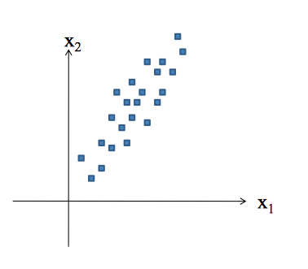

----

## Principal Component Analysis
# Concepts
<space>


----

## Principal Component Analysis
# Concepts
<space>

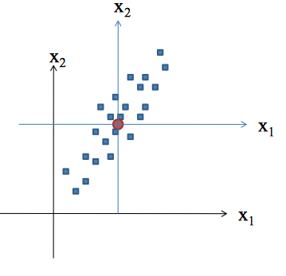

----

## Principal Component Analysis
# Concepts
<space>

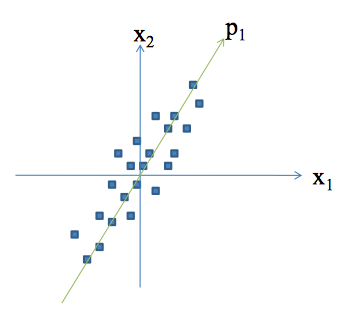

----

## Principal Component Analysis
# Concepts
<space>

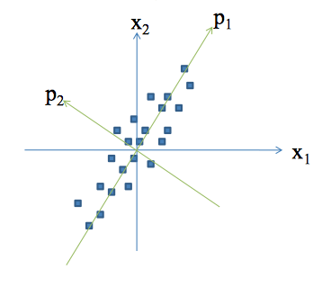

----

## Principal Component Analysis
# Concepts
<space>

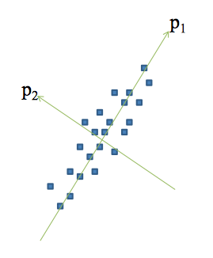

----

## Principal Component Analysis
# Concepts
<space>

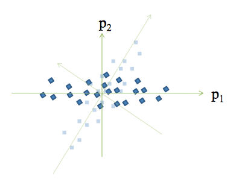

----

## Principal Component Analysis
# Concepts
<space>

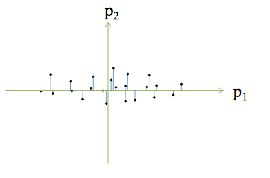

----

## Principal Component Analysis
# Concepts
<space>

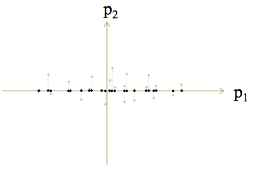

----

## Principal Component Analysis
# Concepts
<space>

- Assumes linearity
- $\bf{PX}=\bf{Y}$
  - $\bf{X}$ is original dataset, $\bf{P}$ is a transformation of $\bf{X}$ into $\bf{Y}$
- How to choose $\bf{P}$?<br>
  - Reduce noise (redundancy)<br>
  - Maximize signal (variance)
  - Provides most information

----

## Principal Component Analysis
# Concepts
<space>

- Covariance matrix is square, symmetric
- $\bf{C_{x}} = \frac{1}{(n-1)}\bf{XX^{T}}$
- Diagonals are variances, off-diagonals are covariances
  - Goal: maximize diagonals and minimize off-diagonals
- The optimal $\bf{Y}$ would have a covariance matrix, $\bf{C_{Y}}$, with positive values on the diagonal and 0's on the off-diagonals
  - Diagonalization

----

## Principal Component Analysis
# The Objective
<space>

- Find some matrix $\bf{P}$ where $\bf{PX}=\bf{Y}$ such that $\bf{Y}$'s covariance matrix is diagonalized
  - The rows of $\bf{P}$ are the Principal components
  - PCA by "eigen decomposition"

----

## Principal Component Analysis
# Eigenwhat?
<space>

- Eigenvalues help uncover valuable insight into the underlying structure of a vector space
- Eigenvalues/vectors come up extensively in physics, engineering, statistics<br><br>
- Eigenvalues are scalars derived from a square matrix, "characteristic roots"
- Eigenvectors are non-zero vectors associated with eigenvalues
- Almost every square matrix has at least 1 eigenvalue/vector combo (otherwise its "degenerative")
- Decomposing a square matrix into eigenvalues/vectors is eigen decomposition

----

## Principal Component Analysis
# Eigenwhat?
<space>

$\bf{A}x = \lambda x$
  - $\lambda$ is an eigenvalue of $\bf{A}$ and $\bf{x}$ is an eigenvector of $\bf{A}$<br>

----

## Principal Component Analysis
# Eigenwhat?
<space>

$\bf{A}x = \lambda x$<br>
$\bf{A}x - \lambda Ix = 0$<br>
$(\bf{A} - \lambda I)x = 0$<br>
For this to be non-trivial $\det(\bf{A} - \lambda I)$ = 0<br>
  - roots are eigenvalues of $\bf{A}$
  - characteristic polynomial of $\bf{A}$
  - ${\lambda}$ is called the spectrum

----

## Principal Component Analysis
# EigenExample
<space>

\[A = \begin{bmatrix} 5 & 2\\ 2 & 5 \end{bmatrix}, I= \begin{bmatrix} 1 & 0\\ 0 & 1 \end{bmatrix}, X = \begin{bmatrix} x_{1}\\ x_{2} \end{bmatrix}\]

----

## Principal Component Analysis
# EigenExample
<space>

\[A = \begin{bmatrix} 5 & 2\\ 2 & 5 \end{bmatrix}, I= \begin{bmatrix} 1 & 0\\ 0 & 1 \end{bmatrix}, X = \begin{bmatrix} x_{1}\\ x_{2} \end{bmatrix}\]
\[\begin{bmatrix} 5 & 2\\ 2 & 5 \end{bmatrix}X = \lambda X\]

----

## Principal Component Analysis
# EigenExample
<space>

\[A = \begin{bmatrix} 5 & 2\\ 2 & 5 \end{bmatrix}, I= \begin{bmatrix} 1 & 0\\ 0 & 1 \end{bmatrix}, X = \begin{bmatrix} x_{1}\\ x_{2} \end{bmatrix}\]
\[\begin{bmatrix} 5 & 2\\ 2 & 5 \end{bmatrix}X = \lambda X\]
\[\begin{bmatrix} 5 & 2\\ 2 & 5 \end{bmatrix}X - \lambda X = 0\]
\[(\begin{bmatrix} 5 & 2\\ 2 & 5 \end{bmatrix} - \lambda I)X = 0\]

----

## Principal Component Analysis
# EigenExample
<space>

\[\left | \begin{bmatrix} 5 & 2\\ 2 & 5 \end{bmatrix} - \lambda I \right |= 0\]
\[\left|\begin{bmatrix} 5 & 2\\ 2 & 5 \end{bmatrix} - \lambda \begin{bmatrix} 1 & 0\\ 0 & 1 \end{bmatrix} \right| = 0\]
\[\left|\begin{bmatrix} 5-\lambda & 2\\ 2 & 5-\lambda \end{bmatrix}\right| = 0\]

----

## Principal Component Analysis
# EigenExample
<space>

$(5-\lambda)\times(5-\lambda) - 4 = 0$
<br>
$\lambda^{2} - 10\lambda + 21 = 0$
<br>
$\lambda = ?$

----

## Principal Component Analysis
# EigenExample
<space>


```r
A = matrix(c(5,2,2,5),nrow=2)
roots <- Re(polyroot(c(21,-10,1)))
roots
```

```
## [1] 3 7
```
$\lambda = 3, 7$

----

## Principal Component Analysis
# Eigencheck
<space>

- when $\lambda = 3$<br>
$\bf{Ax} = 3\bf{x}$<br>

----

## Principal Component Analysis
# Eigencheck
<space>

- when $\lambda = 3$<br>
$\bf{Ax} = 3\bf{x}$<br>
$5x_{1} + 2x_{2} = 3x_{1}$<br>
$2x_{1} + 5x_{2} = 3x_{2}$<br>

----

## Principal Component Analysis
# Eigencheck
<space>

- when $\lambda = 3$<br>
$\bf{Ax} = 3\bf{x}$<br>
$5x_{1} + 2x_{2} = 3x_{1}$<br>
$2x_{1} + 5x_{2} = 3x_{2}$<br>
$x_{1} = -x_{2}$<br>

----

## Principal Component Analysis
# Eigencheck
<space>

- when $\lambda = 3$<br>
$\bf{Ax} = 3\bf{x}$<br>
$5x_{1} + 2x_{2} = 3x_{1}$<br>
$2x_{1} + 5x_{2} = 3x_{2}$<br>
$x_{1} = -x_{2}$<br>

\[Eigenvector = \begin{bmatrix} 1\\ -1 \end{bmatrix}\]

----

## Principal Component Analysis
# Eigencheck
<space>

- when $\lambda = 7$<br>
$\bf{Ax} = 7\bf{x}$<br>
$5x_{1} + 2x_{2} = 7x_{1}$<br>
$2x_{2} + 5x_{2} = 7x_{2}$<br>
$x_{1} = x_{2}$<br>

----

## Principal Component Analysis
# Eigencheck
<space>

- when $\lambda = 7$<br>
$\bf{Ax} = 7\bf{x}$<br>
$5x_{1} + 2x_{2} = 7x_{1}$<br>
$2x_{2} + 5x_{2} = 7x_{2}$<br>
$x_{1} = x_{2}$<br>

\[Eigenvector = \begin{bmatrix} 1\\ 1 \end{bmatrix}\]

----

## Principal Component Analysis
# Eigencheck
<space>

$\bf{Ax} = \bf{\lambda x}$

```r
x1 = c(1,-1)
x2 = c(1,1)
A %*% x1 == 3 * x1
A %*% x2 == 7 * x2
```

----

## Principal Component Analysis
# Eigencheck
<space>

$\bf{Ax} = \lambda \bf{x}$

```r
A %*% x1 == 3 * x1
```

```
     [,1]
[1,] TRUE
[2,] TRUE
```

```r
A %*% x2 == 7 * x2
```

```
     [,1]
[1,] TRUE
[2,] TRUE
```

----

## Principal Component Analysis
# Diagonalization
<space>

- If $\bf{A}$ has n linearly independent eigenvectors, then it is diagonalizable
  - Written in the form $\bf{A} = \bf{PD{P}^{-1}}$
  - $\bf{P}$ is row matrix of eigenvectors
  - $\bf{D}$ is diagonal matrix of eigenvalues of $\bf{A}$, off-diagonals are 0
  - $\bf{A}$ is "similar"" to $\bf{D}$

----

## Principal Component Analysis
# Diagonalization
<space>

- If $\bf{A}$ has n linearly independent eigenvectors, then it is diagonalizable
  - Written in the form $\bf{A} = \bf{PD{P}^{-1}}$
  - $\bf{P}$ is row matrix of eigenvectors
  - $\bf{D}$ is diagonal matrix of eigenvalues of $\bf{A}$, off-diagonals are 0
  - $\bf{A}$ is "similar"" to $\bf{D}$
- Eigenvalues of a symmetric matrix can form a new basis (this is what we want!)
- If the eigenvectors are orthonormal, then $\bf{{P}^{T} = {P}^{-1}}$<br>
$\bf{A} = \bf{PD{P}^{T}}$

----

## Principal Component Analysis
# Diagonalization
<space>

$\bf{A} = \bf{PDP^{T}}$

```r
m <- matrix(c(x1,x2),ncol=2)  ## x1, x2 are eigenvectors
m <- m/sqrt(norm(m))  ## normalize
as.matrix(m %*% diag(roots) %*% t(m))
```

```
##      [,1] [,2]
## [1,]    5    2
## [2,]    2    5
```

----

## Principal Component Analysis
# EigenDecomposition summary
<space>

- Eigenvalue and eigenvectors are important
- Linear Algebra theorems allow for matrix manipulation
- Steps to eigendecomposition:
 - 1) Set up characteristic equation
 - 2) Solve for eigenvalues by finding roots of equation
 - 3) Plug eigenvalues back in to find eigenvectors
- But...there's a lot more to eigenvalues!

----

## Principal Component Analysis
# Objective
<space>

- Find some matrix $\bf{P}$ where $\bf{PX}=\bf{Y}$ such that $\bf{C_{Y}}$ is diagonalized
- Covariance matrix<br>
$\bf{C_{Y}} = \frac{1}{(n-1)}\bf{YY}^{T}$

----

## Principal Component Analysis
# Proof
<space>

$\bf{PX} = \bf{Y}$<br>
<br>
$\bf{C_{Y}} = \frac{1}{(n-1)}\bf{YY^{T}}$<br>

----

## Principal Component Analysis
# Proof
<space>

$\bf{PX} = \bf{Y}$<br>
<br>
$\bf{C_{Y}} = \frac{1}{(n-1)}\bf{YY^{T}}$<br>
$=\frac{1}{(n-1)}\bf{PX(PX)^{T}}$<br>
$=\frac{1}{(n-1)}\bf{P(XX^{T})P^{T}}$,  because $(AB)^{T} = B^{T}A^{T}$<br>

----

## Principal Component Analysis
# Proof
<space>

$\bf{PX} = \bf{Y}$<br>
<br>
$\bf{C_{Y}} = \frac{1}{(n-1)}\bf{YY^{T}}$<br>
$=\frac{1}{(n-1)}\bf{PX(PX)^{T}}$<br>
$=\frac{1}{(n-1)}\bf{P(XX^{T})P^{T}}$,  because $(AB)^{T} = B^{T}A^{T}$<br> 
$=\frac{1}{(n-1)}\bf{PAP^{T}}$<br>
- $\bf{P}$ is a matrix with rows that are eigenvectors
- $\bf{A}$ is a diagonalized matrix of eigenvalues and is symmetric...

----

## Principal Component Analysis
# Proof
<space>

- From earlier, $\bf{AE} = \bf{ED}$
- $\bf{A} = \bf{EDE^{-1}}$
- Therefore $\bf{A} = \bf{EDE^{T}}$, because $\bf{E^{T}}=\bf{E^{-1}}$<br>

----

## Principal Component Analysis
# Motivation
<space>

- Choose each row of $\bf{P}$ to be an eigenvector of $\bf{A}$
- Therefore we are forcing this relationship to hold $\bf{P} = \bf{E^{T}}$<br>

----

## Principal Component Analysis
# Motivation
<space>

- Choose each row of $\bf{P}$ to be an eigenvector of $\bf{A}$
- Therefore we are forcing this relationship to hold $\bf{P} = \bf{E^{T}}$<br>
Since $\bf{A} = \bf{EDE^{T}}$<br>
$\bf{A} = \bf{P^{T}DP}$<br>

----

## Principal Component Analysis
# Motivation
<space>

- Choose each row of $\bf{P}$ to be an eigenvector of $\bf{A}$
- Therefore we are forcing this relationship to hold $\bf{P} = \bf{E^{T}}$<br>
Since $\bf{A} = \bf{EDE^{T}}$<br>
$\bf{A} = \bf{P^{T}DP}$<br>
$\bf{C_{Y}} = \frac{1}{(n-1)}\bf{PAP^{T}}$<br>
$\bf{C_{Y}} = \frac{1}{(n-1)}\bf{P(P^{T}DP)P^{T}}$<br>
$\bf{C_{Y}} = \frac{1}{(n-1)}\bf{(PP^{-1})D(PP^{-1})}$<br>
$= \frac{1}{n-1}\bf{D}$
- Therefore $\bf{C_{Y}}$ is diagonalized

----

## Principal Component Analysis
# Summary
<space>

- The principal components of $X$ are the eigenvectors of $XX^{T}$; or the rows of $P$
- The $i^{th}$ diagonal value of $C_{Y}$ is the variance of $X$ along

----

## Principal Component Analysis
# Assumptions
<space>

- Assumes linear relationship between $\bf{X}$ and $\bf{Y}$ (non-linear is a kernel PCA)
- Orthogonal components - ensures no correlation among PCs
- Largest variance indicates most signal
- Assumes data is normally distributed, otherwise PCA might not diagonalize matrix
  - Can use ICA...
  - But most data is normal and PCA is robust to slight deviance from normality

----

## Principal Component Analysis
# Example
<space>


```r
data <- read.csv('tennis_data_2013.csv')
data$Player1 <- as.character(data$Player1)
data$Player2 <- as.character(data$Player2)

tennis <- data
m <- length(data)

for (i in 10:m){
  tennis[,i] <- ifelse(is.na(data[,i]),0,data[,i])
}
```

----

## Principal Component Analysis
# Example
<space>


```r
features <- tennis[,10:m]
dim(features)
```

```
## [1] 943  26
```

```r
str(features)
```

```
## 'data.frame':	943 obs. of  26 variables:
##  $ FSP.1: int  61 61 52 53 76 65 68 47 64 77 ...
##  $ FSW.1: int  35 31 53 39 63 51 73 18 26 76 ...
##  $ SSP.1: int  39 39 48 47 24 35 32 53 36 23 ...
##  $ SSW.1: int  18 13 20 24 12 22 24 15 12 11 ...
##  $ ACE.1: num  5 13 8 8 0 9 5 3 3 6 ...
##  $ DBF.1: num  1 1 4 6 4 3 3 4 0 4 ...
##  $ WNR.1: num  17 13 37 8 16 35 41 21 20 6 ...
##  $ UFE.1: num  29 1 50 6 35 41 50 31 39 4 ...
##  $ BPC.1: num  1 7 1 6 3 2 9 6 3 7 ...
##  $ BPW.1: num  3 14 9 9 12 7 17 20 7 24 ...
##  $ NPA.1: num  8 0 16 0 9 6 14 6 5 0 ...
##  $ NPW.1: num  11 0 23 0 13 12 30 9 14 0 ...
##  $ TPW.1: num  70 80 106 104 128 108 173 78 67 162 ...
##  $ FSP.2: int  68 60 77 50 53 63 60 54 67 60 ...
##  $ FSW.2: int  45 23 57 24 59 60 66 26 42 68 ...
##  $ SSP.2: int  32 40 23 50 47 37 40 46 33 40 ...
##  $ SSW.2: int  17 9 15 19 32 22 34 13 14 25 ...
##  $ ACE.2: num  10 1 9 1 17 24 2 0 12 8 ...
##  $ DBF.2: num  0 4 1 8 11 4 6 11 0 12 ...
##  $ WNR.2: num  40 1 41 1 59 47 57 11 32 8 ...
##  $ UFE.2: num  30 4 41 8 79 45 72 46 20 12 ...
##  $ BPC.2: num  4 0 4 1 3 4 10 2 7 6 ...
##  $ BPW.2: num  8 0 13 7 5 7 17 6 10 14 ...
##  $ NPA.2: num  8 0 12 0 16 14 25 8 8 0 ...
##  $ NPW.2: num  9 0 16 0 28 17 36 12 11 0 ...
##  $ TPW.2: num  101 42 126 79 127 122 173 61 94 141 ...
```

----

## Principal Component Analysis
# Example
<space>


```r
## Manually Calculated PCs
scaled_features <- as.matrix(scale(features))
Cx <- cov(scaled_features)
eigenvalues <- eigen(Cx)$values
eigenvectors <- eigen(Cx)$vectors
PC <- scaled_features %*% eigenvectors
Cy <- cov(PC)
```

- Cy should be diagonalized matrix
  - diagonals of Cy should be the eigenvalues of Cx
  - off diagonals should be 0

----

## Principal Component Analysis
# Example
<space>


```r
sum_diff <- (sum(diag(Cy) - eigenvalues))^2
round(sum_diff,6)
```

```
## [1] 0
```

```r
off_diag <- upper.tri(Cy)|lower.tri(Cy) ## remove diagonal elements
round(sum(Cy[off_diag]),6)   ## off diagonals are 0 since PC's are orthogonal
```

```
## [1] 0
```

----

## Principal Component Analysis
# Example
<space>

 

----

## Principal Component Analysis
# Example
<space>


```r
pca.df <- prcomp(scaled_features)  ## Built in R function
## Eigenvalues of Cx = Variance Explained by PCs
round(eigenvalues,10) == round((pca.df$sdev)^2,10)  
```

```
 [1] TRUE TRUE TRUE TRUE TRUE TRUE TRUE TRUE TRUE TRUE TRUE TRUE TRUE TRUE
[15] TRUE TRUE TRUE TRUE TRUE TRUE TRUE TRUE TRUE TRUE TRUE TRUE
```

```r
round(eigenvectors[,1],10) == round(pca.df$rotation[,1],10) ## Eigenvectors of Cx = PCs
```

```
FSP.1 FSW.1 SSP.1 SSW.1 ACE.1 DBF.1 WNR.1 UFE.1 BPC.1 BPW.1 NPA.1 NPW.1 
 TRUE  TRUE  TRUE  TRUE  TRUE  TRUE  TRUE  TRUE  TRUE  TRUE  TRUE  TRUE 
TPW.1 FSP.2 FSW.2 SSP.2 SSW.2 ACE.2 DBF.2 WNR.2 UFE.2 BPC.2 BPW.2 NPA.2 
 TRUE  TRUE  TRUE  TRUE  TRUE  TRUE  TRUE  TRUE  TRUE  TRUE  TRUE  TRUE 
NPW.2 TPW.2 
 TRUE  TRUE 
```

----

## Principal Component Analysis
# Example
<space>

- Can the first two Principal Components separate our data?

 

----

## Principal Component Analysis
# Example
<space>

- Classify based on PC1?


```r
PC1 <- pca.df$x[,1]
mean_PC1 <- mean(pca.df$x[,1])
gen <- ifelse(PC1 > mean_PC1,"F","M")
sum(diag(table(gen,as.character(data$Gender))))/rows
```

```
[1] 0.7646
```

----

## Principal Component Analysis
# Summary
<space>

- Very popular dimensionality reduction technique
- Intuitive
- Cannot reverse engineer dataset easily
- Sparse PCA emphasizes important features
- Non-linear structure is difficult to model with PCA
- Extensions (ICA, kernel PCA) developed to generalize

----

## Clustering
# Objectives
<space>

1. Motivation and examples
2. Kmeans
3. DBSCAN

----

## Clustering
# Motivation
<space>

- Separate data into meaningful or useful groups
  - Capture natural structure of the data
  - Starting point for further analysis
- Cluster for utility
  - Summarizing data for less expensive computation
  - Data compression
- Very difficult to determine the "correct" number of clusters

----

## Clustering
# Types of Clusters
<space>

- Data that looks similar
- Prototype based
- Density based

----

## Clustering
# Typical clustering problem
<space>

 

----

## Clustering
# Density based cluster
<space>


----

## Clustering
# Kmeans
<space>

- One of the simplest unsupervised learning algorithms
- Group points into clusters; clusters center around a centroid
- Minimize the distance between a point and its centroid

----

## Clustering
# Kmeans algorithm
<space>

- Select K points as initial centroids 
- Do
  - Form K clusters by assigning each point to its closest centroid
  - Recompute the centroid of each cluster 
- Until centroids do not change, or change very minimally, i.e. < 1%
- Computational complexity: $O(nkI)$

----

## Clustering
# Kmeans algorithm
<space>

- Use similarity measures (Euclidean or cosine) depending on the data
- Minimize the squared distance of each point to closest centroid
$SSE(k) = \sum_{i=1}^{m}\sum_{j=1}^{n} (x_{ij} - \bar{x}_{kj})^2$

----

## Clustering
# Kmeans - notes
<space>

- There is no "correct" number of clusters
- Choose initial K randomly 
  - Can lead to poor centroids - local minimum
  - Run kmeans multiple times
- Reduce the total SSE by increasing K
- Increase the cluster with largest SSE
- Split up a cluster into other clusters
  - The centroid that is split will increase total SSE the least

----

## Clustering
# Kmeans - notes
<space>

- Bisecting Kmeans
  - Split points into 2 clusters
    - Take cluster with largest SSE - split that into two clusters
  - Rerun bisecting Kmeans on resulting clusters
  - Stop when you have K clusters
- Less susceptible to initialization problems

----

## Clustering
# Kmean fails
<space>

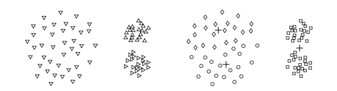

----

## Clustering
# Kmean fails
<space>

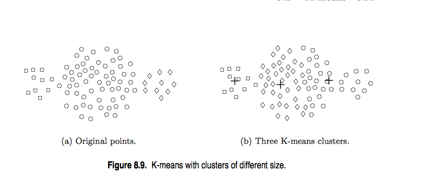

----

## Clustering
# Kmean fails
<space>

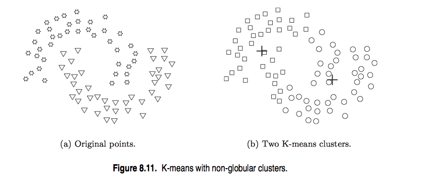

----

## Clustering
# Kmeans - example
<space>


```r
wine <- read.csv('http://archive.ics.uci.edu/ml/machine-learning-databases/wine/wine.data')
names(wine) <- c("class",'Alcohol','Malic','Ash','Alcalinity','Magnesium','Total_phenols',
                 'Flavanoids','NFphenols','Proanthocyanins','Color','Hue','Diluted','Proline')
str(wine[,1:7])
```

```
## 'data.frame':	177 obs. of  7 variables:
##  $ class        : int  1 1 1 1 1 1 1 1 1 1 ...
##  $ Alcohol      : num  13.2 13.2 14.4 13.2 14.2 ...
##  $ Malic        : num  1.78 2.36 1.95 2.59 1.76 1.87 2.15 1.64 1.35 2.16 ...
##  $ Ash          : num  2.14 2.67 2.5 2.87 2.45 2.45 2.61 2.17 2.27 2.3 ...
##  $ Alcalinity   : num  11.2 18.6 16.8 21 15.2 14.6 17.6 14 16 18 ...
##  $ Magnesium    : int  100 101 113 118 112 96 121 97 98 105 ...
##  $ Total_phenols: num  2.65 2.8 3.85 2.8 3.27 2.5 2.6 2.8 2.98 2.95 ...
```

----

## Clustering
# Kmeans - example
<space>

 

----

## Clustering
# DBSCAN
<space>

- A cluster is a dense region of points separated by low-density regions
- Group objects into one cluster if they are connected to one another by densely populated area
- Used when the clusters are irregularly shaped, and when noise and outliers are present
- Computational complexity: $O(n\log{n})$

----

## Clustering
# Terminology
<space>

- Core points are located inside a cluster
- Border points are on the borders between two clusters
- Neighborhood of p are all points within some radius of p, $Eps$

----

## Clustering
# Terminology
<space>

- Core points are located inside a cluster
- Border points are on the borders between two clusters
- Neighborhood of p are all points within some radius of p, $Eps$<br>
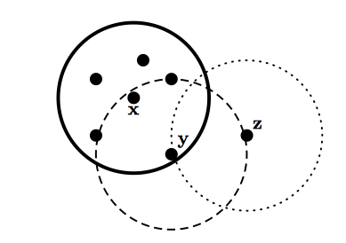

----

## Clustering
# Terminology
<space>

- Core points are located inside a cluster
- Border points are on the borders between two clusters
- Neighborhood of p are all points within some radius of p, $Eps$
- High density region has at least $Minpts$ within $Eps$ of point p
- Noise points are not within $Eps$ of border or core points

----

## Clustering
# Terminology
<space>

- Core points are located inside a cluster
- Border points are on the borders between two clusters
- Neighborhood of p are all points within some radius of p, $Eps$
- High density region has at least $Minpts$ within $Eps$ of point p
- Noise points are not within $Eps$ of border or core points
- If p is density connected to q, they are part of the same cluster, if not, then they are not
- If p is not density connected to any other point, considered noise

----

## Clustering
# DBSCAN
<space>

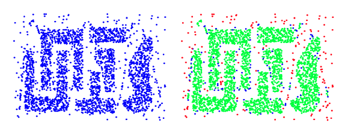

----

## Clustering
# DBSCAN
<space>

 

----

## Clustering
# DBSCAN
<space>

 

----

## Clustering
# Summary
<space>

- Unsupervised learning
- Not a perfect science - lots of interpretation
  - Dependent on values of K, $Eps$, $Minpts$
- Hard to define "correct" clustering
- Many types of algorithms

----

## Summary
# ML - Part II
<space>

- Logistic regression
- Math behind PCA
- Clustering basics

----

## Resources
<space>

- [Machine Learning with R](http://www.packtpub.com/machine-learning-with-r/book)
- [Machine Learning for Hackers](http://shop.oreilly.com/product/0636920018483.do)
- [Elements of Statistical Learning](http://web.stanford.edu/~hastie/local.ftp/Springer/OLD/ESLII_print4.pdf)

----

## THANK YOU!

----

----

----

## Decision Trees
# Objectives
<space>

1. Structure
2. Entropy
3. Boosting and error cost

----

## Decision Trees
# Motivation
<space>

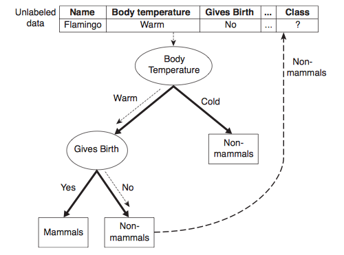

----

## Trees
# Structure
<space>

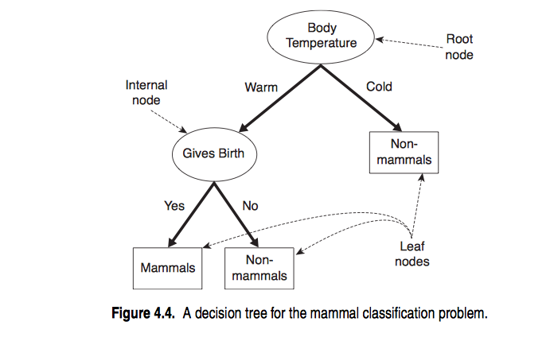

----

## Trees
# Structure
<space>

- Recursive partitioning -> "divide and conquer"
- Going down, choose feature that is most *predictive* of target class
  - Split the data according to feature
  - Continue...

----

## Trees
# Structure
<space>

Until...
- All examples at a node are in same class
- No more features left to distinguish (as a result, prone to overfitting)
- Tree has grown to some prespecified limit (called pruning)

----

## Trees
# Algorithms
<space>

- ID3
  - Original, popular, DT implementation
- C4.5: Like ID3 +
  - Handles continuous cases
  - Imputing missing values
  - Weighing costs
  - Pruning post creation
- C5.0: Like C4.5 + 
  - Faster, less memory usage
  - Boosting

----

## Trees
# Selecting features
<space>

- How to select feature?
  - Purity of resulting split
  - After splitting, how homogenous are the resulting classes?

----

## Trees
# Selecting features
<space>

- How to select feature?
  - Purity of resulting split
  - After splitting, how homogenous are the resulting classes?
- Entropy: amount of information contained in a random variable
  - For a feature with N classes:<br>
  &nbsp;&nbsp;- 0 = purely homogenous<br>
  &nbsp;&nbsp;- $\log_{2}(N)$ = completely mixed

----

## Trees
# Entropy
<space>

$Entropy(S) = \sum_{i=1}^{c} -p_{i}\log_{2}(p_{i})$
  - where $S$ is a dataset
  - $c$ is the number of classes in that data
  - $p_{i}$ is the proportion of values in that class

----

## Trees
# Entropy - example
<space>

What is the entropy of a fair, 6 sided die?


```r
entropy <- function(probs){
  # probs is a list of probabilities
  ent <- 0
  for(i in probs){
    ent_temp <- -i*log2(i)
    ent <- ent + ent_temp
  }
  return(ent)
}
```

----

## Trees
# Entropy - example
<space>


```r
fair <- rep(1/6,6)
entropy(fair)
```

```
[1] 2.585
```

```r
log2(6)
```

```
[1] 2.585
```

----

## Trees
# Entropy - example
<space>

What is the entropy of a biased, 6 sided die?<br>
$P(X=1) = P(X=2) = P(X=3) = 1/9$<br>
$P(X=4) = P(X=5) = P(X=6) = 2/9$


```r
biased <- c(rep(1/9,3),rep(2/9,3))
entropy(biased)
```

```
[1] 2.503
```

----

## Trees
# Entropy - example
<space>


```r
more_biased <- c(rep(1/18,3),rep(5/18,3))
entropy(more_biased)
```

```
[1] 2.235
```

```r
most_biased <- c(rep(1/100,5),rep(95/100,1))
entropy(most_biased)
```

```
[1] 0.4025
```

----

## Trees
# Entropy - example
<space>


```r
curve(-x*log2(x)-(1 - x)*log2(1 - x), col =" red", xlab = "P(Heads)", ylab = "Entropy", 
      lwd = 4, main='Entropy of a coin toss')
```

 

----

## Trees
# Entropy
<space>

- C5.0 uses the change in entropy to determine the change in purity
- InfoGain = Entropy (pre split) - Entropy (post split)
  - Entropy (pre split) >> current Entropy
  - Entropy (post split) >> need to consider Entropy of each possible split
  - $Entropy(post) = \sum_{i=1}^{n}w_{i}Entropy(P_{i})$
<br>
- Notes:
  - The more a feature splits the data in obvious ways the less informative it is
  - The more a feature splits the data - in general - the more information is gained by splitting at that feature

----

## Trees
# Example
<space>


```r
voting_data <- read.csv('http://archive.ics.uci.edu/ml/machine-learning-databases/voting-records/house-votes-84.data')
names(voting_data) <- c('party','handicapped-infants','water-project-cost-sharing',
                        'adoption-of-the-budget-resolution','physician-fee-freeze',
                        'el-salvador-aid','religious-groups-in-schools',
                        'anti-satellite-test-ban','aid-to-nicaraguan-contras',
                        'mx-missile','immigration','synfuels-corporation-cutback',
                        'education-spending','superfund-right-to-sue','crime',
                        'duty-free-exports','export-administration-act-south-africa')
```

----

## Trees
# Example
<space>


```r
prop.table(table(voting_data[,1]))
```

```

  democrat republican 
    0.6152     0.3848 
```

```r
n <- nrow(voting_data)
train_ind <- sample(n,2/3*n)
voting_train <- voting_data[train_ind,]
voting_test <- voting_data[-train_ind,]
```

----

## Trees
# Example
<space>

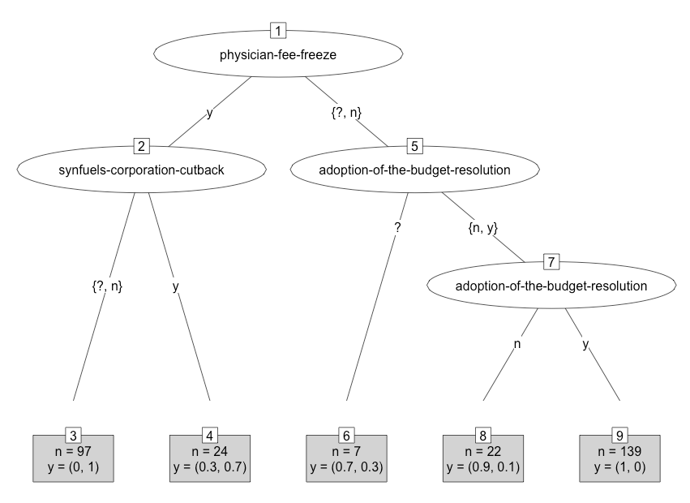


----

## Trees
# Example
<space>


```
            tree_predict
             democrat republican
  democrat         85          2
  republican        2         56
```

----

## Trees
# Example
<space>


```r
head(C5imp(tree_model))   # most important variables
```

```
                                  Overall
physician-fee-freeze                96.19
synfuels-corporation-cutback        40.14
mx-missile                          12.80
adoption-of-the-budget-resolution    9.69
handicapped-infants                  0.00
water-project-cost-sharing           0.00
```

----

## Trees
# Boosting
<space>

- Combine a bunch of weak learners to create a team that is much stronger
- This is where C5.0 improves on C4.5

----

## Trees
# Boosting Example
<space>


```r
boosted_tree_model <- C5.0(voting_train[,-1],voting_train[,1], trials=25)
boosted_tennis_predict <- predict(boosted_tree_model,voting_test[,-1])
boosted_conf <- table(voting_test[,1], boosted_tennis_predict)
boosted_conf
```

```
            boosted_tennis_predict
             democrat republican
  democrat         85          2
  republican        1         57
```

----

## Trees
# Error Cost
<space>

- Still getting too many false positives (predict Republican but actually Democrat)
- Introduce higher cost to getting this wrong

----

## Trees
# Error Cost
<space>


```r
error_cost <- matrix(c(0,1,2,0),nrow=2)
cost_model <- C5.0(voting_train[,-1],voting_train[,1], trials=1, costs = error_cost)
cost_predict <- predict(cost_model, newdata=voting_test[,-1])
conf <- table(voting_test[,1], cost_predict)
conf
```

```
            cost_predict
             democrat republican
  democrat         83          4
  republican        1         57
```

----

## Trees
# Error Cost
<space>

 

----

## Trees
# Pros and Cons
<space>

- Trees are non-parametric, rule based classification or regression method
- Simple to understand and interpret
- Little data preparation
- Works well with small or large number of features
<br>
- Easy to overfit
- Biased towards splits on features with large number of levels
- Usually finds local optimum
- Difficult concepts are hard to learn
- Avoid pre-pruning
- Hard to know optimal length of tree without growing it there first

----

## Summary
# ML - Part II
<space>

- Logistic regression
- Math behind PCA
- Clustering basics

----

## Resources
<space>

- [Machine Learning with R](http://www.packtpub.com/machine-learning-with-r/book)
- [Machine Learning for Hackers](http://shop.oreilly.com/product/0636920018483.do)
- [Elements of Statistical Learning](http://web.stanford.edu/~hastie/local.ftp/Springer/OLD/ESLII_print4.pdf)

----
