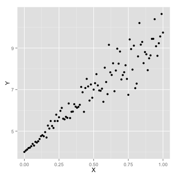
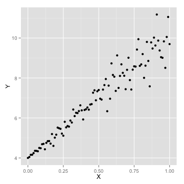
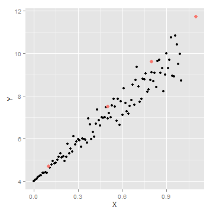

---

title       : Machine Learning with R - II
author      : Ilan Man
job         : Strategy Operations  @ Squarespace
framework   : io2012        # {io2012, html5slides, shower, dzslides, ...}
highlighter : highlight.js  # {highlight.js, prettify, highlight}
hitheme     : tomorrow      # 
widgets     : mathjax       # {mathjax, quiz, bootstrap}
mode        : selfcontained # {standalone, draft}

----

## Agenda 
<space>

1. Logistic Regression
2. Principle Component Analysis
3. Clustering
4. Trees

----

## Objectives 
<space>

1. Understand some popular algorithms and techniques
2. Learn how to tune parameters
3. Practice R

----

## Logistic Regression
# Motivation
<space>


```r
x <- 1:10
log_ex <- data.frame(Y = c(rnorm(5, 0, 0.01), rnorm(5, 5, 0.01)), X = x)
ggplot(log_ex, aes(X, Y)) + geom_point(color = "blue", size = 3) + stat_smooth(method = "lm", 
    se = F, color = "green", size = 1)
```

 


----

## Logistic Regression
# Motivation
<space>


```r
library("MASS")
library(ggplot2)
data(menarche)
log_data <- data.frame(Y = menarche$Menarche/menarche$Total)
log_data$X <- menarche$Age

glm.out <- glm(cbind(Menarche, Total - Menarche) ~ Age, family = binomial(logit), 
    data = menarche)
lm.out <- lm(Y ~ X, data = log_data)

log_data$fitted <- glm.out$fitted

data_points <- ggplot(log_data) + geom_point(aes(x = X, y = Y), color = "blue", 
    size = 3)
line_points <- data_points + geom_abline(intercept = coef(lm.out)[1], slope = coef(lm.out)[2], 
    color = "green", size = 1)
curve_points <- line_points + geom_line(aes(x = X, y = fitted), color = "red", 
    size = 1)
```


----

## Logistic Regression
# Notation
<space>

- type of regression to predict the probability of being in a class
  - typical to set threshold to 0.5
- assumes error terms are Binomially distributed
  - which generates 1's and 0's as the error term
- sigmoid or logistic function: $g(z) = \frac{1}{1+e^{-z}}$
  - interpret the output as $P(Y=1 | X)$
  - bounded by 0 and 1

----

## Logistic Regression
# Notation
<space>


```r
curve(1/(1 + exp(-x)), from = -10, to = 10, ylab = "P(Y=1|X)", col = "red", 
    lwd = 3)
abline(a = 0.5, b = 0, lty = 2, col = "blue", lwd = 3)
```

 


----

## Logistic Regression
# Find parameters
<space>

- The hypothesis function, $h_{\theta}(x)$, is P(Y=1|X)
- Linear Regression --> $h_{\theta}(x) = \theta x^{T}$
- Logistic Regression --> $h_{\theta}(x) = g(\theta x^{T})$ 
<br>
where $g(z) = \frac{1}{1+e^{-z}}$

----

## Logistic Regression
# Notation
<space>

- Re-arranging $Y = \frac{1}{1+e^{-\theta x^{T}}}$ yields $\log{\frac{Y}{1 - Y}} = \theta x^{T}$<br>
- "log odds"" are linear in X
- this is called the logit of theta
  - links X linearly with some function of Y

----

## Logistic Regression
# Find parameters
<space>

- So $h_{\theta}(x) = \frac{1}{1+e^{-\theta x^{T}}}$
- What is the cost function?
- Why can't we use the same cost function as for the linear hypothesis?
  - logistic residuals are Binomially distributed - not Normal
  - the regression function is not linear in X

----

## Logistic Regression
# Find parameters
<space>

- Define logistic cost function as:

$cost(h_{\theta}(x)):$<br>
&nbsp;&nbsp; $= -\log(x),$ &nbsp;&nbsp;&nbsp;  $y = 1$<br>
&nbsp;&nbsp; $= -\log(1-x),$ &nbsp;   $y = 0$

  


----

## Logistic Regression
# Find parameters
<space>

- using statistics, it can be shown that<br>
$cost(h_{\theta}(x), y) = -y \log(h_{\theta}(x)) + (1-y) \log(1-h_{\theta}(x))$<br>

----

## Logistic Regression
# Find parameters
<space>

- using statistics, it can be shown that<br>
$cost(h_{\theta}(x), y) = -y \log(h_{\theta}(x)) + (1-y) \log(1-h_{\theta}(x))$<br>
- Logistic regression cost function is then<br>
$cost(h_{\theta}(x), y)  = \frac{1}{m} \sum_{i=1}^{m} -y \log(h_{\theta}(x)) + (1-y) \log(1-h_{\theta}(x))$

----

## Logistic Regression
# Find parameters
<space>

- using statistics, it can be shown that<br>
$cost(h_{\theta}(x), y) = -y \log(h_{\theta}(x)) + (1-y) \log(1-h_{\theta}(x))$<br>
- Logistic regression cost function is then<br>
$cost(h_{\theta}(x), y)  = \frac{1}{m} \sum_{i=1}^{m} -y \log(h_{\theta}(x)) + (1-y) \log(1-h_{\theta}(x))$
- Minimize the cost

----

## Logistic Regression
# Gradient descent
<space>

 


----

## Logistic Regression
# Gradient descent
<space>


```r
x <- cbind(1, x)  #Add ones to x  
theta <- c(0, 0)  # initalize theta vector 
m <- nrow(x)  # Number of the observations 
grad_cost <- function(X, y, theta) return(sum(((X %*% theta) - y)^2))
```


----

## Logistic Regression
# Gradient descent
<space>


```r
gradDescent <- function(X, y, theta, iterations, alpha) {
    m <- length(y)
    grad <- rep(0, length(theta))
    cost.df <- data.frame(cost = 0, theta = 0)
    
    for (i in 1:iterations) {
        h <- X %*% theta
        grad <- (t(X) %*% (h - y))/m
        theta <- theta - alpha * grad
        cost.df <- rbind(cost.df, c(grad_cost(X, y, theta), theta))
    }
    
    return(list(theta, cost.df))
}
```


----

## Logistic Regression
# Gradient descent
<space>


```r
## initialize X, y and theta
X1 <- matrix(ncol = 1, nrow = nrow(df), cbind(1, df$X))
Y1 <- matrix(ncol = 1, nrow = nrow(df), df$Y)

init_theta <- as.matrix(c(0))
grad_cost(X1, Y1, init_theta)
```

```
[1] 5321
```

```r

iterations = 100
alpha = 0.1
results <- gradDescent(X1, Y1, init_theta, iterations, alpha)
```


----

## Logistic Regression
# Gradient descent
<space>


```
## Error: object 'cost.df' not found
```


----

## Logistic Regression
# Gradient descent
<space>


```r
grad_cost(X1, Y1, theta[[1]])
```

```
[1] 351.4
```

```r
## Make some predictions
intercept <- df[df$X == 0, ]$Y
pred <- function(x) return(intercept + c(x) %*% theta)
new_points <- c(0.1, 0.5, 0.8, 1.1)
new_preds <- data.frame(X = new_points, Y = sapply(new_points, pred))
```


----

## Logistic Regression
# Gradient descent
<space>


```r
ggplot(data = df, aes(x = X, y = Y)) + geom_point(size = 2)
```

 

```r
ggplot(data = df, aes(x = X, y = Y)) + geom_point() + geom_point(data = new_preds, 
    aes(x = X, y = Y, color = "red"), size = 3) + scale_colour_discrete(guide = FALSE)
```

 


----

## Regression example
# Gradient descent - summary
<space>

- minimization algorithm
- approximation, non-closed form solution
- good for large number of examples
- hard to select the right $\alpha$
- traditional looping is slow - optimization algorithms are used in practice

----

## Logistic Regression
# Summary
<space>

- very popular classification algorithm
- based on Binomial error terms, i.e. 1's and 0's

----

## Principle Component Analysis
# Motivation
<space>

- used widely in modern data analysis
- not well understood
- intuition: reduce data into only relevant dimensions
- the goal of PCA is to compute the most meaningful was to re-express noisy data, revealing the hidden structure

----

## Principle Component Analysis
# Concepts
<space>

- first big assumption: linearity
- $PX=Y$
  - $X$ is original dataset, $P$ is a transformation of $X$ into $Y$
- how do we choose $P$?
  - reduce noise
  - maximize variance

----

## Principle Component Analysis
# Concepts
<space>

- covariance matrix
     - $C = X*X^{T}$

- restated goals are
  - minimize covariance and maximize variance
  - the optimizal $C$ is a diagonal matrix, off diagonals are = 0
  
----

## Principle Component Analysis
# Concepts
<space>

- summary of assumptions
  - linearity (non-linear is a kernel PCA)
  - largest variance indicates most signal, low variance = noise
  - orthogonal components - makes the linear algebra easier
  - assumes data is normally distributed, otherwise PCA might not diagonalize matrix
    - can use ICA
    - but most data is normal and PCA is robust to slight deviance from normality

----

## Principle Component Analysis
# Eigenwhat?
<space>

- $Ax = \lambdax$
  - $\lambda$ is an eigenvalue of $A$ and $x$ is an eigenvector of $A$
- $Ax - \lambdaIx = 0$
- $(A - \lambdaI)x = 0$
- $\det(A - \lambdaI)$ = 0


----

## Principle Component Analysis
# Eigenwhat?
<space>

$\[A=\left[{\begin{array}{cc}5 & 2 \\2 & 5\\\end{array}\right ]\]$

A = matrix(c(5,2,2,5),nrow=2)
I = diag(nrow(A))
|A - L*I| = 0
det(c(5-l,2,2,5-l))
(5-l)*(5-l) - 4 = 0
25 - 10l + l^2 - 4 = 0
l^2 - 10l + 21 = 0
roots <- Re(polyroot(c(21,-10,1)))
```

----

## Principle Component Analysis
# Eigenwhat?
<space>

- when lambda = -3
Ax = 3x
5x1 + 2x2 = 3x1
2x1 + 5x2 = 3x2
x1=-x2
- one eigenvector = [1 -1]

----

## Principle Component Analysis
# Eigenwhat?
<space>

- when lambda = 7
5x1 + 2x2 = 7x1
2x2 + 5x2 = 7x2
x1 = x2
- another eigenvector = [1 1]

----

## Principle Component Analysis
# Eigenwhat?
<space>

A%*%c(1,-1) == 3 * as.matrix(c(1,-1))
A%*%c(1,1) == 7 * as.matrix(c(1,1))
roots

----

## Principle Component Analysis
# Eigenwhat?
<space>

- check
m <- matrix(c(1,-1,1,1),ncol=2)
m <- m/sqrt(norm(m))
as.matrix(m%*%diag(roots)%*%t(m))
- lambda is a diagonal matrix, with 0 off diagonals

----

## Principle Component Analysis
# Motivation
<space>

PX = Y

CY = (1/(n-1))*YYt
=PX(PX)t
=PXXtPt
=PAPt
# P is a matrix with columns that are eigenvectors
# A is a diagonalized matrix of eigenvalues (by linear algebra) and symmetric
A = EDEt

----

## Principle Component Analysis
# Motivation
<space>

# each row of P should be an eigenvector of A
P=Et
# also note that Pt = P-1 (linear algebra)
A = PtDP
CY = PPtDPPt
= (1/(n-1))*D
# D is a diagonal matrix, depending on how we choose P
# therefore CY is diagonalized

----

## Principle Component Analysis
# Example
<space>


```r
data <- read.csv("tennis_data_2013.csv")
```

```
## Warning: cannot open file 'tennis_data_2013.csv': No such file or
## directory
```

```
## Error: cannot open the connection
```

```r
data$Player1 <- as.character(data$Player1)
```

```
## Error: object of type 'closure' is not subsettable
```

```r
data$Player2 <- as.character(data$Player2)
```

```
## Error: object of type 'closure' is not subsettable
```

```r

tennis <- data
m <- length(data)

for (i in 10:m) {
    tennis[, i] <- ifelse(is.na(data[, i]), 0, data[, i])
}
```

```
## Error: object of type 'closure' is not subsettable
```

```r

str(tennis)
```

```
## function (..., list = character(), package = NULL, lib.loc = NULL, 
##     verbose = getOption("verbose"), envir = .GlobalEnv)
```

```r

features <- tennis[, 10:m]
```

```
## Error: object of type 'closure' is not subsettable
```

```r

head(features)
```

```
##   classification developer domain coupon plan_period plan_type
## 1              0         0      1      1      Annual  Standard
## 2              1         0      1      0      Annual  Business
## 3              0         0      1      0       Month Unlimited
## 4              1         0      1      1      Annual  Business
## 5              1         0      1      0      Annual Unlimited
## 6              0         0      1      0      Annual Unlimited
##   num_prod_sold num_prod_inventory sold_over_inventory     GMV num_starred
## 1             0                  5               0.000       0           0
## 2           300                220               1.364 1421525           0
## 3             8                  8               1.000   18000           0
## 4          1207               1065               1.133 6957645           0
## 5           242                220               1.100 1672000           0
## 6             0                  2               0.000       0           0
##   num_on_sale avg_prod_price avg_purchase_amt unique_cust discounts_given
## 1           0          13100                0           0               0
## 2           0           6920             6461           4           27445
## 3           0           3375             2250           2               0
## 4           0           6542             6533          12            5405
## 5           0           7182             7600           3               0
## 6           0           8000                0           0               0
##   num_physical num_digital num_service percent_physical percent_digital
## 1            0           1           0                0               1
## 2           63           0           0                1               0
## 3            0           0           3                0               0
## 4           17           0           0                1               0
## 5           11           0           0                1               0
## 6            0           0           0                0               0
##   percent_service num_with_shipping_cost num_with_taxes views_30day
## 1               0                      0              0         169
## 2               0                      0              0        2279
## 3               1                      0              0          56
## 4               0                     17              0         584
## 5               0                      0              0        1037
## 6               0                      0              0         110
##   visits_30day views_7day visits_7day
## 1           81         63          19
## 2          453        402          94
## 3           20         27           6
## 4          191        153          53
## 5          363        341         114
## 6           29         47          12
```

```r
str(features)
```

```
## 'data.frame':	299 obs. of  28 variables:
##  $ classification        : int  0 1 0 1 1 0 0 0 1 0 ...
##  $ developer             : Factor w/ 2 levels "0","1": 1 1 1 1 1 1 1 1 1 1 ...
##  $ domain                : Factor w/ 2 levels "0","1": 2 2 2 2 2 2 2 2 2 2 ...
##  $ coupon                : Factor w/ 2 levels "0","1": 2 1 1 2 1 1 1 1 1 2 ...
##  $ plan_period           : Factor w/ 2 levels "Annual","Month": 1 1 2 1 1 1 1 1 2 1 ...
##  $ plan_type             : Factor w/ 3 levels "Business","Standard",..: 2 1 3 1 3 3 2 2 3 1 ...
##  $ num_prod_sold         : int  0 300 8 1207 242 0 508 0 6916 0 ...
##  $ num_prod_inventory    : int  5 220 8 1065 220 2 280 1 3666 0 ...
##  $ sold_over_inventory   : num  0 1.36 1 1.13 1.1 ...
##  $ GMV                   : int  0 1421525 18000 6957645 1672000 0 802800 0 45825286 0 ...
##  $ num_starred           : int  0 0 0 0 0 0 0 0 1540 0 ...
##  $ num_on_sale           : int  0 0 0 0 0 0 0 0 0 0 ...
##  $ avg_prod_price        : num  13100 6920 3375 6542 7182 ...
##  $ avg_purchase_amt      : num  0 6461 2250 6533 7600 ...
##  $ unique_cust           : int  0 4 2 12 3 0 21 0 1 0 ...
##  $ discounts_given       : int  0 27445 0 5405 0 0 0 0 26784 0 ...
##  $ num_physical          : int  0 63 0 17 11 0 70 0 244 0 ...
##  $ num_digital           : int  1 0 0 0 0 0 0 0 0 0 ...
##  $ num_service           : int  0 0 3 0 0 0 3 0 0 0 ...
##  $ percent_physical      : num  0 1 0 1 1 ...
##  $ percent_digital       : num  1 0 0 0 0 0 0 0 0 0 ...
##  $ percent_service       : num  0 0 1 0 0 ...
##  $ num_with_shipping_cost: int  0 0 0 17 0 0 0 0 244 0 ...
##  $ num_with_taxes        : int  0 0 0 0 0 0 0 0 0 0 ...
##  $ views_30day           : int  169 2279 56 584 1037 110 179 28 10966 192 ...
##  $ visits_30day          : int  81 453 20 191 363 29 63 14 3385 116 ...
##  $ views_7day            : int  63 402 27 153 341 47 72 5 2238 33 ...
##  $ visits_7day           : int  19 94 6 53 114 12 25 3 713 13 ...
```

```r
dim(features)
```

```
## [1] 299  28
```


----

## Principle Component Analysis
# Example
<space>


```r
scaled_features <- as.matrix(scale(features))
```

```
## Error: 'x' must be numeric
```

```r
Cx <- cov(scaled_features)
```

```
## Error: object 'scaled_features' not found
```

```r
eigenvalues <- eigen(Cx)$values
```

```
## Error: object 'Cx' not found
```

```r
eigenvectors <- eigen(Cx)$vectors
```

```
## Error: object 'Cx' not found
```

```r
PC <- scaled_features %*% eigenvectors
```

```
## Error: object 'scaled_features' not found
```


----

## Principle Component Analysis
# Example
<space>


```r
Cy <- cov(PC)
```

```
## Error: object 'PC' not found
```

```r
sum(round(diag(Cy) - eigenvalues, 5))
```

```
## Error: object 'Cy' not found
```

```r
sum(round(Cy[upper.tri(Cy)], 5))  ## off diagonals are 0 since PC's are orthogonal
```

```
## Error: object 'Cy' not found
```


----

## Principle Component Analysis
# Example
<space>


```r
var_explained <- round(eigenvalues/sum(eigenvalues) * 100, digits = 2)
```

```
## Error: object 'eigenvalues' not found
```

```r
cum_var_explained <- round(cumsum(eigenvalues)/sum(eigenvalues) * 100, digits = 2)
```

```
## Error: object 'eigenvalues' not found
```

```r

var_explained <- as.data.frame(var_explained)
```

```
## Error: object 'var_explained' not found
```

```r
names(var_explained) <- "variance_explained"
```

```
## Error: object 'var_explained' not found
```

```r
var_explained$PC <- as.numeric(rownames(var_explained))
```

```
## Error: object 'var_explained' not found
```

```r
var_explained <- cbind(var_explained, cum_var_explained)
```

```
## Error: object 'var_explained' not found
```

```r

library(ggplot2)
ggplot(var_explained) + geom_bar(aes(x = PC, y = variance_explained), stat = "identity") + 
    geom_line(aes(x = PC, y = cum_var_explained))
```

```
## Error: object 'var_explained' not found
```


----

## Principle Component Analysis
# Example
<space>


```r
pca.df <- prcomp(scaled_features)
```

```
## Error: object 'scaled_features' not found
```

```r
eigenvalues == (pca.df$sdev)^2
```

```
## Error: object 'eigenvalues' not found
```

```r
eigenvectors[, 1] == pca.df$rotation[, 1]
```

```
## Error: object 'eigenvectors' not found
```

```r
sum((eigenvectors[, 1])^2)
```

```
## Error: object 'eigenvectors' not found
```


----

## Principle Component Analysis
# Example
<space>


```r
rows <- nrow(tennis)
pca.plot <- as.data.frame(pca.df$x[, 1:2])
```

```
## Error: object 'pca.df' not found
```

```r
pca.plot$gender <- data$Gender
```

```
## Error: object of type 'closure' is not subsettable
```

```r
ggplot(data = pca.plot, aes(x = PC1, y = PC2, color = gender)) + geom_point()
```

```
## Error: object 'pca.plot' not found
```


----

## Principle Component Analysis
# Example
<space>

- how accurate is the first PC at dividing the dataset?
gen <- ifelse(pca.df$x[,1] > abs(mean(pca.df$x[,1]))*2,"F","M")
sum(diag(table(gen,as.character(data$Gender))))/rows

----

## Principle Component Analysis
# Summary
<space>

----

## Clustering
# Motivation
<space>

- separate data into meaningful or useful groups
  - capture natural structure of the data
  - starting point for further analysis
- cluster for utility
  - summarizing data for less expensive computation
  - data compression

----

## Clustering
# Types of Clusters
<space>

- data that looks more like other data in that cluster than outside
- each data point is more similar to the prototype (centeroid) of the cluster than the prototype of other clusters
- where the density is highest, that is a cluster

----

## Clustering
# Typical clustering problem
<space>

 


----

## Clustering
# Density based cluster
<space>


----

## Clustering
# Kmeans
<space>

- prototype, partitional based
- choose K initial centroids/clusters
- points are assigned to the closest centroid
- centroid is then updated based on the points in that cluster
- update steps until no point changes or centroids remain the same

----

## Clustering
# Kmeans algorithm
<space>

1. Select K points as initial centroids. 
2. Repeat
3. &nbsp;&nbsp; Form K clusters by assigning each point to its closest centroid.
4. &nbsp;&nbsp; Recompute the centroid of each cluster. 
5. until Centroids do not change, or change very minimally, i.e. <1%

----

## Clustering
# Kmeans algorithm
<space>

- Use similarity measures (Euclidean or cosine) depending on the data
- Minimize the squared distance of each point to closest centroid
  - minimize the objective function
  - the centroid that minimizes the SSE of the cluster is the mean
  - leads to local minimum - not global - since optimizing based on chosen centroids

----

## Clustering
# Kmeans
<space>

- choose K randomly - can lead to poor centroids
     - run k-means multiple times - still doesn’t solve problems

- can reduce the total SSE by increasing K
     - can increase the cluster with largest SSE
- can decrease K and minimize SSE
     - split up a cluster into other clusters
     - the centroid that is split will increase total SSE the least
- bisecting K means
   - less susceptible to initialization problems
   - split points into 2 clusters
        - take cluster with largest SSE - split that into two clusters
   - rerun bisecting K mean on resulting clusters
   - stop when you have K clusters

----

## Clustering
# Kmean fails
<space>


----

## Clustering
# Kmean fails
<space>


----

## Clustering
# Kmean fails
<space>


----

## Clustering
# Kmeans
<space>


```r
tennis_kmean <- kmeans(features, centers = 5)
```

```
## Warning: NAs introduced by coercion
```

```
## Error: NA/NaN/Inf in foreign function call (arg 1)
```

```r
table(tennis$Gender, tennis_kmean$cluster)
```

```
## Error: object of type 'closure' is not subsettable
```


----

## Clustering
# Kmeans animation
<space>

install.packages('animation')
library(animation)

oopt = ani.options(interval = 1)
ani_ex = rbind(matrix(rnorm(100, sd = 0.3), ncol = 2), 
          matrix(rnorm(100, sd = 0.3), 
          ncol = 2))
colnames(ani_ex) = c("x", "y")

kmeans.an = function(
  x = cbind(X1 = runif(50), X2 = runif(50)), centers = 4, hints = c('Move centers!', 'Find cluster?'),
  pch = 1:5, col = 1:5
) {
  x = as.matrix(x)
  ocluster = sample(centers, nrow(x), replace = TRUE)
  if (length(centers) == 1) centers = x[sample(nrow(x), centers), ] else
    centers = as.matrix(centers)
  numcent = nrow(centers)
  dst = matrix(nrow = nrow(x), ncol = numcent)
  j = 1
  pch = rep(pch, length = numcent)
  col = rep(col, length = numcent)
  
  for (j in 1:ani.options('nmax')) {
    dev.hold()
    plot(x, pch = pch[ocluster], col = col[ocluster], panel.first = grid())
    mtext(hints[1], 4)
    points(centers, pch = pch[1:numcent], cex = 3, lwd = 2, col = col[1:numcent])
    ani.pause()
    for (i in 1:numcent) {
      dst[, i] = sqrt(apply((t(t(x) - unlist(centers[i, ])))^2, 1, sum))
    }
    ncluster = apply(dst, 1, which.min)
    plot(x, type = 'n')
    mtext(hints[2], 4)
    grid()
    ocenters = centers
    for (i in 1:numcent) {
      xx = subset(x, ncluster == i)
      polygon(xx[chull(xx), ], density = 10, col = col[i], lty = 2)
      points(xx, pch = pch[i], col = col[i])
      centers[i, ] = apply(xx, 2, mean)
    }
    points(ocenters, cex = 3, col = col[1:numcent], pch = pch[1:numcent], lwd = 2)
    ani.pause()
    if (all(ncluster == ocluster)) break
    ocluster = ncluster
  }
  invisible(list(cluster = ncluster, centers = centers))
}

kmeans.an(ani_ex, centers = 5, hints = c("Move centers","Cluster found?"))

----

## Clustering
# DBSCAN
<space>

- density based
     - center based approach to finding density
     - count the number of points within some radius of a point, the radius is call Eps
     - if Eps is too big, there will be m points, if eps is too small, there will be 1 point
     - core point has X points within a radius of Eps, border points are within a radius of Eps of core point, and noise points are not within Eps of border or core points
     - if p is density connected to q, they are part of the same cluster, if not, then they are not; if p is not density connected to any other point, its considered noise
     
----

## Clustering
# DBSCAN
<space>


```r
x <- c(2, 2, 8, 5, 7, 6, 1, 4)
y <- c(10, 5, 4, 8, 5, 4, 2, 9)
cluster <- data.frame(X = c(x, 2 * x, 3 * x), Y = c(y, -2 * x, 1/4 * y))
plot(cluster)
```

 


----

## Clustering
# DBSCAN
<space>


```r
library(fpc)
cluster_DBSCAN <- dbscan(cluster, eps = 3, MinPts = 2, method = "hybrid")
plot(cluster_DBSCAN, cluster, main = "Clustering using DBSCAN algorithm (eps=3, MinPts=3)")
```

 


----

## Clustering
# Summary
<space>

----

## Trees
# Motivation
<space>

- representation of decisions made in order to classify or predict


----

## Trees
# Structure
<space>


----

## Trees
# Structure
<space>

- recursive partitioning -> "divide and conquer"
- going down, choose feature that is most *predictive* of target class
  - split the data according to feature
  - continue...

----

## Trees
# Structure
<space>

until...
- all examples at a node are in same class
- no more features left to distinguish (prone to overfitting)
- tree has grown to some prespecified limit (prune)

----

## Trees
# Algorithms
<space>

- ID3
  - original, popular, DT implementation
- C4.5
  - like ID3 +
  - handles continuous cases
  - imputing missing values
  - weighing costs
  - pruning post creation
- C5.0
  - like C4.5 + 
  - faster, less memory usage
  - boosting

----

## Trees
# Selecting features
<space>

- How does tree decide how to select feature?
  - purity of resulting split
- __Entropy__: amount of information contained in a random variable
  - For a feature with N classes:
    - 0 = purely homogenous
    - $\log_{2}(N)$ = completely mixed

----

## Trees
# Entropy
<space>

$Entropy(S) = \sum_{i=1}^{c} -p_{i}\log_{2}(p_{i})$
  - where $S$ is a dataset
  - $c$ is the number of levels in that data
  - $p_{i}$ is the proportion of values in that level

----

## Trees
# Entropy - example
<space>

What is the entropy of a fair, 6 sided die?


```r
entropy <- function(probs) {
    ent <- 0
    for (i in probs) {
        ent_temp <- -i * log2(i)
        ent <- ent + ent_temp
    }
    return(ent)
}
```


----

## Trees
# Entropy - example
<space>


```r
fair <- rep(1/6, 6)
entropy(fair)
```

```
## [1] 2.585
```

```r
log2(6)
```

```
## [1] 2.585
```


----

## Trees
# Entropy - example
<space>

What is the entropy of a biased, 6 sided die?
- $P(X=1) = P(X=2) = P(X=3) = 1/9$
- $P(X=4) = P(X=5) = P(X=6) = 2/9$


```r
biased <- c(rep(1/9, 3), rep(2/9, 3))
entropy(biased)
```

```
[1] 2.503
```


----

## Trees
# Entropy - example
<space>


```r
more_biased <- c(rep(1/18, 3), rep(5/18, 3))
entropy(more_biased)
```

```
[1] 2.235
```

```r

most_biased <- c(rep(1/100, 5), rep(95/100, 1))
entropy(most_biased)
```

```
[1] 0.4025
```


----

## Trees
# Entropy - example
<space>


```r
curve(-x * log2(x) - (1 - x) * log2(1 - x), col = " red", xlab = "x", ylab = "Entropy", 
    lwd = 4, main = "Entropy of a coin toss")
```

 


----

## Trees
# Entropy
<space>

- C5.0 uses the change in entropy to determine the change in purity
- InfoGain = Entropy (pre split) - Entropy (post split)
  - Entropy (pre split) = current Entropy
  - Entropy (post split) is trickier
    - need to consider Entropy of each possible split
  - $E(post) = \sum_{i=1}^{n}w_{i}Entropy(P_{i})$

- Notes:
  - The more a feature splits the data in obvious ways, the less informative it is, entropy is lower
  - The more a feature splits the data - in general - the higher the entropy and hence information gained by splitting at that feature

----

## Trees
# Example
<space>


```r
voting_data <- read.csv("http://archive.ics.uci.edu/ml/machine-learning-databases/voting-records/house-votes-84.data")
names(voting_data) <- c("party", "handicapped-infants", "water-project-cost-sharing", 
    "adoption-of-the-budget-resolution", "physician-fee-freeze", "el-salvador-aid", 
    "religious-groups-in-schools", "anti-satellite-test-ban", "aid-to-nicaraguan-contras", 
    "mx-missile", "immigration", "synfuels-corporation-cutback", "education-spending", 
    "superfund-right-to-sue", "crime", "duty-free-exports", "export-administration-act-south-africa")
```


----

## Trees
# Example
<space>


```r
prop.table(table(voting_data[, 1]))
```

```

  democrat republican 
    0.6152     0.3848 
```

```r
n <- nrow(voting_data)
train_ind <- sample(n, 2/3 * n)
voting_train <- voting_data[train_ind, ]
voting_test <- voting_data[-train_ind, ]
```


----

## Trees
# Example
<space>


```
## Error: object 'voting_train' not found
```


----

## Trees
# Example
<space>


```

 
   Cell Contents
|-------------------------|
|                       N |
|         N / Table Total |
|-------------------------|

 
Total Observations in Table:  145 

 
             | predicted class 
actual class |   democrat | republican |  Row Total | 
-------------|------------|------------|------------|
    democrat |         92 |          4 |         96 | 
             |      0.634 |      0.028 |            | 
-------------|------------|------------|------------|
  republican |          4 |         45 |         49 | 
             |      0.028 |      0.310 |            | 
-------------|------------|------------|------------|
Column Total |         96 |         49 |        145 | 
-------------|------------|------------|------------|

 
```


----

## Trees
# Example
<space>


```r
# most important variables
head(C5imp(tree_model))
```

```
##                                   Overall
## physician-fee-freeze                97.23
## adoption-of-the-budget-resolution   43.60
## el-salvador-aid                     35.64
## anti-satellite-test-ban             10.03
## synfuels-corporation-cutback         4.50
## handicapped-infants                  0.00
```


----

## Trees
# Example
<space>


```r
# in-sample error rate
summary(tree_model)
```

```
## 
## Call:
## C5.0.default(x = voting_train[, -1], y = voting_train[, 1], trials = 1)
## 
## 
## C5.0 [Release 2.07 GPL Edition]  	Thu Aug 14 20:51:32 2014
## -------------------------------
## 
## Class specified by attribute `outcome'
## 
## Read 289 cases (17 attributes) from undefined.data
## 
## Decision tree:
## 
## physician-fee-freeze in {?,n}: democrat (162.5/2.1)
## physician-fee-freeze = y:
## :...adoption-of-the-budget-resolution = ?: republican (0)
##     adoption-of-the-budget-resolution = n:
##     :...el-salvador-aid = n: democrat (1.7/0.4)
##     :   el-salvador-aid in {?,y}: republican (101.5/2.4)
##     adoption-of-the-budget-resolution = y:
##     :...anti-satellite-test-ban in {?,y}: republican (13.6/0.5)
##         anti-satellite-test-ban = n:
##         :...synfuels-corporation-cutback = n: republican (4.5/1.2)
##             synfuels-corporation-cutback in {?,y}: democrat (5.2)
## 
## 
## Evaluation on training data (289 cases):
## 
## 	    Decision Tree   
## 	  ----------------  
## 	  Size      Errors  
## 
## 	     6    6( 2.1%)   <<
## 
## 
## 	   (a)   (b)    <-classified as
## 	  ----  ----
## 	   168     3    (a): class democrat
## 	     3   115    (b): class republican
## 
## 
## 	Attribute usage:
## 
## 	 97.23%	physician-fee-freeze
## 	 43.60%	adoption-of-the-budget-resolution
## 	 35.64%	el-salvador-aid
## 	 10.03%	anti-satellite-test-ban
## 	  4.50%	synfuels-corporation-cutback
## 
## 
## Time: 0.0 secs
```


----

## Trees
# Boosting
<space>

- by combining a number of weak performing learners create a team that is much stronger than any one of the learners alone.
- this is where C5.0 improves on C4.5

----

## Trees
# Example - Boosting
<space>


```r
boosted_tree_model <- C5.0(voting_train[, -1], voting_train[, 1], trials = 25)
boosted_tennis_predict <- predict(boosted_tree_model, voting_test[, -1])

boosted_conf <- CrossTable(voting_test[, 1], boosted_tennis_predict, prop.chisq = FALSE, 
    prop.c = FALSE, prop.r = FALSE, dnn = c("actual class", "predicted class"))
```

```
## 
##  
##    Cell Contents
## |-------------------------|
## |                       N |
## |         N / Table Total |
## |-------------------------|
## 
##  
## Total Observations in Table:  145 
## 
##  
##              | predicted class 
## actual class |   democrat | republican |  Row Total | 
## -------------|------------|------------|------------|
##     democrat |         93 |          3 |         96 | 
##              |      0.641 |      0.021 |            | 
## -------------|------------|------------|------------|
##   republican |          2 |         47 |         49 | 
##              |      0.014 |      0.324 |            | 
## -------------|------------|------------|------------|
## Column Total |         95 |         50 |        145 | 
## -------------|------------|------------|------------|
## 
## 
```


----

## Trees
# Example - Boosting
<space>


```r
# in-sample error rate
summary(boosted_tree_model)
```

```
## 
## Call:
## C5.0.default(x = voting_train[, -1], y = voting_train[, 1], trials = 25)
## 
## 
## C5.0 [Release 2.07 GPL Edition]  	Thu Aug 14 20:51:33 2014
## -------------------------------
## 
## Class specified by attribute `outcome'
## 
## Read 289 cases (17 attributes) from undefined.data
## 
## -----  Trial 0:  -----
## 
## Decision tree:
## 
## physician-fee-freeze in {?,n}: democrat (162.5/2.1)
## physician-fee-freeze = y:
## :...adoption-of-the-budget-resolution = ?: republican (0)
##     adoption-of-the-budget-resolution = n:
##     :...el-salvador-aid = n: democrat (1.7/0.4)
##     :   el-salvador-aid in {?,y}: republican (101.5/2.4)
##     adoption-of-the-budget-resolution = y:
##     :...anti-satellite-test-ban in {?,y}: republican (13.6/0.5)
##         anti-satellite-test-ban = n:
##         :...synfuels-corporation-cutback = n: republican (4.5/1.2)
##             synfuels-corporation-cutback in {?,y}: democrat (5.2)
## 
## -----  Trial 1:  -----
## 
## Decision tree:
## 
## adoption-of-the-budget-resolution in {?,y}: democrat (154.8/25.9)
## adoption-of-the-budget-resolution = n:
## :...duty-free-exports in {?,n}: republican (111.6/17.8)
##     duty-free-exports = y: democrat (22.5/4.7)
## 
## -----  Trial 2:  -----
## 
## Decision tree:
## 
## physician-fee-freeze in {?,n}: democrat (128.6/22.6)
## physician-fee-freeze = y:
## :...immigration in {?,y}: republican (74.1/2.5)
##     immigration = n:
##     :...duty-free-exports in {?,n}: republican (59.2/17.7)
##         duty-free-exports = y: democrat (27.1/6.3)
## 
## -----  Trial 3:  -----
## 
## Decision tree:
## 
## physician-fee-freeze in {?,n}: democrat (116.4/27.2)
## physician-fee-freeze = y:
## :...synfuels-corporation-cutback in {?,n}: republican (108.1/19.5)
##     synfuels-corporation-cutback = y: democrat (64.5/24)
## 
## -----  Trial 4:  -----
## 
## Decision tree:
## 
## physician-fee-freeze in {?,y}: republican (189.6/56.1)
## physician-fee-freeze = n:
## :...adoption-of-the-budget-resolution = n: republican (28.9/10.7)
##     adoption-of-the-budget-resolution in {?,y}: democrat (70.4/8)
## 
## -----  Trial 5:  -----
## 
## Decision tree:
## 
## physician-fee-freeze in {?,n}: democrat (106/22.4)
## physician-fee-freeze = y:
## :...education-spending in {?,y}: republican (115/30)
##     education-spending = n:
##     :...anti-satellite-test-ban in {?,n}: democrat (43.3/10.2)
##         anti-satellite-test-ban = y: republican (24.7/9.9)
## 
## -----  Trial 6:  -----
## 
## Decision tree:
## 
## physician-fee-freeze in {?,n}: democrat (92.8/24)
## physician-fee-freeze = y:
## :...synfuels-corporation-cutback in {?,n}: republican (87.6/21.3)
##     synfuels-corporation-cutback = y:
##     :...mx-missile in {?,y}: democrat (21.9/3.7)
##         mx-missile = n:
##         :...anti-satellite-test-ban in {?,y}: republican (12.3)
##             anti-satellite-test-ban = n:
##             :...adoption-of-the-budget-resolution = n: republican (50.8/18.9)
##                 adoption-of-the-budget-resolution in {?,y}: democrat (23.6/1.5)
## 
## -----  Trial 7:  -----
## 
## Decision tree:
## 
## duty-free-exports = ?: democrat (0)
## duty-free-exports = y:
## :...crime in {?,n}: democrat (28.4/0.8)
## :   crime = y:
## :   :...anti-satellite-test-ban in {?,n}: democrat (53.9/12.6)
## :       anti-satellite-test-ban = y: republican (15.9/2.8)
## duty-free-exports = n:
## :...synfuels-corporation-cutback in {?,n}: republican (79.6/11)
##     synfuels-corporation-cutback = y:
##     :...physician-fee-freeze in {?,n}: democrat (15.2/1.3)
##         physician-fee-freeze = y:
##         :...immigration in {?,n}: democrat (57.7/17.4)
##             immigration = y: republican (38.4/11.8)
## 
## -----  Trial 8:  -----
## 
## Decision tree:
## 
## adoption-of-the-budget-resolution = ?: democrat (0)
## adoption-of-the-budget-resolution = n:
## :...immigration in {?,y}: republican (48.4/7.3)
## :   immigration = n:
## :   :...superfund-right-to-sue = n: democrat (15.5/1.5)
## :       superfund-right-to-sue in {?,y}: republican (77.7/35)
## adoption-of-the-budget-resolution = y:
## :...physician-fee-freeze in {?,n}: democrat (77.1/6.8)
##     physician-fee-freeze = y:
##     :...anti-satellite-test-ban in {?,n}: democrat (49.7/13.7)
##         anti-satellite-test-ban = y: republican (20.7/1.5)
## 
## -----  Trial 9:  -----
## 
## Decision tree:
## 
## physician-fee-freeze in {?,n}: democrat (114/25.6)
## physician-fee-freeze = y:
## :...handicapped-infants in {?,y}: republican (41.6/7.2)
##     handicapped-infants = n:
##     :...superfund-right-to-sue in {?,n}: republican (15.9/1.7)
##         superfund-right-to-sue = y:
##         :...crime = ?: democrat (0)
##             crime = n: republican (4.9)
##             crime = y:
##             :...mx-missile in {?,y}: democrat (22.2/3.5)
##                 mx-missile = n:
##                 :...anti-satellite-test-ban in {?,y}: republican (8.1)
##                     anti-satellite-test-ban = n:
##                     :...synfuels-corporation-cutback = n: republican (33/9.8)
##                         synfuels-corporation-cutback in {?,
##                                                          y}: democrat (49.4/15.7)
## 
## -----  Trial 10:  -----
## 
## Decision tree:
## 
## physician-fee-freeze = ?: republican (0)
## physician-fee-freeze = n: democrat (100.5/26.2)
## physician-fee-freeze = y:
## :...immigration in {?,y}: republican (78.6/15.7)
##     immigration = n:
##     :...duty-free-exports in {?,n}: republican (79.9/30.9)
##         duty-free-exports = y: democrat (30.1/7.3)
## 
## -----  Trial 11:  -----
## 
## Decision tree:
## 
## adoption-of-the-budget-resolution = ?: democrat (0)
## adoption-of-the-budget-resolution = y:
## :...physician-fee-freeze in {?,n}: democrat (47.6/4.8)
## :   physician-fee-freeze = y:
## :   :...synfuels-corporation-cutback = n: republican (35.7/9.6)
## :       synfuels-corporation-cutback in {?,y}: democrat (41.4/8.5)
## adoption-of-the-budget-resolution = n:
## :...immigration in {?,y}: republican (62.1/13.6)
##     immigration = n:
##     :...physician-fee-freeze in {?,n}: democrat (12.8/1.6)
##         physician-fee-freeze = y:
##         :...education-spending = n: democrat (30/9.1)
##             education-spending in {?,y}: republican (59.5/20.4)
## 
## -----  Trial 12:  -----
## 
## Decision tree:
## 
## physician-fee-freeze in {?,n}: democrat (89.4/25)
## physician-fee-freeze = y:
## :...export-administration-act-south-africa = n: democrat (68.2/27.9)
##     export-administration-act-south-africa in {?,y}: republican (131.4/44.4)
## 
## -----  Trial 13:  -----
## 
## Decision tree:
## 
## physician-fee-freeze = ?: republican (0)
## physician-fee-freeze = n: democrat (83.6/24.9)
## physician-fee-freeze = y:
## :...synfuels-corporation-cutback in {?,n}: republican (86.6/22.6)
##     synfuels-corporation-cutback = y:
##     :...mx-missile in {?,y}: democrat (28.1/7.5)
##         mx-missile = n:
##         :...anti-satellite-test-ban in {?,y}: republican (12.6)
##             anti-satellite-test-ban = n:
##             :...adoption-of-the-budget-resolution = n: republican (57.2/21.7)
##                 adoption-of-the-budget-resolution in {?,y}: democrat (20.8/1.6)
## 
## -----  Trial 14:  -----
## 
## Decision tree:
## 
## duty-free-exports in {?,y}: democrat (85.8/22)
## duty-free-exports = n:
## :...synfuels-corporation-cutback = ?: republican (0)
##     synfuels-corporation-cutback = n:
##     :...adoption-of-the-budget-resolution in {?,n}: republican (63.5/4.4)
##     :   adoption-of-the-budget-resolution = y: democrat (21.2/8.3)
##     synfuels-corporation-cutback = y:
##     :...physician-fee-freeze in {?,n}: democrat (10.9/0.7)
##         physician-fee-freeze = y:
##         :...immigration in {?,n}: democrat (61.4/18.5)
##             immigration = y: republican (46.1/14.7)
## 
## -----  Trial 15:  -----
## 
## Decision tree:
## 
## crime = ?: republican (0)
## crime = n: democrat (29.4/7.8)
## crime = y:
## :...religious-groups-in-schools in {?,n}: republican (57.5/8.5)
##     religious-groups-in-schools = y:
##     :...physician-fee-freeze in {?,n}: democrat (20/1.5)
##         physician-fee-freeze = y:
##         :...handicapped-infants in {?,y}: republican (25/1.1)
##             handicapped-infants = n:
##             :...education-spending in {?,n}: democrat (60.7/16.6)
##                 education-spending = y:
##                 :...synfuels-corporation-cutback in {?,
##                     :                                n}: republican (25.6)
##                     synfuels-corporation-cutback = y:
##                     :...anti-satellite-test-ban in {?,n}: democrat (61.7/23.9)
##                         anti-satellite-test-ban = y: republican (9.1)
## 
## -----  Trial 16:  -----
## 
## Decision tree:
## 
## physician-fee-freeze = ?: republican (0)
## physician-fee-freeze = n: democrat (75.8/22.1)
## physician-fee-freeze = y:
## :...immigration in {?,y}: republican (90.5/19.5)
##     immigration = n:
##     :...mx-missile = ?: republican (0)
##         mx-missile = y: democrat (27.1/7)
##         mx-missile = n:
##         :...anti-satellite-test-ban in {?,y}: republican (14.8)
##             anti-satellite-test-ban = n:
##             :...duty-free-exports = ?: republican (0)
##                 duty-free-exports = y: democrat (13.7/1.4)
##                 duty-free-exports = n: [S1]
## 
## SubTree [S1]
## 
## export-administration-act-south-africa = n: democrat (39.1/17.3)
## export-administration-act-south-africa in {?,y}: republican (28/0.9)
## 
## -----  Trial 17:  -----
## 
## Decision tree:
## 
## adoption-of-the-budget-resolution = ?: republican (0)
## adoption-of-the-budget-resolution = y:
## :...physician-fee-freeze in {?,n}: democrat (35.3/2.6)
## :   physician-fee-freeze = y:
## :   :...anti-satellite-test-ban = n: democrat (46.8/12.8)
## :       anti-satellite-test-ban in {?,y}: republican (29.8/3)
## adoption-of-the-budget-resolution = n:
## :...duty-free-exports = ?: republican (0)
##     duty-free-exports = y: democrat (22.3/7.8)
##     duty-free-exports = n:
##     :...synfuels-corporation-cutback in {?,n}: republican (72/4.6)
##         synfuels-corporation-cutback = y:
##         :...mx-missile in {?,n}: republican (73.5/21.7)
##             mx-missile = y: democrat (9.3/0.4)
## 
## -----  Trial 18:  -----
## 
## Decision tree:
## 
## physician-fee-freeze = ?: republican (0)
## physician-fee-freeze = n: democrat (74.5/18.9)
## physician-fee-freeze = y:
## :...synfuels-corporation-cutback in {?,n}: republican (103.7/20.6)
##     synfuels-corporation-cutback = y:
##     :...mx-missile = ?: republican (0)
##         mx-missile = y: democrat (24.8/6.8)
##         mx-missile = n:
##         :...anti-satellite-test-ban in {?,y}: republican (10.5)
##             anti-satellite-test-ban = n:
##             :...adoption-of-the-budget-resolution in {?,
##                 :                                     n}: republican (62.2/22.2)
##                 adoption-of-the-budget-resolution = y: democrat (13.3/0.5)
## 
## -----  Trial 19:  -----
## 
## Decision tree:
## 
## immigration in {?,y}: republican (131.7/43.1)
## immigration = n:
## :...physician-fee-freeze in {?,n}: democrat (22.8/1.5)
##     physician-fee-freeze = y:
##     :...education-spending in {?,n}: democrat (58.2/13.9)
##         education-spending = y:
##         :...synfuels-corporation-cutback in {?,n}: republican (23.6)
##             synfuels-corporation-cutback = y: democrat (52.6/23.4)
## 
## -----  Trial 20:  -----
## 
## Decision tree:
## 
## physician-fee-freeze in {?,n}: democrat (92.4/23.5)
## physician-fee-freeze = y:
## :...religious-groups-in-schools in {?,n}: republican (29.7/3.6)
##     religious-groups-in-schools = y:
##     :...mx-missile = ?: republican (0)
##         mx-missile = y: democrat (34.5/6.9)
##         mx-missile = n:
##         :...anti-satellite-test-ban in {?,y}: republican (17.1)
##             anti-satellite-test-ban = n:
##             :...duty-free-exports in {?,n}: republican (90.1/32.9)
##                 duty-free-exports = y: democrat (25.2/7.4)
## 
## -----  Trial 21:  -----
## 
## Decision tree:
## 
## synfuels-corporation-cutback = ?: democrat (0)
## synfuels-corporation-cutback = y:
## :...physician-fee-freeze in {?,n}: democrat (32.9/1)
## :   physician-fee-freeze = y:
## :   :...export-administration-act-south-africa in {?,n}: democrat (55.2/15.7)
## :       export-administration-act-south-africa = y: republican (53.9/22.1)
## synfuels-corporation-cutback = n:
## :...education-spending in {?,y}: republican (53/5.8)
##     education-spending = n:
##     :...crime in {?,n}: democrat (11/0.3)
##         crime = y:
##         :...religious-groups-in-schools in {?,n}: republican (35.4/5.4)
##             religious-groups-in-schools = y: democrat (47.7/15.6)
## 
## -----  Trial 22:  -----
## 
## Decision tree:
## 
## physician-fee-freeze = ?: republican (0)
## physician-fee-freeze = n: democrat (99.8/24.1)
## physician-fee-freeze = y:
## :...education-spending in {?,y}: republican (91.8/12.3)
##     education-spending = n:
##     :...immigration = n: democrat (58/23)
##         immigration in {?,y}: republican (38.4/11.7)
## 
## -----  Trial 23:  -----
## 
## Decision tree:
## 
## adoption-of-the-budget-resolution in {?,n}: republican (143.6/37.3)
## adoption-of-the-budget-resolution = y:
## :...physician-fee-freeze in {?,n}: democrat (48.7/2)
##     physician-fee-freeze = y:
##     :...anti-satellite-test-ban in {?,n}: democrat (59.2/14)
##         anti-satellite-test-ban = y: republican (36.5/4.5)
## 
## -----  Trial 24:  -----
## 
## Decision tree:
## 
## physician-fee-freeze in {?,n}: democrat (88.7/4.1)
## physician-fee-freeze = y:
## :...mx-missile = ?: republican (0)
##     mx-missile = y: democrat (61.6/25.8)
##     mx-missile = n:
##     :...water-project-cost-sharing in {?,n}: republican (33)
##         water-project-cost-sharing = y:
##         :...anti-satellite-test-ban in {?,y}: republican (12.6)
##             anti-satellite-test-ban = n:
##             :...duty-free-exports = ?: republican (0)
##                 duty-free-exports = y: democrat (19.9/2)
##                 duty-free-exports = n:
##                 :...adoption-of-the-budget-resolution in {?,
##                     :                                     n}: republican (47.6/1.8)
##                     adoption-of-the-budget-resolution = y: democrat (23.5/6.2)
## 
## 
## Evaluation on training data (289 cases):
## 
## Trial	    Decision Tree   
## -----	  ----------------  
## 	  Size      Errors  
## 
##    0	     6    6( 2.1%)
##    1	     3   30(10.4%)
##    2	     4   13( 4.5%)
##    3	     3   24( 8.3%)
##    4	     3   26( 9.0%)
##    5	     4   14( 4.8%)
##    6	     6    6( 2.1%)
##    7	     7   56(19.4%)
##    8	     6   19( 6.6%)
##    9	     8   21( 7.3%)
##   10	     4   12( 4.2%)
##   11	     7   16( 5.5%)
##   12	     3   49(17.0%)
##   13	     6    5( 1.7%)
##   14	     6   30(10.4%)
##   15	     8   30(10.4%)
##   16	     7   24( 8.3%)
##   17	     7   16( 5.5%)
##   18	     6    5( 1.7%)
##   19	     5   94(32.5%)
##   20	     6   16( 5.5%)
##   21	     7   30(10.4%)
##   22	     4   14( 4.8%)
##   23	     4   22( 7.6%)
##   24	     7   16( 5.5%)
## boost	          3( 1.0%)   <<
## 
## 
## 	   (a)   (b)    <-classified as
## 	  ----  ----
## 	   170     1    (a): class democrat
## 	     2   116    (b): class republican
## 
## 
## 	Attribute usage:
## 
## 	 98.96%	immigration
## 	 98.27%	adoption-of-the-budget-resolution
## 	 97.23%	physician-fee-freeze
## 	 95.85%	crime
## 	 95.50%	synfuels-corporation-cutback
## 	 93.77%	duty-free-exports
## 	 69.55%	education-spending
## 	 60.55%	religious-groups-in-schools
## 	 50.87%	anti-satellite-test-ban
## 	 46.37%	mx-missile
## 	 43.94%	handicapped-infants
## 	 38.75%	superfund-right-to-sue
## 	 38.06%	export-administration-act-south-africa
## 	 35.99%	water-project-cost-sharing
## 	 35.64%	el-salvador-aid
## 
## 
## Time: 0.0 secs
```


----

## Trees
# Error Cost
<space>

- still getting too many false positives (predict republican but actually democrat)
- introduce higher cost to getting this wrong


```r
error_cost <- matrix(c(0, 1, 2, 0), nrow = 2)
cost_model <- C5.0(voting_train[, -1], voting_train[, 1], trials = 1, costs = error_cost)
```

```
## Warning: 
## no dimnames were given for the cost matrix; the factor levels will be used
```

```r
cost_predict <- predict(cost_model, newdata = voting_test[, -1])
conf <- CrossTable(voting_test[, 1], cost_predict, prop.chisq = FALSE, prop.c = FALSE, 
    prop.r = FALSE, dnn = c("actual class", "predicted class"))
```

```
## 
##  
##    Cell Contents
## |-------------------------|
## |                       N |
## |         N / Table Total |
## |-------------------------|
## 
##  
## Total Observations in Table:  145 
## 
##  
##              | predicted class 
## actual class |   democrat | republican |  Row Total | 
## -------------|------------|------------|------------|
##     democrat |         89 |          7 |         96 | 
##              |      0.614 |      0.048 |            | 
## -------------|------------|------------|------------|
##   republican |          1 |         48 |         49 | 
##              |      0.007 |      0.331 |            | 
## -------------|------------|------------|------------|
## Column Total |         90 |         55 |        145 | 
## -------------|------------|------------|------------|
## 
## 
```


----

## Trees
# Error Cost
<space>


```
## Warning: 
## no dimnames were given for the cost matrix; the factor levels will be used
## 
## Warning: 
## no dimnames were given for the cost matrix; the factor levels will be used
## 
## Warning: 
## no dimnames were given for the cost matrix; the factor levels will be used
## 
## Warning: 
## no dimnames were given for the cost matrix; the factor levels will be used
## 
## Warning: 
## no dimnames were given for the cost matrix; the factor levels will be used
## 
## Warning: 
## no dimnames were given for the cost matrix; the factor levels will be used
## 
## Warning: 
## no dimnames were given for the cost matrix; the factor levels will be used
## 
## Warning: 
## no dimnames were given for the cost matrix; the factor levels will be used
## 
## Warning: 
## no dimnames were given for the cost matrix; the factor levels will be used
## 
## Warning: 
## no dimnames were given for the cost matrix; the factor levels will be used
## 
## Warning: 
## no dimnames were given for the cost matrix; the factor levels will be used
## 
## Warning: 
## no dimnames were given for the cost matrix; the factor levels will be used
## 
## Warning: 
## no dimnames were given for the cost matrix; the factor levels will be used
## 
## Warning: 
## no dimnames were given for the cost matrix; the factor levels will be used
## 
## Warning: 
## no dimnames were given for the cost matrix; the factor levels will be used
## 
## Warning: 
## no dimnames were given for the cost matrix; the factor levels will be used
## 
## Warning: 
## no dimnames were given for the cost matrix; the factor levels will be used
## 
## Warning: 
## no dimnames were given for the cost matrix; the factor levels will be used
## 
## Warning: 
## no dimnames were given for the cost matrix; the factor levels will be used
## 
## Warning: 
## no dimnames were given for the cost matrix; the factor levels will be used
## 
## Warning: 
## no dimnames were given for the cost matrix; the factor levels will be used
## 
## Warning: 
## no dimnames were given for the cost matrix; the factor levels will be used
## 
## Warning: 
## no dimnames were given for the cost matrix; the factor levels will be used
## 
## Warning: 
## no dimnames were given for the cost matrix; the factor levels will be used
## 
## Warning: 
## no dimnames were given for the cost matrix; the factor levels will be used
```

 


----

## Trees
# Pros and Cons
<space>

- trees are non-parametric, rule based classification or regression method
- simple to understand and interpret
- little data preparation
- works well with small or large number of features
<br>
- easy to overfit
- biased towards splits on features with large number of levels
- usually finds local optimum
- difficult concepts are hard to learn
- avoid pre-pruning
- hard to know optimal length of tree without growing it there first

----

## Resources
<space>

- [Machine Learning with R](http://www.packtpub.com/machine-learning-with-r/book)
- [Machine Learning for Hackers](http://shop.oreilly.com/product/0636920018483.do)
- [Elements of Statistical Learning](http://web.stanford.edu/~hastie/local.ftp/Springer/OLD/ESLII_print4.pdf)

----
