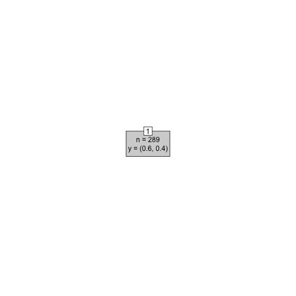

---

title       : Machine Learning with R - II
author      : Ilan Man
job         : Strategy Operations  @ Squarespace
framework   : io2012        # {io2012, html5slides, shower, dzslides, ...}
highlighter : highlight.js  # {highlight.js, prettify, highlight}
hitheme     : tomorrow      # 
widgets     : mathjax       # {mathjax, quiz, bootstrap}
mode        : selfcontained # {standalone, draft}

----

## Agenda 
<space>

1. Logistic Regression
2. Principle Component Analysis
3. Clustering
4. Trees

----

## Objectives 
<space>

1. Understand some popular algorithms and techniques
2. Learn how to tune parameters
3. Practice R

----

## Logistic Regression
# Motivation
<space>

x <- 1:10
log_ex <- data.frame(Y=c(rnorm(5,0,0.01),rnorm(5,5,0.01)),X=x)
ggplot(log_ex,aes(X,Y)) + geom_point(color='blue',size=3) + stat_smooth(method='lm',se=F,color='green',size=1)

----

## Logistic Regression
# Motivation
<space>


```r
library("MASS")
library(ggplot2)
data(menarche)
log_data <- data.frame(Y=menarche$Menarche/menarche$Total)
log_data$X <- menarche$Age

glm.out <- glm(cbind(Menarche, Total-Menarche) ~ Age,family=binomial(logit), data=menarche)
lm.out <- lm(Y~X, data=log_data)

log_data$fitted <- glm.out$fitted

data_points <- ggplot(log_data) + geom_point(aes(x=X,y=Y),color='blue',size=3)
line_points <- data_points + geom_abline(intercept = coef(lm.out)[1], slope = coef(lm.out)[2],color='green',size=1)
curve_points <- line_points + geom_line(aes(x=X,y=fitted),color='red',size=1) 
```

----

## Logistic Regression
# Notation
<space>

- type of regression to predict the probability of being in a class
  - typical to set threshold to 0.5
- assumes error terms are Binomially distributed
  - which generates 1's and 0's as the error term
- sigmoid or logistic function: $g(z) = \frac{1}{1+e^{-z}}$
  - interpret the output as $P(Y=1 | X)$
  - bounded by 0 and 1


```r
curve(1/(1+exp(-x)), from = -10, to = 10, ylab="P(Y=1|X)", col = 'red', lwd = 3.0)
abline(a=0.5, b=0, lty=2, col='blue', lwd = 3.0)
```

 

----

## Logistic Regression
# Find parameters
<space>

- The hypothesis function, $h_{\theta}(x)$, is P(Y=1|X)
- Linear Regression --> $h_{\theta}(x) = \theta x^{T}$
- Logistic Regression --> $h_{\theta}(x) = g(\theta x^{T})$ 
<br>
where $g(z) = \frac{1}{1+e^{-z}}$

----

## Logistic Regression
# Motivation
<space>

- Re-arranging $Y = \frac{1}{1+e^{-\theta x^{T}}}$ yields
<br>
<br>
$\log{\frac{Y}{1 - Y}} = \theta x^{T}$<br>
- log odds are linear in X
- this is called the logit of theta - this is linear in X

----

## Logistic Regression
# Find parameters
<space>

- So $h_{\theta}(x) = \frac{1}{1+e^{-\theta x^{T}}}$
- What is the cost function?
- Why can't we use the same cost function as before?
  - logistic residuals are Binomially distributed - not NORMAL
  - the regression function is not linear in X


----

## Logistic Regression
# Find parameters
<space>

- Define cost function as:

$cost(h_{\theta}(x)):$<br>
$= -\log(x),   y = 1$<br>
$= -\log(1-x),   y = 0$

  

----

## Logistic Regression
# Find parameters
<space>

- using statistics, it can be shown that<br>
$cost(h_{\theta}(x), y) = -y \log(h_{\theta}(x)) + (1-y) \log(1-h_{\theta}(x))$<br>
- Logistic regression cost function is then<br>
$cost(h_{\theta}(x), y)  = \frac{1}{m} \sum_{i=1}^{m} -y \log(h_{\theta}(x)) + (1-y) \log(1-h_{\theta}(x))$
- Minimize the cost

----

## Regression example
# Gradient descent
<space>

 

----

## Regression example
# Gradient descent
<space>


```r
x <- cbind(1,x)  #Add ones to x  
theta<- c(0,0)  # initalize theta vector 
m <- nrow(x)  # Number of the observations 
grad_cost <- function(X,y,theta) return(sum(((X%*%theta)- y)^2))
```

----

## Regression example
# Gradient descent
<space>


```r
gradDescent<-function(X,y,theta,iterations,alpha){
  m <- length(y)
  grad <- rep(0,length(theta))
  cost.df <- data.frame(cost=0,theta=0)
  
  for (i in 1:iterations){
    h <- X%*%theta
    grad <-  (t(X)%*%(h - y))/m
    theta <- theta - alpha * grad
    cost.df <- rbind(cost.df,c(grad_cost(X,y,theta),theta))    
  }  
  
  return(list(theta,cost.df))
}
```

----

## Regression example
# Gradient descent
<space>


```r
## initialize X, y and theta
X1<-matrix(ncol=1,nrow=nrow(df),cbind(1,df$X))
Y1<-matrix(ncol=1,nrow=nrow(df),df$Y)

init_theta<-as.matrix(c(0))
grad_cost(X1,Y1,init_theta)
```

```
[1] 5291
```

```r
iterations = 100
alpha = 0.1
results <- gradDescent(X1,Y1,init_theta,iterations,alpha)
```

----

## Regression example
# Gradient descent
<space>


```
## Error: object 'cost.df' not found
```

----

## Regression example
# Gradient descent
<space>


```r
grad_cost(X1,Y1,theta[[1]])
```

```
[1] 316.3
```

```r
## Make some predictions
intercept <- df[df$X==0,]$Y
pred <- function (x) return(intercept+c(x)%*%theta)
new_points <- c(0.1,0.5,0.8,1.1)
new_preds <- data.frame(X=new_points,Y=sapply(new_points,pred))
```

----

## Regression example
# Gradient descent
<space>


```r
ggplot(data=df,aes(x=X,y=Y))+geom_point(size=2)
```

 

```r
ggplot(data=df,aes(x=X,y=Y))+geom_point()+geom_point(data=new_preds,aes(x=X,y=Y,color='red'),size=3)+scale_colour_discrete(guide = FALSE)
```

 

----

## Regression example
# Gradient descent - summary
<space>

- minimization algorithm
- approximation, non-closed form solution
- good for large number of examples
- hard to select the right $\alpha$
- traditional looping is slow - optimization algorithms are used in practice

----

## Logistic Regression
# Motivation
<space>

# example

----

## Logistic Regression
# Motivation
<space>

# Summary

----

## Principle Component Analysis
# Motivation
<space>

- used widely in modern data analysis
- not well understood
- intuition: reduce data into only relevant dimensions
- the goal of PCA is to compute the most meaningful was to re-express noisy data, revealing the hidden structure

----

## Principle Component Analysis
# Concepts
<space>

- first big assumption: linearity
- $PX=Y$
  - $X$ is original dataset, $P$ is a transformation of $X$ into $Y$
- how do we choose $P$?
  - reduce noise
  - maximize variance

----

## Principle Component Analysis
# Concepts
<space>

- covariance matrix
     - $C = X*X^{T}$

- restated goals are
  - minimize covariance and maximize variance
  - the optimizal $C$ is a diagonal matrix, off diagonals are = 0
  
----

## Principle Component Analysis
# Concepts
<space>

- summary of assumptions
  - linearity (non-linear is a kernel PCA)
  - largest variance indicates most signal, low variance = noise
  - orthogonal components - makes the linear algebra easier
  - assumes data is normally distributed, otherwise PCA might not diagonalize matrix
    - can use ICA
    - but most data is normal and PCA is robust to slight deviance from normality

----

## Principle Component Analysis
# Eigenwhat?
<space>

- $Ax = \lambdax$
  - $\lambda$ is an eigenvalue of $A$ and $x$ is an eigenvector of $A$
- $Ax - \lambdaIx = 0$
- $(A - \lambdaI)x = 0$
- $\det(A - \lambdaI)$ = 0


----

## Principle Component Analysis
# Eigenwhat?
<space>

$\[A=\left[{\begin{array}{cc}5 & 2 \\2 & 5\\\end{array}\right ]\]$

A = matrix(c(5,2,2,5),nrow=2)
I = diag(nrow(A))
|A - L*I| = 0
det(c(5-l,2,2,5-l))
(5-l)*(5-l) - 4 = 0
25 - 10l + l^2 - 4 = 0
l^2 - 10l + 21 = 0
roots <- Re(polyroot(c(21,-10,1)))
```

----

## Principle Component Analysis
# Eigenwhat?
<space>

- when lambda = -3
Ax = 3x
5x1 + 2x2 = 3x1
2x1 + 5x2 = 3x2
x1=-x2
- one eigenvector = [1 -1]

----

## Principle Component Analysis
# Eigenwhat?
<space>

- when lambda = 7
5x1 + 2x2 = 7x1
2x2 + 5x2 = 7x2
x1 = x2
- another eigenvector = [1 1]

----

## Principle Component Analysis
# Eigenwhat?
<space>

A%*%c(1,-1) == 3 * as.matrix(c(1,-1))
A%*%c(1,1) == 7 * as.matrix(c(1,1))
roots

----

## Principle Component Analysis
# Eigenwhat?
<space>

- check
m <- matrix(c(1,-1,1,1),ncol=2)
m <- m/sqrt(norm(m))
as.matrix(m%*%diag(roots)%*%t(m))
- lambda is a diagonal matrix, with 0 off diagonals

----

## Principle Component Analysis
# Motivation
<space>

PX = Y

CY = (1/(n-1))*YYt
=PX(PX)t
=PXXtPt
=PAPt
# P is a matrix with columns that are eigenvectors
# A is a diagonalized matrix of eigenvalues (by linear algebra) and symmetric
A = EDEt

----

## Principle Component Analysis
# Motivation
<space>

# each row of P should be an eigenvector of A
P=Et
# also note that Pt = P-1 (linear algebra)
A = PtDP
CY = PPtDPPt
= (1/(n-1))*D
# D is a diagonal matrix, depending on how we choose P
# therefore CY is diagonalized

----

## Principle Component Analysis
# Example
<space>


```r
data <- read.csv('tennis_data_2013.csv')
```

```
## Warning: cannot open file 'tennis_data_2013.csv': No such file or
## directory
```

```
## Error: cannot open the connection
```

```r
data$Player1 <- as.character(data$Player1)
```

```
## Error: replacement has 0 rows, data has 6497
```

```r
data$Player2 <- as.character(data$Player2)
```

```
## Error: replacement has 0 rows, data has 6497
```

```r
tennis <- data
m <- length(data)

for (i in 10:m){
  tennis[,i] <- ifelse(is.na(data[,i]),0,data[,i])
}

str(tennis)
```

```
## 'data.frame':	6497 obs. of  13 variables:
##  $ type                : Factor w/ 2 levels "red","white": 1 1 1 1 1 1 1 1 1 1 ...
##  $ fixed.acidity       : num  7.4 7.8 7.8 11.2 7.4 7.4 7.9 7.3 7.8 7.5 ...
##  $ volatile.acidity    : num  0.7 0.88 0.76 0.28 0.7 0.66 0.6 0.65 0.58 0.5 ...
##  $ citric.acid         : num  0 0 0.04 0.56 0 0 0.06 0 0.02 0.36 ...
##  $ residual.sugar      : num  1.9 2.6 2.3 1.9 1.9 1.8 1.6 1.2 2 6.1 ...
##  $ chlorides           : num  0.076 0.098 0.092 0.075 0.076 0.075 0.069 0.065 0.073 0.071 ...
##  $ free.sulfur.dioxide : num  11 25 15 17 11 13 15 15 9 17 ...
##  $ total.sulfur.dioxide: num  34 67 54 60 34 40 59 21 18 102 ...
##  $ density             : num  0.998 0.997 0.997 0.998 0.998 ...
##  $ pH                  : num  3.51 3.2 3.26 3.16 3.51 3.51 3.3 3.39 3.36 3.35 ...
##  $ sulphates           : num  0.56 0.68 0.65 0.58 0.56 0.56 0.46 0.47 0.57 0.8 ...
##  $ alcohol             : num  9.4 9.8 9.8 9.8 9.4 9.4 9.4 10 9.5 10.5 ...
##  $ quality             : int  5 5 5 6 5 5 5 7 7 5 ...
```

```r
features <- tennis[,10:m]

head(features)
```

```
##     pH sulphates alcohol quality
## 1 3.51      0.56     9.4       5
## 2 3.20      0.68     9.8       5
## 3 3.26      0.65     9.8       5
## 4 3.16      0.58     9.8       6
## 5 3.51      0.56     9.4       5
## 6 3.51      0.56     9.4       5
```

```r
str(features)
```

```
## 'data.frame':	6497 obs. of  4 variables:
##  $ pH       : num  3.51 3.2 3.26 3.16 3.51 3.51 3.3 3.39 3.36 3.35 ...
##  $ sulphates: num  0.56 0.68 0.65 0.58 0.56 0.56 0.46 0.47 0.57 0.8 ...
##  $ alcohol  : num  9.4 9.8 9.8 9.8 9.4 9.4 9.4 10 9.5 10.5 ...
##  $ quality  : int  5 5 5 6 5 5 5 7 7 5 ...
```

```r
dim(features)
```

```
## [1] 6497    4
```

----

## Principle Component Analysis
# Example
<space>


```r
scaled_features <- as.matrix(scale(features))
Cx <- cov(scaled_features)
eigenvalues <- eigen(Cx)$values
eigenvectors <- eigen(Cx)$vectors
PC <- scaled_features %*% eigenvectors
```

----

## Principle Component Analysis
# Example
<space>


```r
Cy <- cov(PC)
sum(round(diag(Cy) - eigenvalues,5))
```

```
## [1] 0
```

```r
sum(round(Cy[upper.tri(Cy)],5)) ## off diagonals are 0 since PC's are orthogonal
```

```
## [1] 0
```

----

## Principle Component Analysis
# Example
<space>


```r
var_explained <- round(eigenvalues/sum(eigenvalues) * 100, digits = 2)
cum_var_explained <- round(cumsum(eigenvalues)/sum(eigenvalues) * 100, digits = 2)

var_explained <- as.data.frame(var_explained)
names(var_explained) <- "variance_explained"
var_explained$PC <- as.numeric(rownames(var_explained))
var_explained <- cbind(var_explained,cum_var_explained)

library(ggplot2)
ggplot(var_explained) +
  geom_bar(aes(x=PC,y=variance_explained),stat='identity') +
  geom_line(aes(x=PC,y=cum_var_explained))
```

 

----

## Principle Component Analysis
# Example
<space>


```r
pca.df <- prcomp(scaled_features)
eigenvalues == (pca.df$sdev)^2
```

```
## [1] FALSE FALSE FALSE FALSE
```

```r
eigenvectors[,1] == pca.df$rotation[,1]
```

```
##        pH sulphates   alcohol   quality 
##     FALSE     FALSE     FALSE     FALSE
```

```r
sum((eigenvectors[,1])^2)
```

```
## [1] 1
```

----

## Principle Component Analysis
# Example
<space>


```r
rows <- nrow(tennis)
pca.plot <- as.data.frame(pca.df$x[,1:2])
pca.plot$gender <- data$Gender
ggplot(data=pca.plot,aes(x=PC1,y=PC2,color=gender)) + geom_point()
```

```
## Error: object 'gender' not found
```

----

## Principle Component Analysis
# Example
<space>

- how accurate is the first PC at dividing the dataset?
gen <- ifelse(pca.df$x[,1] > abs(mean(pca.df$x[,1]))*2,"F","M")
sum(diag(table(gen,as.character(data$Gender))))/rows

----

## Principle Component Analysis
# Summary
<space>

----

## Clustering
# Motivation
<space>

- used to separate data into meaningful or useful groups (or both)
     - capture natural structure of the data
     - useful starting point for further analysis
- customer segmentation
- cluster for utility
     - summarizing data for less expensive computation
     - data compression
     - nearest neighbors - distance between two cluster centers (centroids)

----

## Clustering
# Motivation
<space>

- types of clusters
     - data points that are more similar to one another than points outside of the cluster - most intuitive definition
     - prototype-based: each data point is more similar to the prototype, i.e. center, of the cluster than the prototype of other clusters. Often a centroid, i.e. mean.
     - density based clusters: where the density is highest, that is a cluster. Works well for data with noise and outliers. Clusters separated by noise.

----

## Clustering
# Kmeans
<space>

- k-means
     - prototype, partitional based
     - choose K initial centroids/clusters
     - points are assigned to the closest centroid
     - centroid is then updated based on the points in that cluster
     - update steps until no point changes or centroids remain the same

----

## Clustering
# Kmeans
<space>

1. Select K points as initial centroids. 
2. repeat
3.     Form K clusters by assigning each point to its closest centroid.
4.     Recompute the centroid of each cluster. 
5. until Centroids do not change, or change very minimally, i.e. <1%


3. Use similarity measures such as Euclidean or cosine similarity depending on the data
4. Minimize the squared distance of each point to closest centroid, minimize the objective function
     - the centroid that minimizes the SSE of the cluster is the mean
     - Kmeans leads to local minimum, not global, since you’re optimizing based on the centroids you chose, not all possible centroids

----

## Clustering
# Kmeans
<space>

- choose K randomly - can lead to poor centroids
     - run k-means multiple times - still doesn’t solve problems

- can reduce the total SSE by increasing the K
     - can increase the cluster with largest SSE
- can decrease K and minimize SSE
     - split up a cluster into other clusters. the centroid that is split will increase total SSE the least
- bisecting K means
     - less susceptible to initialization problems
     - split points into 2 clusters
          - take cluster with largest SSE - split that into two clusters
     - rerun bisecting K mean on resulting clusters
     - stop when you have K clusters

----

## Clustering
# Kmeans
<space>

- K mean fails
     - if some clusters are much bigger than other clusters - it cannot distinguish between natural clusters
     - if clusters have different densities, K means cannot tell 
     - distance metric doesn’t account for non-globular clusters, i.e. if they follow a distribution
- K means will still work if user accepts sub clusters of the natural cluster
- strengths
     - simple, efficient computationally
     - not useful for non-globular, different density, different sized data
     - outlier detection and removal can help address outlier problem
- can derive K mean algorithm using gradient descent
     - can use calculus to show that the mean of the cluster is the best choice of centroid, i.e. minimizes SSE

----

## Clustering
# Kmeans
<space>

tennis_kmean <- kmeans(features, centers=5)

# K MEANS DOES A GOOD JOB IN CLUSTERING GENDERS
table(tennis$Gender,tennis_kmean$cluster)

----

## Clustering
# Kmeans animation
<space>

# animate kmean algorithm
install.packages('animation')
library(animation)

oopt = ani.options(interval = 1)
## the kmeans() example; very fast to converge!
ani_ex = rbind(matrix(rnorm(100, sd = 0.3), ncol = 2), 
          matrix(rnorm(100, sd = 0.3), 
          ncol = 2))
colnames(ani_ex) = c("x", "y")

kmeans.an = function(
  x = cbind(X1 = runif(50), X2 = runif(50)), centers = 4, hints = c('Move centers!', 'Find cluster?'),
  pch = 1:5, col = 1:5
) {
  x = as.matrix(x)
  ocluster = sample(centers, nrow(x), replace = TRUE)
  if (length(centers) == 1) centers = x[sample(nrow(x), centers), ] else
    centers = as.matrix(centers)
  numcent = nrow(centers)
  dst = matrix(nrow = nrow(x), ncol = numcent)
  j = 1
  pch = rep(pch, length = numcent)
  col = rep(col, length = numcent)
  
  for (j in 1:ani.options('nmax')) {
    dev.hold()
    plot(x, pch = pch[ocluster], col = col[ocluster], panel.first = grid())
    mtext(hints[1], 4)
    points(centers, pch = pch[1:numcent], cex = 3, lwd = 2, col = col[1:numcent])
    ani.pause()
    for (i in 1:numcent) {
      dst[, i] = sqrt(apply((t(t(x) - unlist(centers[i, ])))^2, 1, sum))
    }
    ncluster = apply(dst, 1, which.min)
    plot(x, type = 'n')
    mtext(hints[2], 4)
    grid()
    ocenters = centers
    for (i in 1:numcent) {
      xx = subset(x, ncluster == i)
      polygon(xx[chull(xx), ], density = 10, col = col[i], lty = 2)
      points(xx, pch = pch[i], col = col[i])
      centers[i, ] = apply(xx, 2, mean)
    }
    points(ocenters, cex = 3, col = col[1:numcent], pch = pch[1:numcent], lwd = 2)
    ani.pause()
    if (all(ncluster == ocluster)) break
    ocluster = ncluster
  }
  invisible(list(cluster = ncluster, centers = centers))
}

kmeans.an(ani_ex, centers = 5, hints = c("Move centers","Cluster found?"))

----

## Clustering
# DBSCAN
<space>

- density based
     - center based approach to finding density
     - count the number of points within some radius of a point, the radius is call Eps
     - if Eps is too big, there will be m points, if eps is too small, there will be 1 point
     - core point has X points within a radius of Eps, border points are within a radius of Eps of core point, and noise points are not within Eps of border or core points
     - if p is density connected to q, they are part of the same cluster, if not, then they are not; if p is not density connected to any other point, its considered noise
     
----

## Clustering
# DBSCAN
<space>


```r
x <- c(2,2,8,5,7,6,1,4)
y <- c(10,5,4,8,5,4,2,9)
cluster <- data.frame(X=c(x,2*x,3*x),Y=c(y,-2*x,1/4*y))
plot(cluster)
```

 

----

## Clustering
# DBSCAN
<space>


```r
library(fpc)
cluster_DBSCAN<-dbscan(cluster, eps=3, MinPts=2, method="hybrid")
plot(cluster_DBSCAN, cluster, main="Clustering using DBSCAN algorithm (eps=3, MinPts=3)")
```

 

----

## Clustering
# Summary
<space>

----

## Trees
# Motivation
<space>

- A root node that has no incoming edges and zero or more outgoing edges.
- Internal nodes, each of which has exactly one incoming edge and two or more outgoing edges
- Leaf or terminal nodes, each of which has exactly one incoming edge and no outgoing edges. 

- The non- terminal nodes, which include the root and other internal nodes, contain attribute test conditions to separate records that have different characteristics

- trees work best with categorical values
- descriptions are disjoint
- trees are robust to data errors
- training data is missing values

----

## Trees
# Algorithm(s)
<space>

ID3
C4.5
C5.0

----

## Trees
# Entropy calculation
<space>

- The entropy of a sample of data indicates how mixed the class values are; the minimum value of 0 indicates that the sample is completely homogenous, while 1 indicates the maximum amount of disorder.

entropy_function <- function(p) {

  if (min(p) < 0 || sum(p) <= 0) {
    return(NA)
  } else {
    p.norm <- p[p>0]/sum(p)
    -sum(log2(p.norm)*p.norm)
    }
}

----

## Trees
# Entropy calculation
<space>

- InfoGain = Entropy (pre split) - Entropy (post split)
     - Entropy is weighted by the Entropy of each feature split
 - avoid pre-pruning because its impossible to know if the tree will miss subtle but important patterns in the data (if you prune too early)
- hard to know optimal length of tree without growing it there first

----

## Trees
# Entropy calculation
<space>

- Entropy = expected amount of information contained in a random variable -> information is synonymous with "bits" which is why is log, base 2 
     - the more a feature splits the data in obvious ways, the less informative it is for us, entropy is lower
     - the more the feature splits the data, the higher the entropy and hence information gained by splitting at that feature
     - Entropy is minimized when one of the events has a P(X)=1
     - Entropy is maximized when each event has a P(X)=1/n of happening


----

## Trees
# Entropy calculation
<space>


----

## Trees
# Example
<space>


```r
voting_data <- read.csv('http://archive.ics.uci.edu/ml/machine-learning-databases/voting-records/house-votes-84.data')
str(voting_data)
names(voting_data) <- c('party','handicapped-infants','water-project-cost-sharing',
                        'adoption-of-the-budget-resolution','physician-fee-freeze',
                        'el-salvador-aid','religious-groups-in-schools',
                        'anti-satellite-test-ban','aid-to-nicaraguan-contras',
                        'mx-missile','immigration','synfuels-corporation-cutback',
                        'education-spending','superfund-right-to-sue','crime',
                        'duty-free-exports','export-administration-act-south-africa')


prop.table(table(voting_data[,1]))
n <- nrow(voting_data)
train_ind <- sample(n,2/3*n)
voting_train <- voting_data[train_ind,]
voting_test <- voting_data[-train_ind,]
```

----

## Trees
# Example
<space>

         party handicapped-infants water-project-cost-sharing
6     democrat                   n                          y
247 republican                   n                          y
270   democrat                   y                          y
100   democrat                   y                          n
389   democrat                   y                          n
47    democrat                   y                          n
    adoption-of-the-budget-resolution physician-fee-freeze el-salvador-aid
6                                   n                    y               y
247                                 n                    y               y
270                                 y                    n               n
100                                 n                    n               y
389                                 y                    n               n
47                                  y                    n               n
    religious-groups-in-schools anti-satellite-test-ban
6                             y                       n
247                           y                       ?
270                           n                       y
100                           y                       n
389                           n                       y
47                            n                       y
    aid-to-nicaraguan-contras mx-missile immigration
6                           n          n           n
247                         n          n           n
270                         y          y           n
100                         n          n           n
389                         y          y           ?
47                          y          ?           n
    synfuels-corporation-cutback education-spending superfund-right-to-sue
6                              n                  n                      ?
247                            n                  ?                      y
270                            n                  n                      n
100                            y                  y                      n
389                            y                  n                      n
47                             n                  n                      n
    crime duty-free-exports export-administration-act-south-africa
6       y                 y                                      y
247     y                 n                                      n
270     n                 y                                      y
100     y                 n                                      y
389     n                 y                                      ?
47      n                 n                                      ?
 

----

## Trees
# Example
<space>


```r
# make tree using C5.0
tree_model <- C5.0(voting_train[,-1],voting_train[,1], trials=1)
tree_predict <- predict(tree_model, newdata=voting_test[,-1])
conf <- CrossTable(voting_test[,1], tree_predict, prop.chisq = FALSE,
                   prop.c = FALSE, prop.r = FALSE,
                   dnn = c("actual class", "predicted class"))
```

```
## 
##  
##    Cell Contents
## |-------------------------|
## |                       N |
## |         N / Table Total |
## |-------------------------|
## 
##  
## Total Observations in Table:  145 
## 
##  
##              | predicted class 
## actual class |   democrat | republican |  Row Total | 
## -------------|------------|------------|------------|
##     democrat |         88 |          4 |         92 | 
##              |      0.607 |      0.028 |            | 
## -------------|------------|------------|------------|
##   republican |          4 |         49 |         53 | 
##              |      0.028 |      0.338 |            | 
## -------------|------------|------------|------------|
## Column Total |         92 |         53 |        145 | 
## -------------|------------|------------|------------|
## 
## 
```

----

## Trees
# Example
<space>


```r
# most important variables
C5imp(tree_model)
```

```
##                                        Overall
## physician-fee-freeze                     97.92
## synfuels-corporation-cutback             40.83
## adoption-of-the-budget-resolution        10.03
## handicapped-infants                       0.00
## water-project-cost-sharing                0.00
## el-salvador-aid                           0.00
## religious-groups-in-schools               0.00
## anti-satellite-test-ban                   0.00
## aid-to-nicaraguan-contras                 0.00
## mx-missile                                0.00
## immigration                               0.00
## education-spending                        0.00
## superfund-right-to-sue                    0.00
## crime                                     0.00
## duty-free-exports                         0.00
## export-administration-act-south-africa    0.00
```

```r
# in-sample error rate
summary(tree_model)
```

```
## 
## Call:
## C5.0.default(x = voting_train[, -1], y = voting_train[, 1], trials = 1)
## 
## 
## C5.0 [Release 2.07 GPL Edition]  	Thu Aug  7 08:16:35 2014
## -------------------------------
## 
## Class specified by attribute `outcome'
## 
## Read 289 cases (17 attributes) from undefined.data
## 
## Decision tree:
## 
## physician-fee-freeze in {?,n}: democrat (169.5/3.2)
## physician-fee-freeze = y:
## :...synfuels-corporation-cutback in {?,n}: republican (95.5/1.3)
##     synfuels-corporation-cutback = y:
##     :...adoption-of-the-budget-resolution in {?,n}: republican (20.7/4)
##         adoption-of-the-budget-resolution = y: democrat (3.3)
## 
## 
## Evaluation on training data (289 cases):
## 
## 	    Decision Tree   
## 	  ----------------  
## 	  Size      Errors  
## 
## 	     4    9( 3.1%)   <<
## 
## 
## 	   (a)   (b)    <-classified as
## 	  ----  ----
## 	   170     5    (a): class democrat
## 	     4   110    (b): class republican
## 
## 
## 	Attribute usage:
## 
## 	 97.92%	physician-fee-freeze
## 	 40.83%	synfuels-corporation-cutback
## 	 10.03%	adoption-of-the-budget-resolution
## 
## 
## Time: 0.0 secs
```

----

## Trees
# Example - Boosting
<space>

- rooted in the notion that by combining a number of weak performing learners, 
- you can create a team that is much stronger than any one of the learners alone.
- this is where C5.0 improves on C4.5

----

## Trees
# Example - Boosting
<space>


```r
boosted_tree_model <- C5.0(voting_train[,-1],voting_train[,1], trials=25)
boosted_tennis_predict <- predict(boosted_tree_model,voting_test[,-1])

boosted_conf <- CrossTable(voting_test[,1], boosted_tennis_predict, prop.chisq = FALSE,
                           prop.c = FALSE, prop.r = FALSE, 
                           dnn = c("actual class", "predicted class"))
```


 
   Cell Contents
|-------------------------|
|                       N |
|         N / Table Total |
|-------------------------|

 
Total Observations in Table:  145 

 
             | predicted class 
actual class |   democrat | republican |  Row Total | 
-------------|------------|------------|------------|
    democrat |         85 |          7 |         92 | 
             |      0.586 |      0.048 |            | 
-------------|------------|------------|------------|
  republican |          2 |         51 |         53 | 
             |      0.014 |      0.352 |            | 
-------------|------------|------------|------------|
Column Total |         87 |         58 |        145 | 
-------------|------------|------------|------------|

 

```r
# in-sample error rate
summary(boosted_tree_model)
```


Call:
C5.0.default(x = voting_train[, -1], y = voting_train[, 1], trials = 25)


C5.0 [Release 2.07 GPL Edition]  	Thu Aug  7 08:16:35 2014
-------------------------------

Class specified by attribute `outcome'

Read 289 cases (17 attributes) from undefined.data

-----  Trial 0:  -----

Decision tree:

physician-fee-freeze in {?,n}: democrat (169.5/3.2)
physician-fee-freeze = y:
:...synfuels-corporation-cutback in {?,n}: republican (95.5/1.3)
    synfuels-corporation-cutback = y:
    :...adoption-of-the-budget-resolution in {?,n}: republican (20.7/4)
        adoption-of-the-budget-resolution = y: democrat (3.3)

-----  Trial 1:  -----

Decision tree:

adoption-of-the-budget-resolution = ?: democrat (0)
adoption-of-the-budget-resolution = n:
:...synfuels-corporation-cutback in {?,n}: republican (101.1/13.1)
:   synfuels-corporation-cutback = y: democrat (56.3/14.6)
adoption-of-the-budget-resolution = y:
:...physician-fee-freeze in {?,n}: democrat (122.1/7.2)
    physician-fee-freeze = y: republican (9.5/1.7)

-----  Trial 2:  -----

Decision tree:

adoption-of-the-budget-resolution in {?,y}: democrat (109.7/12.1)
adoption-of-the-budget-resolution = n:
:...education-spending = n: democrat (63.1/19.9)
    education-spending in {?,y}: republican (116.2/17.4)

-----  Trial 3:  -----

Decision tree:

physician-fee-freeze in {?,n}: democrat (128.1/21.8)
physician-fee-freeze = y:
:...water-project-cost-sharing in {?,n}: republican (51.2)
    water-project-cost-sharing = y:
    :...superfund-right-to-sue = n: democrat (17.4/1.5)
        superfund-right-to-sue in {?,y}: republican (92.4/22.6)

-----  Trial 4:  -----

Decision tree:

crime in {?,n}: democrat (63.3/6.8)
crime = y:
:...synfuels-corporation-cutback in {?,n}: republican (130.3/35.2)
    synfuels-corporation-cutback = y: democrat (95.4/36.7)

-----  Trial 5:  -----

Decision tree:

physician-fee-freeze in {?,n}: democrat (123.8/30.1)
physician-fee-freeze = y:
:...water-project-cost-sharing in {?,n}: republican (39.5)
    water-project-cost-sharing = y:
    :...duty-free-exports in {?,n}: republican (85.3/26.2)
        duty-free-exports = y: democrat (40.3/8.5)

-----  Trial 6:  -----

Decision tree:

crime in {?,n}: democrat (46.5/7.7)
crime = y:
:...adoption-of-the-budget-resolution = ?: republican (0)
    adoption-of-the-budget-resolution = y: democrat (66.1/20.9)
    adoption-of-the-budget-resolution = n:
    :...water-project-cost-sharing in {?,n}: republican (67.1/9.9)
        water-project-cost-sharing = y:
        :...superfund-right-to-sue in {?,n}: democrat (23.5/2.1)
            superfund-right-to-sue = y: republican (85.8/33.7)

-----  Trial 7:  -----

Decision tree:

physician-fee-freeze in {?,n}: democrat (116.9/32.4)
physician-fee-freeze = y:
:...water-project-cost-sharing in {?,n}: republican (39.1)
    water-project-cost-sharing = y:
    :...superfund-right-to-sue = ?: republican (0)
        superfund-right-to-sue = n: democrat (20.2/3.4)
        superfund-right-to-sue = y:
        :...education-spending = n: democrat (51/18.5)
            education-spending in {?,y}: republican (61.8/11.8)

-----  Trial 8:  -----

Decision tree:

synfuels-corporation-cutback in {?,n}: republican (167.1/50.2)
synfuels-corporation-cutback = y: democrat (121.9/42.5)

-----  Trial 9:  -----

Decision tree:

physician-fee-freeze = ?: republican (0)
physician-fee-freeze = n: democrat (125.8/35.1)
physician-fee-freeze = y:
:...water-project-cost-sharing in {?,n}: republican (29.6)
    water-project-cost-sharing = y:
    :...superfund-right-to-sue = n: democrat (14.3/2.4)
        superfund-right-to-sue in {?,y}: republican (119.4/40.8)

-----  Trial 10:  -----

Decision tree:

crime in {?,n}: democrat (49.5/8.2)
crime = y:
:...synfuels-corporation-cutback in {?,n}: republican (136.4/43.8)
    synfuels-corporation-cutback = y: democrat (103/35)

-----  Trial 11:  -----

Decision tree:

adoption-of-the-budget-resolution in {?,y}: democrat (105.2/24.1)
adoption-of-the-budget-resolution = n:
:...duty-free-exports in {?,n}: republican (121.3/36.3)
    duty-free-exports = y: democrat (62.5/25.3)

-----  Trial 12:  -----

Decision tree:

physician-fee-freeze in {?,n}: democrat (120.9/37)
physician-fee-freeze = y:
:...water-project-cost-sharing in {?,n}: republican (32.3)
    water-project-cost-sharing = y:
    :...el-salvador-aid = ?: republican (0)
        el-salvador-aid = n: democrat (13.7/2.3)
        el-salvador-aid = y:
        :...anti-satellite-test-ban = n: democrat (100.3/45.6)
            anti-satellite-test-ban in {?,y}: republican (21.8)

-----  Trial 13:  -----

Decision tree:

physician-fee-freeze = ?: republican (0)
physician-fee-freeze = n: democrat (109.5/38.2)
physician-fee-freeze = y:
:...water-project-cost-sharing in {?,n}: republican (27.4)
    water-project-cost-sharing = y:
    :...superfund-right-to-sue = ?: republican (0)
        superfund-right-to-sue = n: democrat (10.4/1.3)
        superfund-right-to-sue = y:
        :...duty-free-exports in {?,n}: republican (102.4/23)
            duty-free-exports = y: democrat (39.3/15.1)

-----  Trial 14:  -----

Decision tree:

adoption-of-the-budget-resolution in {?,n}: republican (190.4/62.9)
adoption-of-the-budget-resolution = y: democrat (98.6/30.4)

-----  Trial 15:  -----

Decision tree:

synfuels-corporation-cutback = ?: republican (0)
synfuels-corporation-cutback = y: democrat (122.6/39.7)
synfuels-corporation-cutback = n:
:...physician-fee-freeze = n: democrat (86.2/38.9)
    physician-fee-freeze in {?,y}: republican (80.2/11.3)

-----  Trial 16:  -----

Decision tree:

crime = ?: republican (0)
crime = n: democrat (32.3/8.2)
crime = y:
:...anti-satellite-test-ban in {?,y}: republican (96.3/21.5)
    anti-satellite-test-ban = n:
    :...physician-fee-freeze in {?,n}: democrat (27.4/0.8)
        physician-fee-freeze = y:
        :...water-project-cost-sharing in {?,n}: republican (20.8)
            water-project-cost-sharing = y:
            :...adoption-of-the-budget-resolution in {?,
                :                                     n}: republican (87.9/30.3)
                adoption-of-the-budget-resolution = y: democrat (24.3/0.9)

-----  Trial 17:  -----

Decision tree:

physician-fee-freeze in {?,n}: democrat (127.1/35)
physician-fee-freeze = y:
:...water-project-cost-sharing in {?,n}: republican (24)
    water-project-cost-sharing = y:
    :...education-spending = n: democrat (66/22.3)
        education-spending in {?,y}: republican (71.9/17.1)

-----  Trial 18:  -----

Decision tree:

adoption-of-the-budget-resolution = ?: republican (0)
adoption-of-the-budget-resolution = y: democrat (99.3/28.1)
adoption-of-the-budget-resolution = n:
:...water-project-cost-sharing in {?,n}: republican (63.3/13.8)
    water-project-cost-sharing = y:
    :...physician-fee-freeze = ?: republican (0)
        physician-fee-freeze = n: democrat (15.7/0.7)
        physician-fee-freeze = y:
        :...superfund-right-to-sue = n: democrat (13.6/0.7)
            superfund-right-to-sue in {?,y}: republican (97/26.3)

-----  Trial 19:  -----

Decision tree:

physician-fee-freeze = ?: republican (0)
physician-fee-freeze = n: democrat (112.4/34)
physician-fee-freeze = y:
:...water-project-cost-sharing in {?,n}: republican (32.2)
    water-project-cost-sharing = y:
    :...synfuels-corporation-cutback in {?,n}: republican (61/13.7)
        synfuels-corporation-cutback = y: democrat (83.4/33.8)

-----  Trial 20:  -----

Decision tree:

physician-fee-freeze = ?: republican (0)
physician-fee-freeze = n: democrat (103.4/38.2)
physician-fee-freeze = y:
:...water-project-cost-sharing in {?,n}: republican (26.6)
    water-project-cost-sharing = y:
    :...el-salvador-aid = ?: republican (0)
        el-salvador-aid = n: democrat (9.7/1.4)
        el-salvador-aid = y:
        :...anti-satellite-test-ban in {?,y}: republican (30)
            anti-satellite-test-ban = n:
            :...adoption-of-the-budget-resolution = ?: republican (0)
                adoption-of-the-budget-resolution = y: democrat (15.8/0.4)
                adoption-of-the-budget-resolution = n:
                :...duty-free-exports in {?,n}: republican (86.3/18.6)
                    duty-free-exports = y: democrat (17.1/1.8)

-----  Trial 21:  -----

Decision tree:

synfuels-corporation-cutback in {?,n}: republican (155.4/42)
synfuels-corporation-cutback = y:
:...adoption-of-the-budget-resolution in {?,y}: democrat (24.5/0.4)
    adoption-of-the-budget-resolution = n:
    :...superfund-right-to-sue in {?,n}: democrat (25.6/1.5)
        superfund-right-to-sue = y: republican (83.5/30.7)

-----  Trial 22:  -----

Decision tree:

adoption-of-the-budget-resolution = ?: republican (0)
adoption-of-the-budget-resolution = n:
:...synfuels-corporation-cutback in {?,n}: republican (84/17.1)
:   synfuels-corporation-cutback = y: democrat (102.3/46.9)
adoption-of-the-budget-resolution = y:
:...physician-fee-freeze in {?,n}: democrat (64.5/3.1)
    physician-fee-freeze = y: republican (37.2/10.1)

-----  Trial 23:  -----

Decision tree:

physician-fee-freeze = ?: republican (0)
physician-fee-freeze = n: democrat (132/42.8)
physician-fee-freeze = y:
:...synfuels-corporation-cutback in {?,n}: republican (38/0.2)
    synfuels-corporation-cutback = y:
    :...adoption-of-the-budget-resolution = ?: republican (0)
        adoption-of-the-budget-resolution = y: democrat (13.3/0.2)
        adoption-of-the-budget-resolution = n:
        :...education-spending = n: democrat (34.4/9.7)
            education-spending in {?,y}: republican (70.3/10.1)

-----  Trial 24:  -----

Decision tree:

religious-groups-in-schools = ?: republican (0)
religious-groups-in-schools = n: democrat (36.8/3.8)
religious-groups-in-schools = y:
:...export-administration-act-south-africa = ?: republican (0)
    export-administration-act-south-africa = n: democrat (71.9/21.6)
    export-administration-act-south-africa = y:
    :...el-salvador-aid = n: democrat (24/5)
        el-salvador-aid in {?,y}: republican (154.3/32.8)


Evaluation on training data (289 cases):

Trial	    Decision Tree   
-----	  ----------------  
	  Size      Errors  

   0	     4    9( 3.1%)
   1	     4   27( 9.3%)
   2	     3   26( 9.0%)
   3	     4    8( 2.8%)
   4	     3   41(14.2%)
   5	     4   10( 3.5%)
   6	     5   26( 9.0%)
   7	     5   11( 3.8%)
   8	     2  103(35.6%)
   9	     4    7( 2.4%)
  10	     3   41(14.2%)
  11	     3   26( 9.0%)
  12	     5   46(15.9%)
  13	     5    9( 3.1%)
  14	     2   31(10.7%)
  15	     3   20( 6.9%)
  16	     6   36(12.5%)
  17	     4   12( 4.2%)
  18	     5   18( 6.2%)
  19	     4   14( 4.8%)
  20	     7    5( 1.7%)
  21	     4   86(29.8%)
  22	     4   26( 9.0%)
  23	     5    5( 1.7%)
  24	     4   82(28.4%)
boost	          4( 1.4%)   <<


	   (a)   (b)    <-classified as
	  ----  ----
	   173     2    (a): class democrat
	     2   112    (b): class republican


	Attribute usage:

	 98.62%	religious-groups-in-schools
	 98.27%	adoption-of-the-budget-resolution
	 97.92%	physician-fee-freeze
	 96.19%	crime
	 95.85%	synfuels-corporation-cutback
	 58.48%	anti-satellite-test-ban
	 57.79%	el-salvador-aid
	 50.52%	export-administration-act-south-africa
	 43.94%	water-project-cost-sharing
	 43.60%	education-spending
	 42.91%	duty-free-exports
	 29.07%	superfund-right-to-sue


Time: 0.0 secs

----

## Trees
# Example - Error Cost
<space>

- still getting too many false positives (predict republican but actually democrat)
- introduce higher cost to getting this wrong


```r
error_cost <- matrix(c(0,1,2,0),nrow=2)
cost_model <- C5.0(voting_train[,-1],voting_train[,1], trials=1, costs = error_cost)
```

```
## Warning: 
## no dimnames were given for the cost matrix; the factor levels will be used
```

```r
cost_predict <- predict(cost_model, newdata=voting_test[,-1])
conf <- CrossTable(voting_test[,1], cost_predict, prop.chisq = FALSE,
                   prop.c = FALSE, prop.r = FALSE,
                   dnn = c("actual class", "predicted class"))
```

```
## 
##  
##    Cell Contents
## |-------------------------|
## |                       N |
## |         N / Table Total |
## |-------------------------|
## 
##  
## Total Observations in Table:  145 
## 
##  
##              | predicted class 
## actual class |   democrat | republican |  Row Total | 
## -------------|------------|------------|------------|
##     democrat |         86 |          6 |         92 | 
##              |      0.593 |      0.041 |            | 
## -------------|------------|------------|------------|
##   republican |          3 |         50 |         53 | 
##              |      0.021 |      0.345 |            | 
## -------------|------------|------------|------------|
## Column Total |         89 |         56 |        145 | 
## -------------|------------|------------|------------|
## 
## 
```

----

## Trees
# Example - Error Cost
<space>


```r
tris <- seq(1,50,by=2)
boost_acc <- NULL
for (i in tris){  
  temp <- C5.0(voting_train[,-1],voting_train[,1], trials=i, costs = error_cost)
  temp_pred <- predict(temp,voting_test[,-1])
  boost_acc <- append(boost_acc,sum(diag(table(temp_pred,voting_test[,1]))))
}
```

```
## Warning: 
## no dimnames were given for the cost matrix; the factor levels will be used
## 
## Warning: 
## no dimnames were given for the cost matrix; the factor levels will be used
## 
## Warning: 
## no dimnames were given for the cost matrix; the factor levels will be used
## 
## Warning: 
## no dimnames were given for the cost matrix; the factor levels will be used
## 
## Warning: 
## no dimnames were given for the cost matrix; the factor levels will be used
## 
## Warning: 
## no dimnames were given for the cost matrix; the factor levels will be used
## 
## Warning: 
## no dimnames were given for the cost matrix; the factor levels will be used
## 
## Warning: 
## no dimnames were given for the cost matrix; the factor levels will be used
## 
## Warning: 
## no dimnames were given for the cost matrix; the factor levels will be used
## 
## Warning: 
## no dimnames were given for the cost matrix; the factor levels will be used
## 
## Warning: 
## no dimnames were given for the cost matrix; the factor levels will be used
## 
## Warning: 
## no dimnames were given for the cost matrix; the factor levels will be used
## 
## Warning: 
## no dimnames were given for the cost matrix; the factor levels will be used
## 
## Warning: 
## no dimnames were given for the cost matrix; the factor levels will be used
## 
## Warning: 
## no dimnames were given for the cost matrix; the factor levels will be used
## 
## Warning: 
## no dimnames were given for the cost matrix; the factor levels will be used
## 
## Warning: 
## no dimnames were given for the cost matrix; the factor levels will be used
## 
## Warning: 
## no dimnames were given for the cost matrix; the factor levels will be used
## 
## Warning: 
## no dimnames were given for the cost matrix; the factor levels will be used
## 
## Warning: 
## no dimnames were given for the cost matrix; the factor levels will be used
## 
## Warning: 
## no dimnames were given for the cost matrix; the factor levels will be used
## 
## Warning: 
## no dimnames were given for the cost matrix; the factor levels will be used
## 
## Warning: 
## no dimnames were given for the cost matrix; the factor levels will be used
## 
## Warning: 
## no dimnames were given for the cost matrix; the factor levels will be used
## 
## Warning: 
## no dimnames were given for the cost matrix; the factor levels will be used
```

```r
plot(boost_acc,type='l')
```

 

----

## Trees
# Pros and Cons
<space>

- trees are non-parametric, rule based classification or regression method
- simple to understand and interpret
- little data preparation
- easy to overfit (need to prune to avoid that, or have max tree depth)
- usually finds local optimum. Can mitigate this with an ensemble of trees
- difficult concepts that are not easily expressed by trees (XOR) are hard to learn
- for class imbalance, trees can be biased - should balance dataset before fitting
- trees tend to overfit, so use PCA beforehand

----

## Resources
<space>

- [Machine Learning with R](http://www.packtpub.com/machine-learning-with-r/book)
- [Machine Learning for Hackers](http://shop.oreilly.com/product/0636920018483.do)
- [Elements of Statistical Learning](http://web.stanford.edu/~hastie/local.ftp/Springer/OLD/ESLII_print4.pdf)

----
