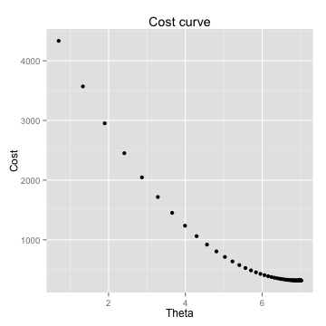
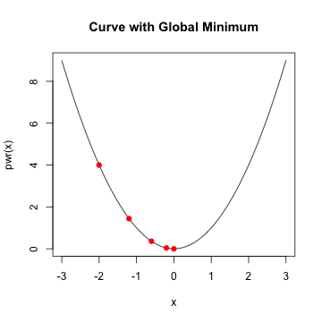

---

title       : Machine Learning with R - II
author      : Ilan Man
job         : Strategy Operations  @ Squarespace
framework   : io2012        # {io2012, html5slides, shower, dzslides, ...}
highlighter : highlight.js  # {highlight.js, prettify, highlight}
hitheme     : tomorrow      # 
widgets     : mathjax       # {mathjax, quiz, bootstrap}
mode        : selfcontained # {standalone, draft}

----

## Agenda 
<space>

1. Logistic Regression
2. Principle Component Analysis
3. Clustering
4. Trees

----

## Objectives 
<space>

1. Understand some popular algorithms and techniques
2. Learn how to tune parameters
3. Practice R

----

## Logistic Regression
# Motivation
<space>


```r
x <- 1:10
log_ex <- data.frame(Y=c(rnorm(5,0,0.01),rnorm(5,5,0.01)),X=x)
ggplot(log_ex,aes(X,Y)) + geom_point(color='blue',size=3) + stat_smooth(method='lm',se=F,color='green',size=1)
```

 

----

## Logistic Regression
# Motivation
<space>


```r
library("MASS")
library(ggplot2)
data(menarche)
log_data <- data.frame(Y=menarche$Menarche/menarche$Total)
log_data$X <- menarche$Age

glm.out <- glm(cbind(Menarche, Total-Menarche) ~ Age,family=binomial(logit), data=menarche)
lm.out <- lm(Y~X, data=log_data)

log_data$fitted <- glm.out$fitted

data_points <- ggplot(log_data) + geom_point(aes(x=X,y=Y),color='blue',size=3)
line_points <- data_points + geom_abline(intercept = coef(lm.out)[1], slope = coef(lm.out)[2],color='green',size=1)
curve_points <- line_points + geom_line(aes(x=X,y=fitted),color='red',size=1) 
```

----

## Logistic Regression
# Notation
<space>

- type of regression to predict the probability of being in a class
  - typical to set threshold to 0.5
- assumes error terms are Binomially distributed
  - which generates 1's and 0's as the error term
- sigmoid or logistic function: $g(z) = \frac{1}{1+e^{-z}}$
  - interpret the output as $P(Y=1 | X)$
  - bounded by 0 and 1

----

## Logistic Regression
# Notation
<space>


```r
curve(1/(1+exp(-x)), from = -10, to = 10, ylab="P(Y=1|X)", col = 'red', lwd = 3.0)
abline(a=0.5, b=0, lty=2, col='blue', lwd = 3.0)
```

 

----

## Logistic Regression
# Find parameters
<space>

- The hypothesis function, $h_{\theta}(x)$, is P(Y=1|X)
- Linear Regression --> $h_{\theta}(x) = \theta x^{T}$
- Logistic Regression --> $h_{\theta}(x) = g(\theta x^{T})$ 
<br>
where $g(z) = \frac{1}{1+e^{-z}}$

----

## Logistic Regression
# Notation
<space>

- Re-arranging $Y = \frac{1}{1+e^{-\theta x^{T}}}$ yields $\log{\frac{Y}{1 - Y}} = \theta x^{T}$<br>
- "log odds"" are linear in X
- this is called the logit of theta
  - links X linearly with some function of Y

----

## Logistic Regression
# Find parameters
<space>

- So $h_{\theta}(x) = \frac{1}{1+e^{-\theta x^{T}}}$
- What is the cost function?
- Why can't we use the same cost function as for the linear hypothesis?
  - logistic residuals are Binomially distributed - not Normal
  - the regression function is not linear in X

----

## Logistic Regression
# Find parameters
<space>

- Define logistic cost function as:

$cost(h_{\theta}(x)):$<br>
&nbsp;&nbsp; $= -\log(x),$ &nbsp;&nbsp;&nbsp;  $y = 1$<br>
&nbsp;&nbsp; $= -\log(1-x),$ &nbsp;   $y = 0$

  

----

## Logistic Regression
# Find parameters
<space>

- using statistics, it can be shown that<br>
$cost(h_{\theta}(x), y) = -y \log(h_{\theta}(x)) + (1-y) \log(1-h_{\theta}(x))$<br>

----

## Logistic Regression
# Find parameters
<space>

- using statistics, it can be shown that<br>
$cost(h_{\theta}(x), y) = -y \log(h_{\theta}(x)) + (1-y) \log(1-h_{\theta}(x))$<br>
- Logistic regression cost function is then<br>
$cost(h_{\theta}(x), y)  = \frac{1}{m} \sum_{i=1}^{m} -y \log(h_{\theta}(x)) + (1-y) \log(1-h_{\theta}(x))$

----

## Logistic Regression
# Find parameters
<space>

- using statistics, it can be shown that<br>
$cost(h_{\theta}(x), y) = -y \log(h_{\theta}(x)) + (1-y) \log(1-h_{\theta}(x))$<br>
- Logistic regression cost function is then<br>
$cost(h_{\theta}(x), y)  = \frac{1}{m} \sum_{i=1}^{m} -y \log(h_{\theta}(x)) + (1-y) \log(1-h_{\theta}(x))$
- Minimize the cost

----

## Logistic Regression
# Gradient descent
<space>

 

----

## Logistic Regression
# Gradient descent
<space>


```r
x <- cbind(1,x)  #Add ones to x  
theta<- c(0,0)  # initalize theta vector 
m <- nrow(x)  # Number of the observations 
grad_cost <- function(X,y,theta) return(sum(((X%*%theta)- y)^2))
```

----

## Logistic Regression
# Gradient descent
<space>


```r
gradDescent<-function(X,y,theta,iterations,alpha){
  m <- length(y)
  grad <- rep(0,length(theta))
  cost.df <- data.frame(cost=0,theta=0)
  
  for (i in 1:iterations){
    h <- X%*%theta
    grad <-  (t(X)%*%(h - y))/m
    theta <- theta - alpha * grad
    cost.df <- rbind(cost.df,c(grad_cost(X,y,theta),theta))    
  }  
  
  return(list(theta,cost.df))
}
```

----

## Logistic Regression
# Gradient descent
<space>


```r
## initialize X, y and theta
X1<-matrix(ncol=1,nrow=nrow(df),cbind(1,df$X))
Y1<-matrix(ncol=1,nrow=nrow(df),df$Y)

init_theta<-as.matrix(c(0))
grad_cost(X1,Y1,init_theta)
```

```
[1] 5155
```

```r
iterations = 100
alpha = 0.1
results <- gradDescent(X1,Y1,init_theta,iterations,alpha)
```

----

## Logistic Regression
# Gradient descent
<space>

 

----

## Logistic Regression
# Gradient descent
<space>


```r
grad_cost(X1,Y1,theta[[1]])
```

```
[1] 307.9
```

```r
## Make some predictions
intercept <- df[df$X==0,]$Y
pred <- function (x) return(intercept+c(x)%*%theta)
new_points <- c(0.1,0.5,0.8,1.1)
new_preds <- data.frame(X=new_points,Y=sapply(new_points,pred))
```

----

## Logistic Regression
# Gradient descent
<space>


```r
ggplot(data=df,aes(x=X,y=Y))+geom_point(size=2)
```

 

```r
ggplot(data=df,aes(x=X,y=Y))+geom_point()+geom_point(data=new_preds,aes(x=X,y=Y,color='red'),size=3)+scale_colour_discrete(guide = FALSE)
```

 

----

## Regression example
# Gradient descent - summary
<space>

- minimization algorithm
- approximation, non-closed form solution
- good for large number of examples
- hard to select the right $\alpha$
- traditional looping is slow - optimization algorithms are used in practice

----

## Logistic Regression
# Summary
<space>

- very popular classification algorithm
- based on Binomial error terms, i.e. 1's and 0's

----

## Principle Component Analysis
# Motivation
<space>

- used widely in modern data analysis
- not well understood
- intuition: reduce data into only relevant dimensions
- the goal of PCA is to compute the most meaningful was to re-express noisy data, revealing the hidden structure

----

## Principle Component Analysis
# Concepts
<space>

- first big assumption: linearity
- $PX=Y$
  - $X$ is original dataset, $P$ is a transformation of $X$ into $Y$
- how do we choose $P$?
  - reduce noise
  - maximize variance

----

## Principle Component Analysis
# Concepts
<space>

- covariance matrix
     - $C = X*X^{T}$

- restated goals are
  - minimize covariance and maximize variance
  - the optimizal $C$ is a diagonal matrix, off diagonals are = 0
  
----

## Principle Component Analysis
# Concepts
<space>

- summary of assumptions
  - linearity (non-linear is a kernel PCA)
  - largest variance indicates most signal, low variance = noise
  - orthogonal components - makes the linear algebra easier
  - assumes data is normally distributed, otherwise PCA might not diagonalize matrix
    - can use ICA
    - but most data is normal and PCA is robust to slight deviance from normality

----

## Principle Component Analysis
# Eigenwhat?
<space>

- $Ax = \lambdax$
  - $\lambda$ is an eigenvalue of $A$ and $x$ is an eigenvector of $A$
- $Ax - \lambdaIx = 0$
- $(A - \lambdaI)x = 0$
- $\det(A - \lambdaI)$ = 0


----

## Principle Component Analysis
# Eigenwhat?
<space>

$\[A=\left[{\begin{array}{cc}5 & 2 \\2 & 5\\\end{array}\right ]\]$

A = matrix(c(5,2,2,5),nrow=2)
I = diag(nrow(A))
|A - L*I| = 0
det(c(5-l,2,2,5-l))
(5-l)*(5-l) - 4 = 0
25 - 10l + l^2 - 4 = 0
l^2 - 10l + 21 = 0
roots <- Re(polyroot(c(21,-10,1)))
```

----

## Principle Component Analysis
# Eigenwhat?
<space>

- when lambda = -3
Ax = 3x
5x1 + 2x2 = 3x1
2x1 + 5x2 = 3x2
x1=-x2
- one eigenvector = [1 -1]

----

## Principle Component Analysis
# Eigenwhat?
<space>

- when lambda = 7
5x1 + 2x2 = 7x1
2x2 + 5x2 = 7x2
x1 = x2
- another eigenvector = [1 1]

----

## Principle Component Analysis
# Eigenwhat?
<space>

A%*%c(1,-1) == 3 * as.matrix(c(1,-1))
A%*%c(1,1) == 7 * as.matrix(c(1,1))
roots

----

## Principle Component Analysis
# Eigenwhat?
<space>

- check
m <- matrix(c(1,-1,1,1),ncol=2)
m <- m/sqrt(norm(m))
as.matrix(m%*%diag(roots)%*%t(m))
- lambda is a diagonal matrix, with 0 off diagonals

----

## Principle Component Analysis
# Motivation
<space>

PX = Y

CY = (1/(n-1))*YYt
=PX(PX)t
=PXXtPt
=PAPt
# P is a matrix with columns that are eigenvectors
# A is a diagonalized matrix of eigenvalues (by linear algebra) and symmetric
A = EDEt

----

## Principle Component Analysis
# Motivation
<space>

# each row of P should be an eigenvector of A
P=Et
# also note that Pt = P-1 (linear algebra)
A = PtDP
CY = PPtDPPt
= (1/(n-1))*D
# D is a diagonal matrix, depending on how we choose P
# therefore CY is diagonalized

----

## Principle Component Analysis
# Example
<space>


```r
data <- read.csv('tennis_data_2013.csv')
```

```
## Warning: cannot open file 'tennis_data_2013.csv': No such file or
## directory
```

```
## Error: cannot open the connection
```

```r
data$Player1 <- as.character(data$Player1)
```

```
## Error: replacement has 0 rows, data has 6497
```

```r
data$Player2 <- as.character(data$Player2)
```

```
## Error: replacement has 0 rows, data has 6497
```

```r
tennis <- data
m <- length(data)

for (i in 10:m){
  tennis[,i] <- ifelse(is.na(data[,i]),0,data[,i])
}

str(tennis)
```

```
## 'data.frame':	6497 obs. of  13 variables:
##  $ type                : Factor w/ 2 levels "red","white": 1 1 1 1 1 1 1 1 1 1 ...
##  $ fixed.acidity       : num  7.4 7.8 7.8 11.2 7.4 7.4 7.9 7.3 7.8 7.5 ...
##  $ volatile.acidity    : num  0.7 0.88 0.76 0.28 0.7 0.66 0.6 0.65 0.58 0.5 ...
##  $ citric.acid         : num  0 0 0.04 0.56 0 0 0.06 0 0.02 0.36 ...
##  $ residual.sugar      : num  1.9 2.6 2.3 1.9 1.9 1.8 1.6 1.2 2 6.1 ...
##  $ chlorides           : num  0.076 0.098 0.092 0.075 0.076 0.075 0.069 0.065 0.073 0.071 ...
##  $ free.sulfur.dioxide : num  11 25 15 17 11 13 15 15 9 17 ...
##  $ total.sulfur.dioxide: num  34 67 54 60 34 40 59 21 18 102 ...
##  $ density             : num  0.998 0.997 0.997 0.998 0.998 ...
##  $ pH                  : num  3.51 3.2 3.26 3.16 3.51 3.51 3.3 3.39 3.36 3.35 ...
##  $ sulphates           : num  0.56 0.68 0.65 0.58 0.56 0.56 0.46 0.47 0.57 0.8 ...
##  $ alcohol             : num  9.4 9.8 9.8 9.8 9.4 9.4 9.4 10 9.5 10.5 ...
##  $ quality             : int  5 5 5 6 5 5 5 7 7 5 ...
```

```r
features <- tennis[,10:m]

head(features)
```

```
##     pH sulphates alcohol quality
## 1 3.51      0.56     9.4       5
## 2 3.20      0.68     9.8       5
## 3 3.26      0.65     9.8       5
## 4 3.16      0.58     9.8       6
## 5 3.51      0.56     9.4       5
## 6 3.51      0.56     9.4       5
```

```r
str(features)
```

```
## 'data.frame':	6497 obs. of  4 variables:
##  $ pH       : num  3.51 3.2 3.26 3.16 3.51 3.51 3.3 3.39 3.36 3.35 ...
##  $ sulphates: num  0.56 0.68 0.65 0.58 0.56 0.56 0.46 0.47 0.57 0.8 ...
##  $ alcohol  : num  9.4 9.8 9.8 9.8 9.4 9.4 9.4 10 9.5 10.5 ...
##  $ quality  : int  5 5 5 6 5 5 5 7 7 5 ...
```

```r
dim(features)
```

```
## [1] 6497    4
```

----

## Principle Component Analysis
# Example
<space>


```r
scaled_features <- as.matrix(scale(features))
Cx <- cov(scaled_features)
eigenvalues <- eigen(Cx)$values
eigenvectors <- eigen(Cx)$vectors
PC <- scaled_features %*% eigenvectors
```

----

## Principle Component Analysis
# Example
<space>


```r
Cy <- cov(PC)
sum(round(diag(Cy) - eigenvalues,5))
```

```
## [1] 0
```

```r
sum(round(Cy[upper.tri(Cy)],5)) ## off diagonals are 0 since PC's are orthogonal
```

```
## [1] 0
```

----

## Principle Component Analysis
# Example
<space>


```r
var_explained <- round(eigenvalues/sum(eigenvalues) * 100, digits = 2)
cum_var_explained <- round(cumsum(eigenvalues)/sum(eigenvalues) * 100, digits = 2)

var_explained <- as.data.frame(var_explained)
names(var_explained) <- "variance_explained"
var_explained$PC <- as.numeric(rownames(var_explained))
var_explained <- cbind(var_explained,cum_var_explained)

library(ggplot2)
ggplot(var_explained) +
  geom_bar(aes(x=PC,y=variance_explained),stat='identity') +
  geom_line(aes(x=PC,y=cum_var_explained))
```

 

----

## Principle Component Analysis
# Example
<space>


```r
pca.df <- prcomp(scaled_features)
eigenvalues == (pca.df$sdev)^2
```

```
## [1] FALSE FALSE FALSE FALSE
```

```r
eigenvectors[,1] == pca.df$rotation[,1]
```

```
##        pH sulphates   alcohol   quality 
##     FALSE     FALSE     FALSE     FALSE
```

```r
sum((eigenvectors[,1])^2)
```

```
## [1] 1
```

----

## Principle Component Analysis
# Example
<space>


```r
rows <- nrow(tennis)
pca.plot <- as.data.frame(pca.df$x[,1:2])
pca.plot$gender <- data$Gender
ggplot(data=pca.plot,aes(x=PC1,y=PC2,color=gender)) + geom_point()
```

```
## Error: object 'gender' not found
```

----

## Principle Component Analysis
# Example
<space>

- how accurate is the first PC at dividing the dataset?
gen <- ifelse(pca.df$x[,1] > abs(mean(pca.df$x[,1]))*2,"F","M")
sum(diag(table(gen,as.character(data$Gender))))/rows

----

## Principle Component Analysis
# Summary
<space>

----

## Clustering
# Motivation
<space>

- separate data into meaningful or useful groups
  - capture natural structure of the data
  - starting point for further analysis
- cluster for utility
  - summarizing data for less expensive computation
  - data compression

----

## Clustering
# Types of Clusters
<space>

- data that looks more like other data in that cluster than outside
- each data point is more similar to the prototype (centeroid) of the cluster than the prototype of other clusters
- where the density is highest, that is a cluster

----

## Clustering
# Typical clustering problem
<space>

 

----

## Clustering
# Density based cluster
<space>


----

## Clustering
# Kmeans algorithm
<space>

- Select K points as initial centroids 
- Do
  - Form K clusters by assigning each point to its closest centroid
  - Recompute the centroid of each cluster 
- Until centroids do not change, or change very minimally, i.e. <1%

----

## Clustering
# Kmeans algorithm
<space>

- Use similarity measures (Euclidean or cosine) depending on the data
- Minimize the squared distance of each point to closest centroid
$SSE(k) = \sum_{i=1}^{m}\sum_{j=1}^{n} (x_{ij} - \bar{x}_{kj})$

----

## Clustering
# Kmeans - notes
<space>

- Choose initial K randomly 
  - can lead to poor centroids - local minimuum
  - Run kmeans multiple times
- Reduce the total SSE by increasing K
- Increase the cluster with largest SSE
- Decrease K and minimize SSE
- Split up a cluster into other clusters
  - The centroid that is split will increase total SSE the least

----

## Clustering
# Kmeans
<space>

- Bisecting K means
  - Split points into 2 clusters
    - Take cluster with largest SSE - split that into two clusters
  - Rerun bisecting K mean on resulting clusters
  - Stop when you have K clusters
- Less susceptible to initialization problems

----

## Clustering
# Kmean fails
<space>


----

## Clustering
# Kmean fails
<space>


----

## Clustering
# Kmean fails
<space>


----

## Clustering
# Kmeans
<space>


```r
wine <- read.csv('http://archive.ics.uci.edu/ml/machine-learning-databases/wine/wine.data')
names(wine) <- c("class",'Alcohol','Malic','Ash','Alcalinity','Magnesium','Total_phenols',
                 'Flavanoids','NFphenols','Proanthocyanins','Color','Hue','Diluted','Proline')
str(wine)
```

```
## 'data.frame':	177 obs. of  14 variables:
##  $ class          : int  1 1 1 1 1 1 1 1 1 1 ...
##  $ Alcohol        : num  13.2 13.2 14.4 13.2 14.2 ...
##  $ Malic          : num  1.78 2.36 1.95 2.59 1.76 1.87 2.15 1.64 1.35 2.16 ...
##  $ Ash            : num  2.14 2.67 2.5 2.87 2.45 2.45 2.61 2.17 2.27 2.3 ...
##  $ Alcalinity     : num  11.2 18.6 16.8 21 15.2 14.6 17.6 14 16 18 ...
##  $ Magnesium      : int  100 101 113 118 112 96 121 97 98 105 ...
##  $ Total_phenols  : num  2.65 2.8 3.85 2.8 3.27 2.5 2.6 2.8 2.98 2.95 ...
##  $ Flavanoids     : num  2.76 3.24 3.49 2.69 3.39 2.52 2.51 2.98 3.15 3.32 ...
##  $ NFphenols      : num  0.26 0.3 0.24 0.39 0.34 0.3 0.31 0.29 0.22 0.22 ...
##  $ Proanthocyanins: num  1.28 2.81 2.18 1.82 1.97 1.98 1.25 1.98 1.85 2.38 ...
##  $ Color          : num  4.38 5.68 7.8 4.32 6.75 5.25 5.05 5.2 7.22 5.75 ...
##  $ Hue            : num  1.05 1.03 0.86 1.04 1.05 1.02 1.06 1.08 1.01 1.25 ...
##  $ Diluted        : num  3.4 3.17 3.45 2.93 2.85 3.58 3.58 2.85 3.55 3.17 ...
##  $ Proline        : int  1050 1185 1480 735 1450 1290 1295 1045 1045 1510 ...
```

- set.seed() to make sure results are reproducible
- add nstart to the function call so that it attempts multiple configurations, selecting the best
- use a screeplot to select optimal K

----

## Clustering
# Kmeans
<space>


```r
s.wine <- scale(wine[,-1])
best_k <- 0
num_k <- 20
for (i in 1:num_k){
  best_k[i] <- sum(kmeans(s.wine,centers=i)$withinss)
  }

barplot(best_k, xlab = "Number of clusters",
        names.arg = 1:num_k,
        ylab="Within groups sum of squares",
        main="Scree Plot for Wine dataset")
```

 

----

## Clustering
# Kmeans animation
<space>

install.packages('animation')
library(animation)

oopt = ani.options(interval = 1)
ani_ex = rbind(matrix(rnorm(100, sd = 0.3), ncol = 2), 
          matrix(rnorm(100, sd = 0.3), 
          ncol = 2))
colnames(ani_ex) = c("x", "y")

kmeans.an = function(
  x = cbind(X1 = runif(50), X2 = runif(50)), centers = 4, hints = c('Move centers!', 'Find cluster?'),
  pch = 1:5, col = 1:5
) {
  x = as.matrix(x)
  ocluster = sample(centers, nrow(x), replace = TRUE)
  if (length(centers) == 1) centers = x[sample(nrow(x), centers), ] else
    centers = as.matrix(centers)
  numcent = nrow(centers)
  dst = matrix(nrow = nrow(x), ncol = numcent)
  j = 1
  pch = rep(pch, length = numcent)
  col = rep(col, length = numcent)
  
  for (j in 1:ani.options('nmax')) {
    dev.hold()
    plot(x, pch = pch[ocluster], col = col[ocluster], panel.first = grid())
    mtext(hints[1], 4)
    points(centers, pch = pch[1:numcent], cex = 3, lwd = 2, col = col[1:numcent])
    ani.pause()
    for (i in 1:numcent) {
      dst[, i] = sqrt(apply((t(t(x) - unlist(centers[i, ])))^2, 1, sum))
    }
    ncluster = apply(dst, 1, which.min)
    plot(x, type = 'n')
    mtext(hints[2], 4)
    grid()
    ocenters = centers
    for (i in 1:numcent) {
      xx = subset(x, ncluster == i)
      polygon(xx[chull(xx), ], density = 10, col = col[i], lty = 2)
      points(xx, pch = pch[i], col = col[i])
      centers[i, ] = apply(xx, 2, mean)
    }
    points(ocenters, cex = 3, col = col[1:numcent], pch = pch[1:numcent], lwd = 2)
    ani.pause()
    if (all(ncluster == ocluster)) break
    ocluster = ncluster
  }
  invisible(list(cluster = ncluster, centers = centers))
}

kmeans.an(ani_ex, centers = 5, hints = c("Move centers","Cluster found?"))

----

## Clustering
# K-medoid
<space>

- multiple distance metrics
- robust medioids
- computationally expensive
- cluster center is one of the points itself

----

## Clustering
# K-medoid
<space>

- cluster each point based on the closest center
- replace each center by the medioid of points in its cluster

----

## Clustering
# K-medoid
<space>

- Selecting the optimal number of clusters
- For each point p, first find the average distance between p and all other points in the same cluster, $A$
- Then find the average distance between p and all points in the nearest cluster, $B$
- The silhouette coefficient for p is $\frac{A - B}{\max(A,B)}$
  - Values close to 1 mean point clearly belongs to that cluster
  - Values close to 0 mean points might belong in another cluster

----

## Clustering
# K-medoid
<space>


```r
library(cluster)

pam.best <- as.numeric()
for (i in 2:20){
  pam.best[i] <- pam(s.wine, k=i)$silinfo$avg.width
}
best_k <- which.max(pam.best)
best_k
```

```
## [1] 3
```

----

## Clustering
# K-medoid
<space>


```r
clusplot(pam(s.wine,best_k), main="K-medoids with K = 3",sub=NULL)
```

 

----

## Clustering
# DBSCAN
<space>

- A cluster is a dense region of points separated by low-density regions
- Group objects into one cluster if they are connected to one another by densely populated area
- Used when the clusters are irregular or intertwined, and when noise and outliers are present

----

## Clustering
# Terminology
<space>

- Core points are located inside a cluster
- Border points are on the borders between two clusters
- Neighborhood of p are all points within some radius of p, Eps

----

## Clustering
# Terminology
<space>

- Core points are located inside a cluster
- Border points are on the borders between two clusters
- Neighborhood of p are all points within some radius of p, Eps
- High density region has at least Minpts within Eps of point p
- Noise points are not within Eps of border or core points

----

## Clustering
# Terminology
<space>

- Core points are located inside a cluster
- Border points are on the borders between two clusters
- Neighborhood of p are all points within some radius of p, Eps
- High density region has at least Minpts within Eps of point p
- Noise points are not within Eps of border or core points
- If p is density connected to q, they are part of the same cluster, if not, then they are not
- If p is not density connected to any other point, its considered noise
     
----

## Clustering
# DBSCAN
<space>

----

## Clustering
# DBSCAN
<space>


```r
x <- c(2,2,8,5,7,6,1,4)
y <- c(10,5,4,8,5,4,2,9)
cluster <- data.frame(X=c(x,2*x,3*x),Y=c(y,-2*x,1/4*y))
plot(cluster)
```

 

----

## Clustering
# DBSCAN
<space>


```r
library(fpc)
cluster_DBSCAN<-dbscan(cluster, eps=3, MinPts=2, method="hybrid")
plot(cluster_DBSCAN, cluster, main="Clustering using DBSCAN algorithm (eps=3, MinPts=3)")
```

 

----

## Clustering
# Summary
<space>

- Unsupervised learning
- Not a perfect science - lots of interpretation
- Hard to define "correct" clustering
- Many types of algorithms

----

## Trees
# Motivation
<space>

- representation of decisions made in order to classify or predict


----

## Trees
# Structure
<space>


----

## Trees
# Structure
<space>

- recursive partitioning -> "divide and conquer"
- going down, choose feature that is most *predictive* of target class
  - split the data according to feature
  - continue...

----

## Trees
# Structure
<space>

until...
- all examples at a node are in same class
- no more features left to distinguish (prone to overfitting)
- tree has grown to some prespecified limit (prune)

----

## Trees
# Algorithms
<space>

- ID3
  - original, popular, DT implementation
- C4.5
  - like ID3 +
  - handles continuous cases
  - imputing missing values
  - weighing costs
  - pruning post creation
- C5.0
  - like C4.5 + 
  - faster, less memory usage
  - boosting

----

## Trees
# Selecting features
<space>

- How does tree decide how to select feature?
  - purity of resulting split
- __Entropy__: amount of information contained in a random variable
  - For a feature with N classes:
    - 0 = purely homogenous
    - $\log_{2}(N)$ = completely mixed

----

## Trees
# Entropy
<space>

$Entropy(S) = \sum_{i=1}^{c} -p_{i}\log_{2}(p_{i})$
  - where $S$ is a dataset
  - $c$ is the number of levels in that data
  - $p_{i}$ is the proportion of values in that level

----

## Trees
# Entropy - example
<space>

What is the entropy of a fair, 6 sided die?


```r
entropy <- function(probs){
  ent <- 0
  for(i in probs){
    ent_temp <- -i*log2(i)
    ent <- ent + ent_temp
  }
  return(ent)
}
```

----

## Trees
# Entropy - example
<space>


```r
fair <- rep(1/6,6)
entropy(fair)
```

```
## [1] 2.585
```

```r
log2(6)
```

```
## [1] 2.585
```

----

## Trees
# Entropy - example
<space>

What is the entropy of a biased, 6 sided die?
- $P(X=1) = P(X=2) = P(X=3) = 1/9$
- $P(X=4) = P(X=5) = P(X=6) = 2/9$


```r
biased <- c(rep(1/9,3),rep(2/9,3))
entropy(biased)
```

```
[1] 2.503
```

----

## Trees
# Entropy - example
<space>


```r
more_biased <- c(rep(1/18,3),rep(5/18,3))
entropy(more_biased)
```

```
[1] 2.235
```

```r
most_biased <- c(rep(1/100,5),rep(95/100,1))
entropy(most_biased)
```

```
[1] 0.4025
```

----

## Trees
# Entropy - example
<space>


```r
curve(-x*log2(x)-(1 - x)*log2(1 - x), col =" red", xlab = "x", ylab = "Entropy", 
      lwd = 4, main='Entropy of a coin toss')
```

 

----

## Trees
# Entropy
<space>

- C5.0 uses the change in entropy to determine the change in purity
- InfoGain = Entropy (pre split) - Entropy (post split)
  - Entropy (pre split) = current Entropy
  - Entropy (post split) is trickier
    - need to consider Entropy of each possible split
  - $E(post) = \sum_{i=1}^{n}w_{i}Entropy(P_{i})$

- Notes:
  - The more a feature splits the data in obvious ways, the less informative it is, entropy is lower
  - The more a feature splits the data - in general - the higher the entropy and hence information gained by splitting at that feature

----

## Trees
# Example
<space>


```r
voting_data <- read.csv('http://archive.ics.uci.edu/ml/machine-learning-databases/voting-records/house-votes-84.data')
names(voting_data) <- c('party','handicapped-infants','water-project-cost-sharing',
                        'adoption-of-the-budget-resolution','physician-fee-freeze',
                        'el-salvador-aid','religious-groups-in-schools',
                        'anti-satellite-test-ban','aid-to-nicaraguan-contras',
                        'mx-missile','immigration','synfuels-corporation-cutback',
                        'education-spending','superfund-right-to-sue','crime',
                        'duty-free-exports','export-administration-act-south-africa')
```

----

## Trees
# Example
<space>


```r
prop.table(table(voting_data[,1]))
```

```

  democrat republican 
    0.6152     0.3848 
```

```r
n <- nrow(voting_data)
train_ind <- sample(n,2/3*n)
voting_train <- voting_data[train_ind,]
voting_test <- voting_data[-train_ind,]
```

----

## Trees
# Example
<space>


----

## Trees
# Example
<space>


```

 
   Cell Contents
|-------------------------|
|                       N |
|         N / Table Total |
|-------------------------|

 
Total Observations in Table:  145 

 
             | predicted class 
actual class |   democrat | republican |  Row Total | 
-------------|------------|------------|------------|
    democrat |         86 |          3 |         89 | 
             |      0.593 |      0.021 |            | 
-------------|------------|------------|------------|
  republican |          9 |         47 |         56 | 
             |      0.062 |      0.324 |            | 
-------------|------------|------------|------------|
Column Total |         95 |         50 |        145 | 
-------------|------------|------------|------------|

 
```

----

## Trees
# Example
<space>


```r
# most important variables
head(C5imp(tree_model))
```

```
##                              Overall
## physician-fee-freeze           97.92
## synfuels-corporation-cutback   41.52
## immigration                     7.61
## duty-free-exports               7.61
## handicapped-infants             0.00
## water-project-cost-sharing      0.00
```

----

## Trees
# Example
<space>


```r
# in-sample error rate
summary(tree_model)
```

```
## 
## Call:
## C5.0.default(x = voting_train[, -1], y = voting_train[, 1], trials = 1)
## 
## 
## C5.0 [Release 2.07 GPL Edition]  	Sat Aug 16 22:09:27 2014
## -------------------------------
## 
## Class specified by attribute `outcome'
## 
## Read 289 cases (17 attributes) from undefined.data
## 
## Decision tree:
## 
## physician-fee-freeze in {?,n}: democrat (167.5/2.2)
## physician-fee-freeze = y:
## :...synfuels-corporation-cutback in {?,n}: republican (103.2/2.7)
##     synfuels-corporation-cutback = y:
##     :...duty-free-exports = ?: democrat (0)
##         duty-free-exports = y: republican (1)
##         duty-free-exports = n:
##         :...immigration in {?,n}: democrat (10/2.2)
##             immigration = y: republican (7.3/2.1)
## 
## 
## Evaluation on training data (289 cases):
## 
## 	    Decision Tree   
## 	  ----------------  
## 	  Size      Errors  
## 
## 	     5    9( 3.1%)   <<
## 
## 
## 	   (a)   (b)    <-classified as
## 	  ----  ----
## 	   174     4    (a): class democrat
## 	     5   106    (b): class republican
## 
## 
## 	Attribute usage:
## 
## 	 97.92%	physician-fee-freeze
## 	 41.52%	synfuels-corporation-cutback
## 	  7.61%	immigration
## 	  7.61%	duty-free-exports
## 
## 
## Time: 0.0 secs
```

----

## Trees
# Boosting
<space>

- by combining a number of weak performing learners create a team that is much stronger than any one of the learners alone.
- this is where C5.0 improves on C4.5

----

## Trees
# Example - Boosting
<space>


```r
boosted_tree_model <- C5.0(voting_train[,-1],voting_train[,1], trials=25)
boosted_tennis_predict <- predict(boosted_tree_model,voting_test[,-1])

boosted_conf <- CrossTable(voting_test[,1], boosted_tennis_predict, prop.chisq = FALSE,
                           prop.c = FALSE, prop.r = FALSE, 
                           dnn = c("actual class", "predicted class"))
```

```
## 
##  
##    Cell Contents
## |-------------------------|
## |                       N |
## |         N / Table Total |
## |-------------------------|
## 
##  
## Total Observations in Table:  145 
## 
##  
##              | predicted class 
## actual class |   democrat | republican |  Row Total | 
## -------------|------------|------------|------------|
##     democrat |         88 |          1 |         89 | 
##              |      0.607 |      0.007 |            | 
## -------------|------------|------------|------------|
##   republican |          5 |         51 |         56 | 
##              |      0.034 |      0.352 |            | 
## -------------|------------|------------|------------|
## Column Total |         93 |         52 |        145 | 
## -------------|------------|------------|------------|
## 
## 
```

----

## Trees
# Example - Boosting
<space>


```r
# in-sample error rate
summary(boosted_tree_model)
```

```
## 
## Call:
## C5.0.default(x = voting_train[, -1], y = voting_train[, 1], trials = 25)
## 
## 
## C5.0 [Release 2.07 GPL Edition]  	Sat Aug 16 22:09:27 2014
## -------------------------------
## 
## Class specified by attribute `outcome'
## 
## Read 289 cases (17 attributes) from undefined.data
## 
## -----  Trial 0:  -----
## 
## Decision tree:
## 
## physician-fee-freeze in {?,n}: democrat (167.5/2.2)
## physician-fee-freeze = y:
## :...synfuels-corporation-cutback in {?,n}: republican (103.2/2.7)
##     synfuels-corporation-cutback = y:
##     :...duty-free-exports = ?: democrat (0)
##         duty-free-exports = y: republican (1)
##         duty-free-exports = n:
##         :...immigration in {?,n}: democrat (10/2.2)
##             immigration = y: republican (7.3/2.1)
## 
## -----  Trial 1:  -----
## 
## Decision tree:
## 
## adoption-of-the-budget-resolution = n: republican (118.9/17)
## adoption-of-the-budget-resolution in {?,y}: democrat (170.1/21.1)
## 
## -----  Trial 2:  -----
## 
## Decision tree:
## 
## physician-fee-freeze in {?,n}: democrat (140/16.4)
## physician-fee-freeze = y: republican (149/38.6)
## 
## -----  Trial 3:  -----
## 
## Decision tree:
## 
## education-spending in {?,n}: democrat (146.8/28.3)
## education-spending = y:
## :...physician-fee-freeze = ?: republican (0)
##     physician-fee-freeze = n: democrat (17.4/2.3)
##     physician-fee-freeze = y:
##     :...synfuels-corporation-cutback in {?,n}: republican (79.3/9.7)
##         synfuels-corporation-cutback = y: democrat (45.4/17.1)
## 
## -----  Trial 4:  -----
## 
## Decision tree:
## 
## physician-fee-freeze = ?: republican (0)
## physician-fee-freeze = n: democrat (102.8/20.4)
## physician-fee-freeze = y:
## :...adoption-of-the-budget-resolution in {?,n}: republican (105.1/18.1)
##     adoption-of-the-budget-resolution = y:
##     :...anti-satellite-test-ban in {?,n}: democrat (53.1/10.5)
##         anti-satellite-test-ban = y: republican (28.1/0.1)
## 
## -----  Trial 5:  -----
## 
## Decision tree:
## 
## synfuels-corporation-cutback in {?,y}: democrat (124.4/31.1)
## synfuels-corporation-cutback = n:
## :...physician-fee-freeze = n: democrat (58/23.6)
##     physician-fee-freeze in {?,y}: republican (106.6/17.4)
## 
## -----  Trial 6:  -----
## 
## Decision tree:
## 
## education-spending = ?: republican (0)
## education-spending = y:
## :...physician-fee-freeze = n: democrat (9.4/1.2)
## :   physician-fee-freeze in {?,y}: republican (144.3/38.6)
## education-spending = n:
## :...crime in {?,n}: democrat (30/0.5)
##     crime = y:
##     :...synfuels-corporation-cutback = n: republican (62.6/19.2)
##         synfuels-corporation-cutback in {?,y}: democrat (42.7/9.2)
## 
## -----  Trial 7:  -----
## 
## Decision tree:
## 
## physician-fee-freeze in {?,n}: democrat (100.2/23.2)
## physician-fee-freeze = y:
## :...crime in {?,n}: republican (10.9/0.1)
##     crime = y:
##     :...immigration in {?,y}: republican (69.2/13.3)
##         immigration = n:
##         :...mx-missile in {?,y}: democrat (23.2/1.5)
##             mx-missile = n:
##             :...anti-satellite-test-ban in {?,n}: democrat (74.9/30.8)
##                 anti-satellite-test-ban = y: republican (10.5)
## 
## -----  Trial 8:  -----
## 
## Decision tree:
## 
## adoption-of-the-budget-resolution in {?,n}: republican (158/43.7)
## adoption-of-the-budget-resolution = y: democrat (131/38.8)
## 
## -----  Trial 9:  -----
## 
## Decision tree:
## 
## physician-fee-freeze = ?: republican (0)
## physician-fee-freeze = n: democrat (93.1/19.5)
## physician-fee-freeze = y:
## :...synfuels-corporation-cutback in {?,n}: republican (103.5/19.5)
##     synfuels-corporation-cutback = y:
##     :...duty-free-exports = ?: democrat (0)
##         duty-free-exports = y: republican (3)
##         duty-free-exports = n:
##         :...immigration in {?,n}: democrat (55/16.5)
##             immigration = y: republican (34.4/12.3)
## 
## -----  Trial 10:  -----
## 
## Decision tree:
## 
## adoption-of-the-budget-resolution = ?: democrat (0)
## adoption-of-the-budget-resolution = n: republican (151.5/54.4)
## adoption-of-the-budget-resolution = y:
## :...physician-fee-freeze in {?,n}: democrat (39/2)
##     physician-fee-freeze = y:
##     :...anti-satellite-test-ban in {?,n}: democrat (71.3/14.5)
##         anti-satellite-test-ban = y: republican (27.2/3.2)
## 
## -----  Trial 11:  -----
## 
## Decision tree:
## 
## education-spending = ?: democrat (0)
## education-spending = n:
## :...crime in {?,n}: democrat (20.3/0.2)
## :   crime = y:
## :   :...religious-groups-in-schools = n: republican (37.4/12.9)
## :       religious-groups-in-schools in {?,y}: democrat (86.4/13.7)
## education-spending = y:
## :...physician-fee-freeze = ?: republican (0)
##     physician-fee-freeze = n: democrat (15.2/1.3)
##     physician-fee-freeze = y:
##     :...anti-satellite-test-ban in {?,y}: republican (14)
##         anti-satellite-test-ban = n:
##         :...superfund-right-to-sue = ?: republican (0)
##             superfund-right-to-sue = n: democrat (9/1.1)
##             superfund-right-to-sue = y:
##             :...adoption-of-the-budget-resolution in {?,
##                 :                                     n}: republican (62.9/8.8)
##                 adoption-of-the-budget-resolution = y: democrat (43.8/18.5)
## 
## -----  Trial 12:  -----
## 
## Decision tree:
## 
## physician-fee-freeze in {?,n}: democrat (99.1/18.5)
## physician-fee-freeze = y:
## :...synfuels-corporation-cutback in {?,n}: republican (106.1/22.8)
##     synfuels-corporation-cutback = y: democrat (83.8/32.7)
## 
## -----  Trial 13:  -----
## 
## Decision tree:
## 
## physician-fee-freeze = ?: republican (0)
## physician-fee-freeze = n: democrat (88.1/21.5)
## physician-fee-freeze = y:
## :...mx-missile in {?,n}: republican (147.7/39.9)
##     mx-missile = y: democrat (53.2/22)
## 
## -----  Trial 14:  -----
## 
## Decision tree:
## 
## physician-fee-freeze = ?: republican (0)
## physician-fee-freeze = n: democrat (79.3/22.1)
## physician-fee-freeze = y:
## :...export-administration-act-south-africa = n: democrat (59.9/22.2)
##     export-administration-act-south-africa in {?,y}: republican (149.8/42.1)
## 
## -----  Trial 15:  -----
## 
## Decision tree:
## 
## physician-fee-freeze = ?: republican (0)
## physician-fee-freeze = n: democrat (71.4/21.7)
## physician-fee-freeze = y:
## :...anti-satellite-test-ban in {?,y}: republican (52.1/11)
##     anti-satellite-test-ban = n:
##     :...adoption-of-the-budget-resolution in {?,n}: republican (99.1/22.1)
##         adoption-of-the-budget-resolution = y: democrat (66.4/17.6)
## 
## -----  Trial 16:  -----
## 
## Decision tree:
## 
## synfuels-corporation-cutback in {?,n}: republican (159.4/49.8)
## synfuels-corporation-cutback = y: democrat (129.6/39.8)
## 
## -----  Trial 17:  -----
## 
## Decision tree:
## 
## education-spending = ?: democrat (0)
## education-spending = n:
## :...crime in {?,n}: democrat (28.8/0.3)
## :   crime = y:
## :   :...religious-groups-in-schools = n: republican (49.1/19.8)
## :       religious-groups-in-schools in {?,y}: democrat (68.9/13.2)
## education-spending = y:
## :...physician-fee-freeze = ?: republican (0)
##     physician-fee-freeze = n: democrat (8.3/0.4)
##     physician-fee-freeze = y:
##     :...immigration in {?,y}: republican (55/4.3)
##         immigration = n:
##         :...adoption-of-the-budget-resolution in {?,n}: republican (59.6/19.6)
##             adoption-of-the-budget-resolution = y: democrat (19.2/2.1)
## 
## -----  Trial 18:  -----
## 
## Decision tree:
## 
## physician-fee-freeze in {?,n}: democrat (87.4/17.6)
## physician-fee-freeze = y:
## :...synfuels-corporation-cutback in {?,n}: republican (106.9/21.8)
##     synfuels-corporation-cutback = y: democrat (94.7/32.5)
## 
## -----  Trial 19:  -----
## 
## Decision tree:
## 
## physician-fee-freeze = ?: republican (0)
## physician-fee-freeze = n: democrat (78.5/21.2)
## physician-fee-freeze = y:
## :...immigration in {?,y}: republican (83/15.1)
##     immigration = n:
##     :...mx-missile in {?,y}: democrat (25.7/4.2)
##         mx-missile = n:
##         :...anti-satellite-test-ban in {?,y}: republican (15.9)
##             anti-satellite-test-ban = n:
##             :...adoption-of-the-budget-resolution in {?,
##                 :                                     n}: republican (68.3/25.7)
##                 adoption-of-the-budget-resolution = y: democrat (17.6/0.6)
## 
## -----  Trial 20:  -----
## 
## Decision tree:
## 
## physician-fee-freeze in {?,n}: democrat (52.6/2.8)
## physician-fee-freeze = y:
## :...synfuels-corporation-cutback in {?,n}: republican (102.9/27.3)
##     synfuels-corporation-cutback = y:
##     :...education-spending in {?,n}: democrat (47/8.4)
##         education-spending = y:
##         :...superfund-right-to-sue in {?,n}: democrat (14/0.4)
##             superfund-right-to-sue = y: republican (71.5/29.2)
## 
## -----  Trial 21:  -----
## 
## Decision tree:
## 
## physician-fee-freeze in {?,n}: democrat (43.1/3)
## physician-fee-freeze = y:
## :...anti-satellite-test-ban = ?: democrat (0)
##     anti-satellite-test-ban = y: republican (62.2/14.3)
##     anti-satellite-test-ban = n:
##     :...crime = ?: democrat (0)
##         crime = n: republican (11.3/2.2)
##         crime = y:
##         :...adoption-of-the-budget-resolution in {?,y}: democrat (82.9/13.9)
##             adoption-of-the-budget-resolution = n:
##             :...synfuels-corporation-cutback in {?,n}: republican (22.1)
##                 synfuels-corporation-cutback = y: democrat (66.4/24.5)
## 
## -----  Trial 22:  -----
## 
## Decision tree:
## 
## physician-fee-freeze in {?,n}: democrat (36.6/2.9)
## physician-fee-freeze = y:
## :...education-spending = ?: republican (0)
##     education-spending = n:
##     :...superfund-right-to-sue = n: republican (25.6/9.5)
##     :   superfund-right-to-sue in {?,y}: democrat (61.1/13.8)
##     education-spending = y:
##     :...anti-satellite-test-ban in {?,y}: republican (20.1)
##         anti-satellite-test-ban = n:
##         :...crime in {?,n}: republican (7.6)
##             crime = y:
##             :...aid-to-nicaraguan-contras = ?: republican (0)
##                 aid-to-nicaraguan-contras = y: democrat (15.5/2.3)
##                 aid-to-nicaraguan-contras = n:
##                 :...immigration = n: democrat (79.3/31.2)
##                     immigration in {?,y}: republican (42.3)
## 
## -----  Trial 23:  -----
## 
## Decision tree:
## 
## physician-fee-freeze = ?: republican (0)
## physician-fee-freeze = n: democrat (29.5/2.3)
## physician-fee-freeze = y:
## :...synfuels-corporation-cutback in {?,n}: republican (126.2/28.4)
##     synfuels-corporation-cutback = y:
##     :...education-spending in {?,n}: democrat (44.7/11.7)
##         education-spending = y:
##         :...mx-missile in {?,n}: republican (74.9/27)
##             mx-missile = y: democrat (12.6/0.8)
## 
## -----  Trial 24:  -----
## 
## Decision tree:
## 
## physician-fee-freeze = ?: republican (0)
## physician-fee-freeze = n: democrat (25.1/0.3)
## physician-fee-freeze = y:
## :...synfuels-corporation-cutback = ?: republican (0)
##     synfuels-corporation-cutback = n:
##     :...education-spending = n: democrat (46.4/18.7)
##     :   education-spending in {?,y}: republican (63.9)
##     synfuels-corporation-cutback = y:
##     :...water-project-cost-sharing = ?: democrat (0)
##         water-project-cost-sharing = n: republican (18.8/0.7)
##         water-project-cost-sharing = y:
##         :...religious-groups-in-schools = n: republican (30.9/9.5)
##             religious-groups-in-schools in {?,y}: democrat (99.9/21.2)
## 
## 
## Evaluation on training data (289 cases):
## 
## Trial	    Decision Tree   
## -----	  ----------------  
## 	  Size      Errors  
## 
##    0	     5    9( 3.1%)
##    1	     2   37(12.8%)
##    2	     2   14( 4.8%)
##    3	     4   23( 8.0%)
##    4	     4   11( 3.8%)
##    5	     3   12( 4.2%)
##    6	     5   27( 9.3%)
##    7	     6   50(17.3%)
##    8	     2   40(13.8%)
##    9	     5    9( 3.1%)
##   10	     4   27( 9.3%)
##   11	     8   27( 9.3%)
##   12	     3   12( 4.2%)
##   13	     3   23( 8.0%)
##   14	     3   41(14.2%)
##   15	     4   11( 3.8%)
##   16	     2  102(35.3%)
##   17	     7   24( 8.3%)
##   18	     3   12( 4.2%)
##   19	     6   11( 3.8%)
##   20	     5    8( 2.8%)
##   21	     6   12( 4.2%)
##   22	     8   48(16.6%)
##   23	     5    8( 2.8%)
##   24	     6   19( 6.6%)
## boost	          4( 1.4%)   <<
## 
## 
## 	   (a)   (b)    <-classified as
## 	  ----  ----
## 	   176     2    (a): class democrat
## 	     2   109    (b): class republican
## 
## 
## 	Attribute usage:
## 
## 	 97.92%	physician-fee-freeze
## 	 96.89%	adoption-of-the-budget-resolution
## 	 95.50%	synfuels-corporation-cutback
## 	 94.12%	education-spending
## 	 92.73%	crime
## 	 42.56%	mx-missile
## 	 42.56%	immigration
## 	 41.87%	anti-satellite-test-ban
## 	 36.68%	export-administration-act-south-africa
## 	 35.99%	superfund-right-to-sue
## 	 27.34%	aid-to-nicaraguan-contras
## 	 26.30%	religious-groups-in-schools
## 	  7.61%	water-project-cost-sharing
## 	  7.61%	duty-free-exports
## 
## 
## Time: 0.0 secs
```

----

## Trees
# Error Cost
<space>

- still getting too many false positives (predict republican but actually democrat)
- introduce higher cost to getting this wrong


```r
error_cost <- matrix(c(0,1,2,0),nrow=2)
cost_model <- C5.0(voting_train[,-1],voting_train[,1], trials=1, costs = error_cost)
```

```
## Warning: 
## no dimnames were given for the cost matrix; the factor levels will be used
```

```r
cost_predict <- predict(cost_model, newdata=voting_test[,-1])
conf <- CrossTable(voting_test[,1], cost_predict, prop.chisq = FALSE,
                   prop.c = FALSE, prop.r = FALSE,
                   dnn = c("actual class", "predicted class"))
```

```
## 
##  
##    Cell Contents
## |-------------------------|
## |                       N |
## |         N / Table Total |
## |-------------------------|
## 
##  
## Total Observations in Table:  145 
## 
##  
##              | predicted class 
## actual class |   democrat | republican |  Row Total | 
## -------------|------------|------------|------------|
##     democrat |         82 |          7 |         89 | 
##              |      0.566 |      0.048 |            | 
## -------------|------------|------------|------------|
##   republican |          1 |         55 |         56 | 
##              |      0.007 |      0.379 |            | 
## -------------|------------|------------|------------|
## Column Total |         83 |         62 |        145 | 
## -------------|------------|------------|------------|
## 
## 
```

----

## Trees
# Error Cost
<space>


```
## Warning: 
## no dimnames were given for the cost matrix; the factor levels will be used
## 
## Warning: 
## no dimnames were given for the cost matrix; the factor levels will be used
## 
## Warning: 
## no dimnames were given for the cost matrix; the factor levels will be used
## 
## Warning: 
## no dimnames were given for the cost matrix; the factor levels will be used
## 
## Warning: 
## no dimnames were given for the cost matrix; the factor levels will be used
## 
## Warning: 
## no dimnames were given for the cost matrix; the factor levels will be used
## 
## Warning: 
## no dimnames were given for the cost matrix; the factor levels will be used
## 
## Warning: 
## no dimnames were given for the cost matrix; the factor levels will be used
## 
## Warning: 
## no dimnames were given for the cost matrix; the factor levels will be used
## 
## Warning: 
## no dimnames were given for the cost matrix; the factor levels will be used
## 
## Warning: 
## no dimnames were given for the cost matrix; the factor levels will be used
## 
## Warning: 
## no dimnames were given for the cost matrix; the factor levels will be used
## 
## Warning: 
## no dimnames were given for the cost matrix; the factor levels will be used
## 
## Warning: 
## no dimnames were given for the cost matrix; the factor levels will be used
## 
## Warning: 
## no dimnames were given for the cost matrix; the factor levels will be used
## 
## Warning: 
## no dimnames were given for the cost matrix; the factor levels will be used
## 
## Warning: 
## no dimnames were given for the cost matrix; the factor levels will be used
## 
## Warning: 
## no dimnames were given for the cost matrix; the factor levels will be used
## 
## Warning: 
## no dimnames were given for the cost matrix; the factor levels will be used
## 
## Warning: 
## no dimnames were given for the cost matrix; the factor levels will be used
## 
## Warning: 
## no dimnames were given for the cost matrix; the factor levels will be used
## 
## Warning: 
## no dimnames were given for the cost matrix; the factor levels will be used
## 
## Warning: 
## no dimnames were given for the cost matrix; the factor levels will be used
## 
## Warning: 
## no dimnames were given for the cost matrix; the factor levels will be used
## 
## Warning: 
## no dimnames were given for the cost matrix; the factor levels will be used
```

 

----

## Trees
# Pros and Cons
<space>

- trees are non-parametric, rule based classification or regression method
- simple to understand and interpret
- little data preparation
- works well with small or large number of features
<br>
- easy to overfit
- biased towards splits on features with large number of levels
- usually finds local optimum
- difficult concepts are hard to learn
- avoid pre-pruning
- hard to know optimal length of tree without growing it there first

----

## Resources
<space>

- [Machine Learning with R](http://www.packtpub.com/machine-learning-with-r/book)
- [Machine Learning for Hackers](http://shop.oreilly.com/product/0636920018483.do)
- [Elements of Statistical Learning](http://web.stanford.edu/~hastie/local.ftp/Springer/OLD/ESLII_print4.pdf)

----
