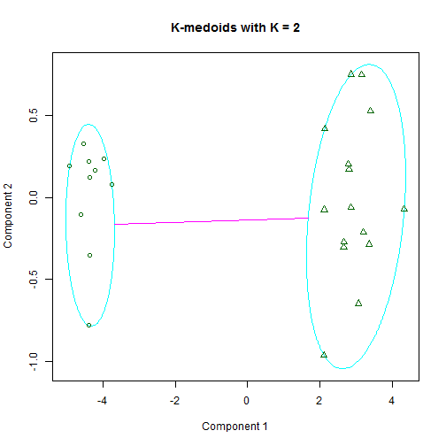

---

title       : Machine Learning with R - II
author      : Ilan Man
job         : Strategy Operations  @ Squarespace
framework   : io2012        # {io2012, html5slides, shower, dzslides, ...}
highlighter : highlight.js  # {highlight.js, prettify, highlight}
hitheme     : tomorrow      # 
widgets     : mathjax       # {mathjax, quiz, bootstrap}
mode        : selfcontained # {standalone, draft}

----

## Agenda 
<space>

1. Logistic Regression
2. Principle Component Analysis
3. Clustering
4. Trees

----

## Objectives 
<space>

1. Understand some popular algorithms and techniques
2. Learn how to tune parameters
3. Practice R

----

## Logistic Regression
# Motivation
<space>


```r
x <- 1:10
log_ex <- data.frame(Y = c(rnorm(5, 0, 0.01), rnorm(5, 5, 0.01)), X = x)
ggplot(log_ex, aes(X, Y)) + geom_point(color = "blue", size = 3) + stat_smooth(method = "lm", 
    se = F, color = "green", size = 1)
```

```
## Error: could not find function "ggplot"
```


----

## Logistic Regression
# Motivation
<space>


```r
library("MASS")
library(ggplot2)
data(menarche)
log_data <- data.frame(Y = menarche$Menarche/menarche$Total)
log_data$X <- menarche$Age

glm.out <- glm(cbind(Menarche, Total - Menarche) ~ Age, family = binomial(logit), 
    data = menarche)
lm.out <- lm(Y ~ X, data = log_data)

log_data$fitted <- glm.out$fitted

data_points <- ggplot(log_data) + geom_point(aes(x = X, y = Y), color = "blue", 
    size = 3)
line_points <- data_points + geom_abline(intercept = coef(lm.out)[1], slope = coef(lm.out)[2], 
    color = "green", size = 1)
curve_points <- line_points + geom_line(aes(x = X, y = fitted), color = "red", 
    size = 1)
```


----

## Logistic Regression
# Notation
<space>

- type of regression to predict the probability of being in a class
  - typical to set threshold to 0.5
- assumes error terms are Binomially distributed
  - which generates 1's and 0's as the error term
- sigmoid or logistic function: $g(z) = \frac{1}{1+e^{-z}}$
  - interpret the output as $P(Y=1 | X)$
  - bounded by 0 and 1

----

## Logistic Regression
# Notation
<space>


```r
curve(1/(1 + exp(-x)), from = -10, to = 10, ylab = "P(Y=1|X)", col = "red", 
    lwd = 3)
abline(a = 0.5, b = 0, lty = 2, col = "blue", lwd = 3)
```

 


----

## Logistic Regression
# Find parameters
<space>

- The hypothesis function, $h_{\theta}(x)$, is P(Y=1|X)
- Linear Regression --> $h_{\theta}(x) = \theta x^{T}$
- Logistic Regression --> $h_{\theta}(x) = g(\theta x^{T})$ 
<br>
where $g(z) = \frac{1}{1+e^{-z}}$

----

## Logistic Regression
# Notation
<space>

- Re-arranging $Y = \frac{1}{1+e^{-\theta x^{T}}}$ yields $\log{\frac{Y}{1 - Y}} = \theta x^{T}$<br>
- "log odds"" are linear in X
- this is called the logit of theta
  - links X linearly with some function of Y

----

## Logistic Regression
# Find parameters
<space>

- So $h_{\theta}(x) = \frac{1}{1+e^{-\theta x^{T}}}$
- What is the cost function?
- Why can't we use the same cost function as for the linear hypothesis?
  - logistic residuals are Binomially distributed - not Normal
  - the regression function is not linear in X

----

## Logistic Regression
# Find parameters
<space>

- Define logistic cost function as:

$cost(h_{\theta}(x)):$<br>
&nbsp;&nbsp; $= -\log(x),$ &nbsp;&nbsp;&nbsp;  $y = 1$<br>
&nbsp;&nbsp; $= -\log(1-x),$ &nbsp;   $y = 0$

  


----

## Logistic Regression
# Find parameters
<space>

- using statistics, it can be shown that<br>
$cost(h_{\theta}(x), y) = -y \log(h_{\theta}(x)) + (1-y) \log(1-h_{\theta}(x))$<br>

----

## Logistic Regression
# Find parameters
<space>

- using statistics, it can be shown that<br>
$cost(h_{\theta}(x), y) = -y \log(h_{\theta}(x)) + (1-y) \log(1-h_{\theta}(x))$<br>
- Logistic regression cost function is then<br>
$cost(h_{\theta}(x), y)  = \frac{1}{m} \sum_{i=1}^{m} -y \log(h_{\theta}(x)) + (1-y) \log(1-h_{\theta}(x))$

----

## Logistic Regression
# Find parameters
<space>

- using statistics, it can be shown that<br>
$cost(h_{\theta}(x), y) = -y \log(h_{\theta}(x)) + (1-y) \log(1-h_{\theta}(x))$<br>
- Logistic regression cost function is then<br>
$cost(h_{\theta}(x), y)  = \frac{1}{m} \sum_{i=1}^{m} -y \log(h_{\theta}(x)) + (1-y) \log(1-h_{\theta}(x))$
- Minimize the cost

----

## Logistic Regression
# Gradient descent
<space>

 


----

## Logistic Regression
# Gradient descent
<space>


```r
x <- cbind(1, x)  #Add ones to x  
theta <- c(0, 0)  # initalize theta vector 
m <- nrow(x)  # Number of the observations 
grad_cost <- function(X, y, theta) return(sum(((X %*% theta) - y)^2))
```


----

## Logistic Regression
# Gradient descent
<space>


```r
gradDescent <- function(X, y, theta, iterations, alpha) {
    m <- length(y)
    grad <- rep(0, length(theta))
    cost.df <- data.frame(cost = 0, theta = 0)
    
    for (i in 1:iterations) {
        h <- X %*% theta
        grad <- (t(X) %*% (h - y))/m
        theta <- theta - alpha * grad
        cost.df <- rbind(cost.df, c(grad_cost(X, y, theta), theta))
    }
    
    return(list(theta, cost.df))
}
```


----

## Logistic Regression
# Gradient descent
<space>


```r
## initialize X, y and theta
X1 <- matrix(ncol = 1, nrow = nrow(df), cbind(1, df$X))
Y1 <- matrix(ncol = 1, nrow = nrow(df), df$Y)

init_theta <- as.matrix(c(0))
grad_cost(X1, Y1, init_theta)
```

```
[1] 5187
```

```r

iterations = 100
alpha = 0.1
results <- gradDescent(X1, Y1, init_theta, iterations, alpha)
```


----

## Logistic Regression
# Gradient descent
<space>


```
## Error: object 'cost.df' not found
```


----

## Logistic Regression
# Gradient descent
<space>


```r
grad_cost(X1, Y1, theta[[1]])
```

```
[1] 300
```

```r
## Make some predictions
intercept <- df[df$X == 0, ]$Y
pred <- function(x) return(intercept + c(x) %*% theta)
new_points <- c(0.1, 0.5, 0.8, 1.1)
new_preds <- data.frame(X = new_points, Y = sapply(new_points, pred))
```


----

## Logistic Regression
# Gradient descent
<space>


```r
ggplot(data = df, aes(x = X, y = Y)) + geom_point(size = 2)
```

 

```r
ggplot(data = df, aes(x = X, y = Y)) + geom_point() + geom_point(data = new_preds, 
    aes(x = X, y = Y, color = "red"), size = 3) + scale_colour_discrete(guide = FALSE)
```

 


----

## Regression example
# Gradient descent - summary
<space>

- minimization algorithm
- approximation, non-closed form solution
- good for large number of examples
- hard to select the right $\alpha$
- traditional looping is slow - optimization algorithms are used in practice

----

## Logistic Regression
# Summary
<space>

- very popular classification algorithm
- based on Binomial error terms, i.e. 1's and 0's

----

## Principle Component Analysis
# Motivation
<space>

- used widely in modern data analysis
- not well understood
- intuition: reduce data into only relevant dimensions
- the goal of PCA is to compute the most meaningful was to re-express noisy data, revealing the hidden structure

----

## Principle Component Analysis
# Concepts
<space>

- first big assumption: linearity
- $PX=Y$
  - $X$ is original dataset, $P$ is a transformation of $X$ into $Y$
- how do we choose $P$?
  - reduce noise
  - maximize variance

----

## Principle Component Analysis
# Concepts
<space>

- covariance matrix
     - $C = X*X^{T}$

- restated goals are
  - minimize covariance and maximize variance
  - the optimizal $C$ is a diagonal matrix, off diagonals are = 0
  
----

## Principle Component Analysis
# Concepts
<space>

- summary of assumptions
  - linearity (non-linear is a kernel PCA)
  - largest variance indicates most signal, low variance = noise
  - orthogonal components - makes the linear algebra easier
  - assumes data is normally distributed, otherwise PCA might not diagonalize matrix
    - can use ICA
    - but most data is normal and PCA is robust to slight deviance from normality

----

## Principle Component Analysis
# Eigenwhat?
<space>

- $Ax = \lambdax$
  - $\lambda$ is an eigenvalue of $A$ and $x$ is an eigenvector of $A$
- $Ax - \lambdaIx = 0$
- $(A - \lambdaI)x = 0$
- $\det(A - \lambdaI)$ = 0


----

## Principle Component Analysis
# Eigenwhat?
<space>

$\[A=\left[{\begin{array}{cc}5 & 2 \\2 & 5\\\end{array}\right ]\]$

A = matrix(c(5,2,2,5),nrow=2)
I = diag(nrow(A))
|A - L*I| = 0
det(c(5-l,2,2,5-l))
(5-l)*(5-l) - 4 = 0
25 - 10l + l^2 - 4 = 0
l^2 - 10l + 21 = 0
roots <- Re(polyroot(c(21,-10,1)))
```

----

## Principle Component Analysis
# Eigenwhat?
<space>

- when lambda = -3
Ax = 3x
5x1 + 2x2 = 3x1
2x1 + 5x2 = 3x2
x1=-x2
- one eigenvector = [1 -1]

----

## Principle Component Analysis
# Eigenwhat?
<space>

- when lambda = 7
5x1 + 2x2 = 7x1
2x2 + 5x2 = 7x2
x1 = x2
- another eigenvector = [1 1]

----

## Principle Component Analysis
# Eigenwhat?
<space>

A%*%c(1,-1) == 3 * as.matrix(c(1,-1))
A%*%c(1,1) == 7 * as.matrix(c(1,1))
roots

----

## Principle Component Analysis
# Eigenwhat?
<space>

- check
m <- matrix(c(1,-1,1,1),ncol=2)
m <- m/sqrt(norm(m))
as.matrix(m%*%diag(roots)%*%t(m))
- lambda is a diagonal matrix, with 0 off diagonals

----

## Principle Component Analysis
# Motivation
<space>

PX = Y

CY = (1/(n-1))*YYt
=PX(PX)t
=PXXtPt
=PAPt
# P is a matrix with columns that are eigenvectors
# A is a diagonalized matrix of eigenvalues (by linear algebra) and symmetric
A = EDEt

----

## Principle Component Analysis
# Motivation
<space>

# each row of P should be an eigenvector of A
P=Et
# also note that Pt = P-1 (linear algebra)
A = PtDP
CY = PPtDPPt
= (1/(n-1))*D
# D is a diagonal matrix, depending on how we choose P
# therefore CY is diagonalized

----

## Principle Component Analysis
# Example
<space>


```r
data <- read.csv("tennis_data_2013.csv")
```

```
## Warning: cannot open file 'tennis_data_2013.csv': No such file or
## directory
```

```
## Error: cannot open the connection
```

```r
data$Player1 <- as.character(data$Player1)
```

```
## Error: object of type 'closure' is not subsettable
```

```r
data$Player2 <- as.character(data$Player2)
```

```
## Error: object of type 'closure' is not subsettable
```

```r

tennis <- data
m <- length(data)

for (i in 10:m) {
    tennis[, i] <- ifelse(is.na(data[, i]), 0, data[, i])
}
```

```
## Error: object of type 'closure' is not subsettable
```

```r

str(tennis)
```

```
## function (..., list = character(), package = NULL, lib.loc = NULL, 
##     verbose = getOption("verbose"), envir = .GlobalEnv)
```

```r

features <- tennis[, 10:m]
```

```
## Error: object of type 'closure' is not subsettable
```

```r

head(features)
```

```
## Error: object 'features' not found
```

```r
str(features)
```

```
## Error: object 'features' not found
```

```r
dim(features)
```

```
## Error: object 'features' not found
```


----

## Principle Component Analysis
# Example
<space>


```r
scaled_features <- as.matrix(scale(features))
```

```
## Error: object 'features' not found
```

```r
Cx <- cov(scaled_features)
```

```
## Error: object 'scaled_features' not found
```

```r
eigenvalues <- eigen(Cx)$values
```

```
## Error: object 'Cx' not found
```

```r
eigenvectors <- eigen(Cx)$vectors
```

```
## Error: object 'Cx' not found
```

```r
PC <- scaled_features %*% eigenvectors
```

```
## Error: object 'scaled_features' not found
```


----

## Principle Component Analysis
# Example
<space>


```r
Cy <- cov(PC)
```

```
## Error: object 'PC' not found
```

```r
sum(round(diag(Cy) - eigenvalues, 5))
```

```
## Error: object 'Cy' not found
```

```r
sum(round(Cy[upper.tri(Cy)], 5))  ## off diagonals are 0 since PC's are orthogonal
```

```
## Error: object 'Cy' not found
```


----

## Principle Component Analysis
# Example
<space>


```r
var_explained <- round(eigenvalues/sum(eigenvalues) * 100, digits = 2)
```

```
## Error: object 'eigenvalues' not found
```

```r
cum_var_explained <- round(cumsum(eigenvalues)/sum(eigenvalues) * 100, digits = 2)
```

```
## Error: object 'eigenvalues' not found
```

```r

var_explained <- as.data.frame(var_explained)
```

```
## Error: object 'var_explained' not found
```

```r
names(var_explained) <- "variance_explained"
```

```
## Error: object 'var_explained' not found
```

```r
var_explained$PC <- as.numeric(rownames(var_explained))
```

```
## Error: object 'var_explained' not found
```

```r
var_explained <- cbind(var_explained, cum_var_explained)
```

```
## Error: object 'var_explained' not found
```

```r

library(ggplot2)
ggplot(var_explained) + geom_bar(aes(x = PC, y = variance_explained), stat = "identity") + 
    geom_line(aes(x = PC, y = cum_var_explained))
```

```
## Error: object 'var_explained' not found
```


----

## Principle Component Analysis
# Example
<space>


```r
pca.df <- prcomp(scaled_features)
```

```
## Error: object 'scaled_features' not found
```

```r
eigenvalues == (pca.df$sdev)^2
```

```
## Error: object 'eigenvalues' not found
```

```r
eigenvectors[, 1] == pca.df$rotation[, 1]
```

```
## Error: object 'eigenvectors' not found
```

```r
sum((eigenvectors[, 1])^2)
```

```
## Error: object 'eigenvectors' not found
```


----

## Principle Component Analysis
# Example
<space>


```r
rows <- nrow(tennis)
pca.plot <- as.data.frame(pca.df$x[, 1:2])
```

```
## Error: object 'pca.df' not found
```

```r
pca.plot$gender <- data$Gender
```

```
## Error: object of type 'closure' is not subsettable
```

```r
ggplot(data = pca.plot, aes(x = PC1, y = PC2, color = gender)) + geom_point()
```

```
## Error: object 'pca.plot' not found
```


----

## Principle Component Analysis
# Example
<space>

- how accurate is the first PC at dividing the dataset?
gen <- ifelse(pca.df$x[,1] > abs(mean(pca.df$x[,1]))*2,"F","M")
sum(diag(table(gen,as.character(data$Gender))))/rows

----

## Principle Component Analysis
# Summary
<space>

----

## Clustering
# Motivation
<space>

- separate data into meaningful or useful groups
  - capture natural structure of the data
  - starting point for further analysis
- cluster for utility
  - summarizing data for less expensive computation
  - data compression

----

## Clustering
# Types of Clusters
<space>

- data that looks more like other data in that cluster than outside
- each data point is more similar to the prototype (centeroid) of the cluster than the prototype of other clusters
- where the density is highest, that is a cluster

----

## Clustering
# Typical clustering problem
<space>

 


----

## Clustering
# Density based cluster
<space>


----

## Clustering
# Kmeans algorithm
<space>

- Select K points as initial centroids 
- Do
  - Form K clusters by assigning each point to its closest centroid
  - Recompute the centroid of each cluster 
- Until centroids do not change, or change very minimally, i.e. <1%

----

## Clustering
# Kmeans algorithm
<space>

- Use similarity measures (Euclidean or cosine) depending on the data
- Minimize the squared distance of each point to closest centroid
$SSE(k) = \sum_{i=1}^{m}\sum_{j=1}^{n} (x_{ij} - \bar{x}_{kj})$

----

## Clustering
# Kmeans - notes
<space>

- Choose initial K randomly 
  - can lead to poor centroids - local minimuum
  - Run kmeans multiple times
- Reduce the total SSE by increasing K
- Increase the cluster with largest SSE
- Decrease K and minimize SSE
- Split up a cluster into other clusters
  - The centroid that is split will increase total SSE the least

----

## Clustering
# Kmeans
<space>

- Bisecting K means
  - Split points into 2 clusters
    - Take cluster with largest SSE - split that into two clusters
  - Rerun bisecting K mean on resulting clusters
  - Stop when you have K clusters
- Less susceptible to initialization problems

----

## Clustering
# Kmean fails
<space>


----

## Clustering
# Kmean fails
<space>


----

## Clustering
# Kmean fails
<space>


----

## Clustering
# Kmeans
<space>


```r
# wine <-
# read.csv('http://archive.ics.uci.edu/ml/machine-learning-databases/wine/wine.data')
names(wine) <- c("class", "Alcohol", "Malic", "Ash", "Alcalinity", "Magnesium", 
    "Total_phenols", "Flavanoids", "NFphenols", "Proanthocyanins", "Color", 
    "Hue", "Diluted", "Proline")
```

```
## Error: object 'wine' not found
```

```r
str(wine)
```

```
## Error: object 'wine' not found
```


- set.seed() to make sure results are reproducible
- add nstart to the function call so that it attempts multiple configurations, selecting the best
- use a screeplot to select optimal K

----

## Clustering
# Kmeans
<space>


```r
wine <- scale(wine[, -1])
```

```
## Error: object 'wine' not found
```

```r
best_k <- 0
num_k <- 20
for (i in 1:num_k) {
    best_k[i] <- sum(kmeans(wine, centers = i)$withinss)
}
```

```
## Error: object 'wine' not found
```

```r

barplot(best_k, xlab = "Number of clusters", names.arg = 1:num_k, ylab = "Within groups sum of squares", 
    main = "Scree Plot for Wine dataset")
```

```
## Error: incorrect number of names
```

 


----

## Clustering
# Kmeans animation
<space>

install.packages('animation')
library(animation)

oopt = ani.options(interval = 1)
ani_ex = rbind(matrix(rnorm(100, sd = 0.3), ncol = 2), 
          matrix(rnorm(100, sd = 0.3), 
          ncol = 2))
colnames(ani_ex) = c("x", "y")

kmeans.an = function(
  x = cbind(X1 = runif(50), X2 = runif(50)), centers = 4, hints = c('Move centers!', 'Find cluster?'),
  pch = 1:5, col = 1:5
) {
  x = as.matrix(x)
  ocluster = sample(centers, nrow(x), replace = TRUE)
  if (length(centers) == 1) centers = x[sample(nrow(x), centers), ] else
    centers = as.matrix(centers)
  numcent = nrow(centers)
  dst = matrix(nrow = nrow(x), ncol = numcent)
  j = 1
  pch = rep(pch, length = numcent)
  col = rep(col, length = numcent)
  
  for (j in 1:ani.options('nmax')) {
    dev.hold()
    plot(x, pch = pch[ocluster], col = col[ocluster], panel.first = grid())
    mtext(hints[1], 4)
    points(centers, pch = pch[1:numcent], cex = 3, lwd = 2, col = col[1:numcent])
    ani.pause()
    for (i in 1:numcent) {
      dst[, i] = sqrt(apply((t(t(x) - unlist(centers[i, ])))^2, 1, sum))
    }
    ncluster = apply(dst, 1, which.min)
    plot(x, type = 'n')
    mtext(hints[2], 4)
    grid()
    ocenters = centers
    for (i in 1:numcent) {
      xx = subset(x, ncluster == i)
      polygon(xx[chull(xx), ], density = 10, col = col[i], lty = 2)
      points(xx, pch = pch[i], col = col[i])
      centers[i, ] = apply(xx, 2, mean)
    }
    points(ocenters, cex = 3, col = col[1:numcent], pch = pch[1:numcent], lwd = 2)
    ani.pause()
    if (all(ncluster == ocluster)) break
    ocluster = ncluster
  }
  invisible(list(cluster = ncluster, centers = centers))
}

kmeans.an(ani_ex, centers = 5, hints = c("Move centers","Cluster found?"))

----

## Clustering
# K-medoid
<space>

- multiple distance metrics
- robust medioids
- computationally expensive
- cluster center is one of the points itself

----

## Clustering
# K-medoid
<space>

- cluster each point based on the closest center
- replace each center by the medioid of points in its cluster

----

## Clustering
# K-medoid
<space>


```r
library(cluster)
## generate 25 objects, divided into 2 clusters.
x <- rbind(cbind(rnorm(10, 0, 0.5), rnorm(10, 0, 0.5)), cbind(rnorm(15, 5, 0.5), 
    rnorm(15, 5, 0.5)))
pamx <- pam(x, 2)
summary(pamx)
```

```
## Medoids:
##      ID                
## [1,]  4 -0.1848 -0.2264
## [2,] 11  4.8207  4.9879
## Clustering vector:
##  [1] 1 1 1 1 1 1 1 1 1 1 2 2 2 2 2 2 2 2 2 2 2 2 2 2 2
## Objective function:
##  build   swap 
## 0.7233 0.5272 
## 
## Numerical information per cluster:
##      size max_diss av_diss diameter separation
## [1,]   10   0.9003   0.382    1.173      5.867
## [2,]   15   1.4748   0.624    2.386      5.867
## 
## Isolated clusters:
##  L-clusters: character(0)
##  L*-clusters: [1] 1 2
## 
## Silhouette plot information:
##    cluster neighbor sil_width
## 4        1        2    0.9418
## 2        1        2    0.9388
## 9        1        2    0.9356
## 7        1        2    0.9304
## 6        1        2    0.9271
## 5        1        2    0.9192
## 10       1        2    0.9137
## 3        1        2    0.9058
## 8        1        2    0.8885
## 1        1        2    0.8731
## 11       2        1    0.9073
## 21       2        1    0.9041
## 25       2        1    0.9024
## 15       2        1    0.8984
## 16       2        1    0.8954
## 23       2        1    0.8929
## 12       2        1    0.8876
## 14       2        1    0.8731
## 18       2        1    0.8726
## 13       2        1    0.8644
## 20       2        1    0.8627
## 22       2        1    0.8426
## 17       2        1    0.8315
## 19       2        1    0.8145
## 24       2        1    0.7842
## Average silhouette width per cluster:
## [1] 0.9174 0.8689
## Average silhouette width of total data set:
## [1] 0.8883
## 
## 300 dissimilarities, summarized :
##    Min. 1st Qu.  Median    Mean 3rd Qu.    Max. 
##   0.036   0.752   4.130   4.060   7.230   9.250 
## Metric :  euclidean 
## Number of objects : 25
## 
## Available components:
##  [1] "medoids"    "id.med"     "clustering" "objective"  "isolation" 
##  [6] "clusinfo"   "silinfo"    "diss"       "call"       "data"
```

```r
clusplot(pamx, main = "K-medoids with K = 2", sub = NULL)
```

 


http://www.bvmengineering.ac.in/docs/published%20papers/cpit/cpit/201405.pdf
----

## Clustering
# DBSCAN
<space>

- density based
     - center based approach to finding density
     - count the number of points within some radius of a point, the radius is call Eps
     - if Eps is too big, there will be m points, if eps is too small, there will be 1 point
     - core point has X points within a radius of Eps, border points are within a radius of Eps of core point, and noise points are not within Eps of border or core points
     - if p is density connected to q, they are part of the same cluster, if not, then they are not; if p is not density connected to any other point, its considered noise
     
----

## Clustering
# DBSCAN
<space>


```r
x <- c(2, 2, 8, 5, 7, 6, 1, 4)
y <- c(10, 5, 4, 8, 5, 4, 2, 9)
cluster <- data.frame(X = c(x, 2 * x, 3 * x), Y = c(y, -2 * x, 1/4 * y))
plot(cluster)
```

 


----

## Clustering
# DBSCAN
<space>


```r
library(fpc)
cluster_DBSCAN <- dbscan(cluster, eps = 3, MinPts = 2, method = "hybrid")
plot(cluster_DBSCAN, cluster, main = "Clustering using DBSCAN algorithm (eps=3, MinPts=3)")
```

 


----

## Clustering
# Summary
<space>

----

## Trees
# Motivation
<space>

- representation of decisions made in order to classify or predict


----

## Trees
# Structure
<space>


----

## Trees
# Structure
<space>

- recursive partitioning -> "divide and conquer"
- going down, choose feature that is most *predictive* of target class
  - split the data according to feature
  - continue...

----

## Trees
# Structure
<space>

until...
- all examples at a node are in same class
- no more features left to distinguish (prone to overfitting)
- tree has grown to some prespecified limit (prune)

----

## Trees
# Algorithms
<space>

- ID3
  - original, popular, DT implementation
- C4.5
  - like ID3 +
  - handles continuous cases
  - imputing missing values
  - weighing costs
  - pruning post creation
- C5.0
  - like C4.5 + 
  - faster, less memory usage
  - boosting

----

## Trees
# Selecting features
<space>

- How does tree decide how to select feature?
  - purity of resulting split
- __Entropy__: amount of information contained in a random variable
  - For a feature with N classes:
    - 0 = purely homogenous
    - $\log_{2}(N)$ = completely mixed

----

## Trees
# Entropy
<space>

$Entropy(S) = \sum_{i=1}^{c} -p_{i}\log_{2}(p_{i})$
  - where $S$ is a dataset
  - $c$ is the number of levels in that data
  - $p_{i}$ is the proportion of values in that level

----

## Trees
# Entropy - example
<space>

What is the entropy of a fair, 6 sided die?


```r
entropy <- function(probs) {
    ent <- 0
    for (i in probs) {
        ent_temp <- -i * log2(i)
        ent <- ent + ent_temp
    }
    return(ent)
}
```


----

## Trees
# Entropy - example
<space>


```r
fair <- rep(1/6, 6)
entropy(fair)
```

```
## [1] 2.585
```

```r
log2(6)
```

```
## [1] 2.585
```


----

## Trees
# Entropy - example
<space>

What is the entropy of a biased, 6 sided die?
- $P(X=1) = P(X=2) = P(X=3) = 1/9$
- $P(X=4) = P(X=5) = P(X=6) = 2/9$


```r
biased <- c(rep(1/9, 3), rep(2/9, 3))
entropy(biased)
```

```
[1] 2.503
```


----

## Trees
# Entropy - example
<space>


```r
more_biased <- c(rep(1/18, 3), rep(5/18, 3))
entropy(more_biased)
```

```
[1] 2.235
```

```r

most_biased <- c(rep(1/100, 5), rep(95/100, 1))
entropy(most_biased)
```

```
[1] 0.4025
```


----

## Trees
# Entropy - example
<space>


```r
curve(-x * log2(x) - (1 - x) * log2(1 - x), col = " red", xlab = "x", ylab = "Entropy", 
    lwd = 4, main = "Entropy of a coin toss")
```

 


----

## Trees
# Entropy
<space>

- C5.0 uses the change in entropy to determine the change in purity
- InfoGain = Entropy (pre split) - Entropy (post split)
  - Entropy (pre split) = current Entropy
  - Entropy (post split) is trickier
    - need to consider Entropy of each possible split
  - $E(post) = \sum_{i=1}^{n}w_{i}Entropy(P_{i})$

- Notes:
  - The more a feature splits the data in obvious ways, the less informative it is, entropy is lower
  - The more a feature splits the data - in general - the higher the entropy and hence information gained by splitting at that feature

----

## Trees
# Example
<space>


```r
voting_data <- read.csv("http://archive.ics.uci.edu/ml/machine-learning-databases/voting-records/house-votes-84.data")
```

```
## Warning: InternetOpenUrl failed: 'The operation timed out'
```

```
## Error: cannot open the connection
```

```r
names(voting_data) <- c("party", "handicapped-infants", "water-project-cost-sharing", 
    "adoption-of-the-budget-resolution", "physician-fee-freeze", "el-salvador-aid", 
    "religious-groups-in-schools", "anti-satellite-test-ban", "aid-to-nicaraguan-contras", 
    "mx-missile", "immigration", "synfuels-corporation-cutback", "education-spending", 
    "superfund-right-to-sue", "crime", "duty-free-exports", "export-administration-act-south-africa")
```

```
## Error: object 'voting_data' not found
```


----

## Trees
# Example
<space>


```r
prop.table(table(voting_data[, 1]))
```

```
Error: object 'voting_data' not found
```

```r
n <- nrow(voting_data)
```

```
Error: object 'voting_data' not found
```

```r
train_ind <- sample(n, 2/3 * n)
```

```
Error: object 'n' not found
```

```r
voting_train <- voting_data[train_ind, ]
```

```
Error: object 'voting_data' not found
```

```r
voting_test <- voting_data[-train_ind, ]
```

```
Error: object 'voting_data' not found
```


----

## Trees
# Example
<space>


```
## Error: object 'voting_train' not found
```

```
## Error: object 'tree_formula' not found
```


----

## Trees
# Example
<space>


```
Error: object 'voting_train' not found
```

```
Error: error in evaluating the argument 'object' in selecting a method for function 'predict': Error: object 'tree_model' not found
```

```
Error: object 'voting_test' not found
```


----

## Trees
# Example
<space>


```r
# most important variables
head(C5imp(tree_model))
```

```
## Error: object 'tree_model' not found
```


----

## Trees
# Example
<space>


```r
# in-sample error rate
summary(tree_model)
```

```
## Error: object 'tree_model' not found
```


----

## Trees
# Boosting
<space>

- by combining a number of weak performing learners create a team that is much stronger than any one of the learners alone.
- this is where C5.0 improves on C4.5

----

## Trees
# Example - Boosting
<space>


```r
boosted_tree_model <- C5.0(voting_train[, -1], voting_train[, 1], trials = 25)
```

```
## Error: object 'voting_train' not found
```

```r
boosted_tennis_predict <- predict(boosted_tree_model, voting_test[, -1])
```

```
## Error: error in evaluating the argument 'object' in selecting a method for function 'predict': Error: object 'boosted_tree_model' not found
```

```r

boosted_conf <- CrossTable(voting_test[, 1], boosted_tennis_predict, prop.chisq = FALSE, 
    prop.c = FALSE, prop.r = FALSE, dnn = c("actual class", "predicted class"))
```

```
## Error: object 'voting_test' not found
```


----

## Trees
# Example - Boosting
<space>


```r
# in-sample error rate
summary(boosted_tree_model)
```

```
## Error: object 'boosted_tree_model' not found
```


----

## Trees
# Error Cost
<space>

- still getting too many false positives (predict republican but actually democrat)
- introduce higher cost to getting this wrong


```r
error_cost <- matrix(c(0, 1, 2, 0), nrow = 2)
cost_model <- C5.0(voting_train[, -1], voting_train[, 1], trials = 1, costs = error_cost)
```

```
## Error: object 'voting_train' not found
```

```r
cost_predict <- predict(cost_model, newdata = voting_test[, -1])
```

```
## Error: error in evaluating the argument 'object' in selecting a method for function 'predict': Error: object 'cost_model' not found
```

```r
conf <- CrossTable(voting_test[, 1], cost_predict, prop.chisq = FALSE, prop.c = FALSE, 
    prop.r = FALSE, dnn = c("actual class", "predicted class"))
```

```
## Error: object 'voting_test' not found
```


----

## Trees
# Error Cost
<space>


```
## Error: object 'voting_train' not found
```

```
## Warning: no non-missing arguments to min; returning Inf
## Warning: no non-missing arguments to max; returning -Inf
## Warning: no non-missing arguments to min; returning Inf
## Warning: no non-missing arguments to max; returning -Inf
```

```
## Error: need finite 'xlim' values
```

 


----

## Trees
# Pros and Cons
<space>

- trees are non-parametric, rule based classification or regression method
- simple to understand and interpret
- little data preparation
- works well with small or large number of features
<br>
- easy to overfit
- biased towards splits on features with large number of levels
- usually finds local optimum
- difficult concepts are hard to learn
- avoid pre-pruning
- hard to know optimal length of tree without growing it there first

----

## Resources
<space>

- [Machine Learning with R](http://www.packtpub.com/machine-learning-with-r/book)
- [Machine Learning for Hackers](http://shop.oreilly.com/product/0636920018483.do)
- [Elements of Statistical Learning](http://web.stanford.edu/~hastie/local.ftp/Springer/OLD/ESLII_print4.pdf)

----
