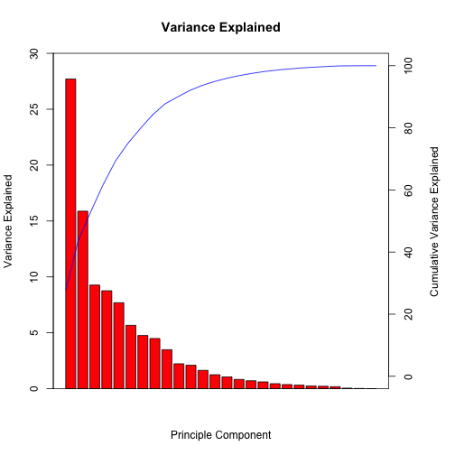
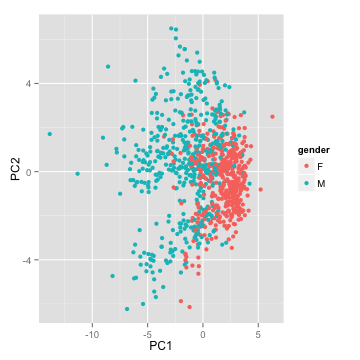
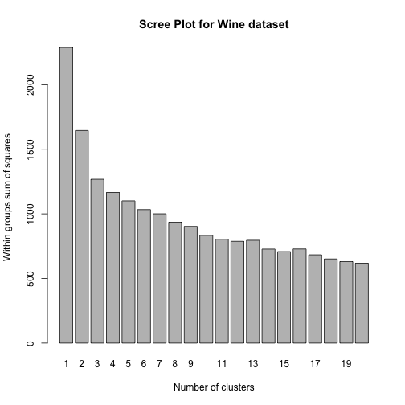
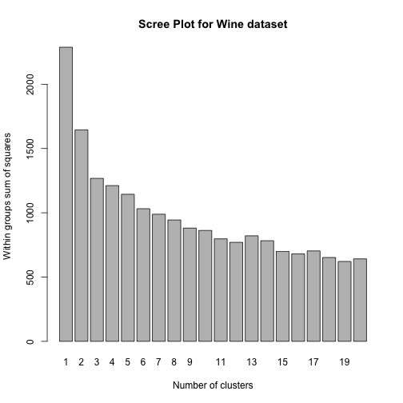
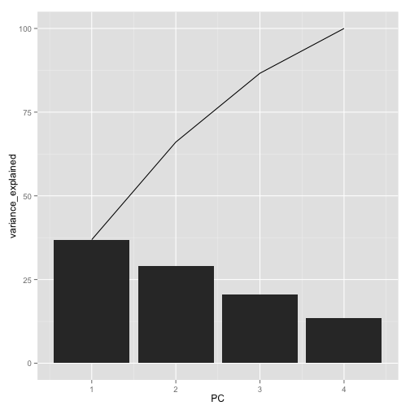

---

title       : Machine Learning with R - Part II
author      : Ilan Man
job         : Strategy Operations  @ Squarespace
framework   : io2012        # {io2012, html5slides, shower, dzslides, ...}
highlighter : highlight.js  # {highlight.js, prettify, highlight}
hitheme     : tomorrow      # 
widgets     : mathjax       # {mathjax, quiz, bootstrap}
mode        : selfcontained # {standalone, draft}

----

## Objectives 
<space>

1. Understand what's happening under the hood of some popular ML algorithms and techniques
2. Learn how to tune parameters
3. Practice R

----

## Agenda 
<space>

1. Logistic Regression
2. Principle Component Analysis
3. Clustering
4. Trees

----

## Logistic Regression
# Motivation
<space>

 

----

## Logistic Regression
# Motivation
<space>

 

----

## Logistic Regression
# Motivation
<space>

 

----

## Logistic Regression
# Concepts
<space>

- Binary response variable (Y = 1 or Y = 0) association to a set of explanatory variables
- Like Linear Regression with a categorical outcome

----

## Logistic Regression
# Concepts
<space>

- Binary response variable (Y = 1 or Y = 0) association to a set of explanatory variables
- Like Linear Regression with a categorical outcome
- $\hat{y} = \beta_{0} + \beta_{1}x_{1} + ... + \beta_{n}x_{n}$

----

## Logistic Regression
# Concepts
<space>

- Binary response variable (Y = 1 or Y = 0) association to a set of explanatory variables
- Like Linear Regression with a categorical outcome
- $\hat{y} = \beta_{0} + \beta_{1}x_{1} + ... + \beta_{n}x_{n}$ becomes<br>
- $\log{\frac{P(Y=1)}{1 - P(Y=1)}} = \beta_{0} + \beta_{1}x_{1} + ... + \beta_{n}x_{n}$
- Can be extended to multiple and/or ordered categories

----

## Logistic Regression
# Concepts
<space>

- Family of GLMs
<ol>
<li>Random component <br>- Noise or Errors
<li>Systematic Component <br>- Linear combination in $X_{i}$
<li>Link Function <br>- Connects Random and Systematic components
</ol>

----

## Logistic Regression
# Concepts
<space>

- Data is I.I.D.
  - $Y$'s assume to come from family of exponential distributions
- Uses MLE to determine parameters - Not OLS
  - MLE satisfies lots of nice properties (unbiased, consistent)
  - Does not require transformation of $Y$'s to be Normal
  - Does not require constant variance

----

## Logistic Regression
# Concepts
<space>

- Type of regression to predict the probability of being in a class
  - Output is $P(Y=1 | X)$
  - Typical threshold is 0.5
- Assumes error terms are Binomially distributed
  - Generates 1's and 0's as the error term

----

## Logistic Regression
# Concepts
<space>

- Type of regression to predict the probability of being in a class
  - Output is $P(Y=1\hspace{2 mm} |\hspace{2 mm} X)$
  - Typical threshold is 0.5
- Assumes error terms are Binomially distributed
  - Generates 1's and 0's as the error term
- Sigmoid (logistic) function: $g(z) = \frac{1}{1+e^{-z}}$
  - Bounded by 0 and 1

----

## Logistic Regression
# Concepts
<space>

 

----

## Logistic Regression
# Find parameters
<space>

- The hypothesis function, $h_{\theta}(x)$, is $P(Y=1|X)$
- Linear regression: $h_{\theta}(x) = \theta x^{T}$<br>
(Recall that $\theta x^{T} = \beta_{0} + \beta_{1}x_{1} + ... + \beta_{n}x_{n}$)

----

## Logistic Regression
# Find parameters
<space>

- The hypothesis function, $h_{\theta}(x)$, is $P(Y=1|X)$
- Linear regression: $h_{\theta}(x) = \theta x^{T}$<br>
(Recall that $\theta x^{T} = \beta_{0} + \beta_{1}x_{1} + ... + \beta_{n}x_{n}$)
- Logistic regression: $h_{\theta}(x) = g(\theta x^{T})$ 
<br>
where $g(z) = \frac{1}{1+e^{-z}}$

----

## Logistic Regression
# Notation
<space>

- Re-arranging $Y = \frac{1}{1+e^{-\theta x^{T}}}$ yields
<br>
$\log{\frac{Y}{1 - Y}} = \theta x^{T}$, "log odds"
- Log odds are linear in $X$
- This is called the logit of $Y$
  - Links the odds of $Y$ (a probability) to a linear regression in $X$
  - Logit ranges from -ve infite to +ve infinite
  - When $x_{1}$ increases by 1 unit, $P(Y=1)$ increases by $e^{\theta_{1}}$

----

## Logistic Regression
# Find parameters
<space>

- So $h_{\theta}(x) = \frac{1}{1+e^{-\theta x^{T}}}$
- Cost function?
- Why can't we use the same cost function as for the linear hypothesis?

----

## Logistic Regression
# Find parameters
<space>

- So $h_{\theta}(x) = \frac{1}{1+e^{-\theta x^{T}}}$
- Cost function?
- Why can't we use the same cost function as for the linear hypothesis?
  - Logistic residuals are Binomially distributed
  - Regression function is not linear in $X$

----

## Logistic Regression
# Find parameters
<space>

- $Y$ can be 1 or 0 (binary case)
- $Y \hspace{2 mm} | \hspace{2 mm} X$ ~ Bernoulli

----

## Logistic Regression
# Find parameters
<space>

- $Y$ can be 1 or 0 (binary case)
- $Y \hspace{2 mm} | \hspace{2 mm} X$ ~ Bernoulli
- $P(Y\hspace{2 mm} |\hspace{2 mm} X) = p$, when $Y$ = 1 
  - $p = h_{\theta}(x)$
- $P(Y\hspace{2 mm} |\hspace{2 mm} X) = 1-p$, when $Y$ = 0

----

## Logistic Regression
# Find parameters
<space>

- $Y$ can be 1 or 0 (binary case)
- $Y | X$ ~ Bernoulli
- $P(Y|X) = p$, when $Y$ = 1
  - $p = h_{\theta}(x)$
- $P(Y|X) = 1-p$, when $Y$ = 0
- $P(Y = y_{i}|X) = p^{y_{i}}(1-p)^{1-y_{i}}$
- Taking the log of both sides...

----

## Logistic Regression
# Find parameters
<space>

$cost(h_{\theta}(x), y) = -y \log(h_{\theta}(x)) + (1-y) \log(1-h_{\theta}(x))$<br>

  

----

## Logistic Regression
# Find parameters
<space>

$cost(h_{\theta}(x), y) = -y \log(h_{\theta}(x)) + (1-y) \log(1-h_{\theta}(x))$<br>
- Logistic regression cost function is then<br>
$cost(h_{\theta}(x), y)  = \frac{1}{m} \sum_{i=1}^{m} -y \log(h_{\theta}(x)) + (1-y) \log(1-h_{\theta}(x))$

----

## Logistic Regression
# Find parameters
<space>

$cost(h_{\theta}(x), y) = -y \log(h_{\theta}(x)) + (1-y) \log(1-h_{\theta}(x))$<br>
- Logistic regression cost function is then<br>
$cost(h_{\theta}(x), y)  = \frac{1}{m} \sum_{i=1}^{m} -y \log(h_{\theta}(x_{i})) + (1-y) \log(1-h_{\theta}(x_{i}))$
- Minimize the cost

----

## Logistic Regression
# Find parameters
<space>

- Cannot solve analytically
- Use approximation methods
  - (Stochastic) Gradient Descent
  - Conjugate Descent
  - Newton-Raphson Method
  - BFGS

----

## Logistic Regression
# Newton-Raphson Method
<space>

- Class of hill-climbing techniques
- Efficient
- Easier to calculate that gradient descent
  - Except for first and second derivatives
- Fast

----

## Logistic Regression
# Newton-Raphson Method
<space>

- Assume $f'(x_{0})$ is close to zero and $f''(x_{0})$ is positive

----

## Logistic Regression
# Newton-Raphson Method
<space>

- Assume $f'(x_{0})$ is close to zero and $f''(x_{0})$ is positive
- Re-write $f(x)$ as its Taylor expansion:<br>
$f(x) = f(x_{0}) + (x-x_{0})f'(x_{0}) + \frac{1}{2}(x-x_{0})^{2}f''(x_{0})$

----

## Logistic Regression
# Newton-Raphson Method
<space>

- Assume $f'(x_{0})$ is close to zero and $f''(x_{0})$ is positive
- Re-write $f(x)$ as its Taylor expansion:<br>
$f(x) = f(x_{0}) + (x-x_{0})f'(x_{0}) + \frac{1}{2}(x-x_{0})^{2}f''(x_{0})$
- Take the derivative w.r.t $x$ and set = 0<br>
$0 = f'(x_{0}) + \frac{1}{2}f''(x_{0})2(x_{1} − x_{0})$<br>
$x_{1} = x_{0} − \frac{f'(x_{0})}{f''(x_{0})}$
  - $x_{1}$ is a better approximation for the minimum than $x_{0}$
  - and so on...

----

## Logistic Regression
# Newton-Raphson Method
<space>

$f(x) = x^{4} - 3\log(x)$

 

----

## Logistic Regression
# Newton-Raphson Method
<space>


```r
fn <- function(x) x^4 - 3*log(x)
dfn <- function(x) 4*x^3 - 3/x
d2fn <- function(x) 12*x^2 + 3/x^2 

newton <- function(num.its, dfn, d2fn){
  theta <- rep(0,num.its)
  theta[1] <- round(runif(1,0,100),0)

  for (i in 2:num.its) {
    h <- - dfn(theta[i-1]) / d2fn(theta[i-1])
    theta[i] <- theta[i-1] + h 
  }
  
  out <- cbind(1:num.its,theta)
  dimnames(out)[[2]] <- c("iteration","estimate")
  return(out)
}
```

----

## Logistic Regression
# Newton-Raphson Method
<space>


```
     iteration estimate
[1,]         1   27.000
[2,]         2   18.000
[3,]         3   12.000
[4,]         4    8.000
[5,]         5    5.334
```

```
      iteration estimate
[16,]        16   0.9306
[17,]        17   0.9306
[18,]        18   0.9306
[19,]        19   0.9306
[20,]        20   0.9306
```

```
[1] 0.9658
```

----

## Logistic Regression
# Newton-Raphson Method
<space>


```r
optimize(fn,c(-100,100))  ## built-in R optimization function
```

```
$minimum
[1] 0.9306

$objective
[1] 0.9658
```

----

## Logistic Regression
# Newton-Raphson Method
<space>

- Minimization algorithm
- Approximation, non-closed form solution
- Built-in to many programs
- Can be used to find the parameters of a logistic regression equation

----

## Logistic Regression
# Summary
<space>

- Very popular classification algorithm
- Part of family of GLMs
- Based on Binomial error terms, 1's and 0's
- Usually requires large sample size
- Assumes linearity between logit function and independent variables
- Uses sigmoid to link the probabilities with regression
- Does not work out of the box with correlated features...

----

## Principle Component Analysis
# Motivation
<space>

- Unsupervised learning
- Used widely in modern data analysis
- Compute the most meaningful way to re-express noisy data, revealing the hidden structure
- Commonly used to supplement supervised learning algorithms

----

## Principle Component Analysis
# Concepts
<space>


----

## Principle Component Analysis
# Concepts
<space>


----

## Principle Component Analysis
# Concepts
<space>


----

## Principle Component Analysis
# Concepts
<space>


----

## Principle Component Analysis
# Concepts
<space>


----

## Principle Component Analysis
# Concepts
<space>


----

## Principle Component Analysis
# Concepts
<space>


----

## Principle Component Analysis
# Concepts
<space>


----

## Principle Component Analysis
# Concepts
<space>


----

## Principle Component Analysis
# Concepts
<space>

- Assumes linearity
- $\bf{PX}=\bf{Y}$
  - $\bf{X}$ is original dataset, $\bf{P}$ is a transformation of $\bf{X}$ into $\bf{Y}$
- How to choose $\bf{P}$?<br>
  1) Reduce noise (redundancy)<br>
  2) Maximize signal (variance)
  - Provides most information

----

## Principle Component Analysis
# Concepts
<space>

- Covariance matrix is square, symmetric
  - $\bf{C_{x}} = \bf{XX^{T}}$
- Diagonals are variances, off-diagonals are covariances
  - Want to maximize diagonals and minimize off-diagonals
- The optimal $\bf{Y}$ would have a covariance matrix, $\bf{C_{Y}}$, with positive values on the diagonal and 0's on the off-diagonals
  - Diagonalization

----

## Principle Component Analysis
# The Objective
<space>

- Find some matrix $\bf{P}$ where $\bf{PX}=\bf{Y}$ such that $\bf{Y}$'s covariance matrix is diagonalized
  - The rows of $\bf{P}$ are the principle components
  - PCA by "eigen decomposition"

----

## Principle Component Analysis
# Eigenwhat?
<space>

- Eigenvalues help uncover valuable insight into the underlying structure of a vector space
- Eigenvalues/vectors come up extensively in physics, engineering, statistics
- Eigenvalues are scalars derived from a square matrix, "characteristic roots" it
- Eigenvectors are non-zero vectors associated with eigenvalues
- Every square matrix has at least 1 eigenvalue/vector combo (otherwise its "degenerative")
- Decomposing a square matrix into eigenvalues/vectors is eigen decomposition

----

## Principle Component Analysis
# Eigenwhat?
<space>

$\bf{A}x = \lambda x$
  - $\lambda$ is an eigenvalue of $\bf{A}$ and $\bf{x}$ is an eigenvector of $\bf{A}$<br>

----

## Principle Component Analysis
# Eigenwhat?
<space>

$\bf{A}x - \lambda Ix = 0$<br>
$(\bf{A} - \lambda I)x = 0$<br>
For this to be non-trivial then:<br>
$\det(\bf{A} - \lambda I)$ = 0<br>
  - singular
  - roots are eigenvalues of $\bf{A}$
  - characteristic polynomial of $\bf{A}$
  - ${\lambda}$ is called the spectrum

----

## Principle Component Analysis
# EigenExample
<space>

\[A = \begin{bmatrix} 5 & 2\\ 2 & 5 \end{bmatrix}, I= \begin{bmatrix} 1 & 0\\ 0 & 1 \end{bmatrix}, X = \begin{bmatrix} x_{1}\\ x_{2} \end{bmatrix}\]

----

## Principle Component Analysis
# EigenExample
<space>

\[A = \begin{bmatrix} 5 & 2\\ 2 & 5 \end{bmatrix}, I= \begin{bmatrix} 1 & 0\\ 0 & 1 \end{bmatrix}, X = \begin{bmatrix} x_{1}\\ x_{2} \end{bmatrix}\]
\[\begin{bmatrix} 5 & 2\\ 2 & 5 \end{bmatrix}X = \lambda X\]

----

## Principle Component Analysis
# EigenExample
<space>

\[A = \begin{bmatrix} 5 & 2\\ 2 & 5 \end{bmatrix}, I= \begin{bmatrix} 1 & 0\\ 0 & 1 \end{bmatrix}, X = \begin{bmatrix} x_{1}\\ x_{2} \end{bmatrix}\]
\[\begin{bmatrix} 5 & 2\\ 2 & 5 \end{bmatrix}X = \lambda X\]
\[\begin{bmatrix} 5 & 2\\ 2 & 5 \end{bmatrix}X - \lambda X = 0\]
\[(\begin{bmatrix} 5 & 2\\ 2 & 5 \end{bmatrix} - \lambda I)X = 0\]

----

## Principle Component Analysis
# EigenExample
<space>

\[\left | \begin{bmatrix} 5 & 2\\ 2 & 5 \end{bmatrix} - \lambda I \right |= 0\]
\[\left|\begin{bmatrix} 5 & 2\\ 2 & 5 \end{bmatrix} - \lambda \begin{bmatrix} 1 & 0\\ 0 & 1 \end{bmatrix} \right| = 0\]
\[\left|\begin{bmatrix} 5-\lambda & 2\\ 2 & 5-\lambda \end{bmatrix}\right| = 0\]

----

## Principle Component Analysis
# EigenExample
<space>

$(5-\lambda)\times(5-\lambda) - 4 = 0$
<br>
$\lambda^{2} - 10\lambda + 21 = 0$
<br>
$\lambda = ?$

----

## Principle Component Analysis
# EigenExample
<space>


```r
A = matrix(c(5,2,2,5),nrow=2)
roots <- Re(polyroot(c(21,-10,1)))
roots
```

```
## [1] 3 7
```
$\lambda = 3, 7$

----

## Principle Component Analysis
# Eigencheck
<space>

- when $\lambda = 3$<br>
$A\bf{x} = 3\bf{x}$<br>

----

## Principle Component Analysis
# Eigencheck
<space>

- when $\lambda = 3$<br>
$A\bf{x} = 3\bf{x}$<br>
$5x_{1} + 2x_{2} = 3x_{1}$<br>
$2x_{1} + 5x_{2} = 3x_{2}$<br>

----

## Principle Component Analysis
# Eigencheck
<space>

- when $\lambda = 3$<br>
$A\bf{x} = 3\bf{x}$<br>
$5x_{1} + 2x_{2} = 3x_{1}$<br>
$2x_{1} + 5x_{2} = 3x_{2}$<br>
$x_{1} = -x_{2}$<br>

----

## Principle Component Analysis
# Eigencheck
<space>

- when $\lambda = 3$<br>
$Ax = 3x$<br>
$5x_{1} + 2x_{2} = 3x_{1}$<br>
$2x_{1} + 5x_{2} = 3x_{2}$<br>
$x_{1} = -x_{2}$<br>

\[Eigenvector = \begin{bmatrix} 1\\ -1 \end{bmatrix}\]

----

## Principle Component Analysis
# Eigencheck
<space>

- when $\lambda = 7$<br>
$A\bf{x} = 7\bf{x}$<br>
$5x_{1} + 2x_{2} = 7x_{1}$<br>
$2x_{2} + 5x_{2} = 7x_{2}$<br>
$x_{1} = x_{2}$<br>

----

## Principle Component Analysis
# Eigencheck
<space>

- when $\lambda = 7$<br>
$A\bf{x} = 7\bf{x}$<br>
$5x_{1} + 2x_{2} = 7x_{1}$<br>
$2x_{2} + 5x_{2} = 7x_{2}$<br>
$x_{1} = x_{2}$<br>

\[Eigenvector = \begin{bmatrix} 1\\ 1 \end{bmatrix}\]

----

## Principle Component Analysis
# Eigencheck
<space>

$A\bf{x} = \lambda \bf{x}$

```r
x1 = c(1,-1)
x2 = c(1,1)
A %*% x1 == 3 * x1
A %*% x2 == 7 * x2
```

----

## Principle Component Analysis
# Eigencheck
<space>

$Ax = \lambda x$

```r
A %*% x1 == 3 * x1
```

```
     [,1]
[1,] TRUE
[2,] TRUE
```

```r
A %*% x2 == 7 * x2
```

```
     [,1]
[1,] TRUE
[2,] TRUE
```

----

## Principle Component Analysis
# Diagonalization
<space>

- If $\bf{A}$ has n linearly independent eigenvectors, then it is diagonalizable
  - Written in the form $\bf{A} = \bf{PD{P}^{-1}}$, 
  - $\bf{P}$ are rows of eigenvectors
  - $\bf{D}$ is diagonal matrix of eigenvalues of $\bf{A}$
  - $\bf{A}$ is similar to $\bf{D}$
- Eigenvalues of a symmetric matrix can form a new basis (this is what we want!)
- If a eigenvectors are orthonormal, then $\bf{{P}^{T} = {P}^{-1}}$<br>
$\bf{A} = \bf{PD{P}^{T}}$

----

## Principle Component Analysis
# Diagonalization
<space>

$\bf{A} = \bf{PDP^{T}}$

```r
m <- matrix(c(x1,x2),ncol=2)
m <- m/sqrt(norm(m))  ## normalize
as.matrix(m %*% diag(roots) %*% t(m))
```

```
##      [,1] [,2]
## [1,]    5    2
## [2,]    2    5
```

----

## Principle Component Analysis
# EigenDecomposition
<space>

- Eigenvalue and eigenvectors are important
- Linear Algebra theorems allow for matrix manipulation
- Steps to eigendecomposition:
 - 1) Set up characteristic equation
 - 2) Solve for eigenvalues by finding roots of equation
 - 3) Plug eigenvalues back in to find eigenvectors
- There's a lot more to eigenvalues!

----

## Principle Component Analysis
# Objective
<space>

- Find some matrix $\bf{P}$ where $\bf{PX}=\bf{Y}$ such that $\bf{Y}$'s covariance matrix is diagonalized
- Covariance matrix<br>
$\bf{C_{X}} = \bf{XX}^{T}$
  - Diagonals are the variances, off-diagonals are covariances

----

## Principle Component Analysis
# Proof
<space>

$\bf{PX} = \bf{Y}$<br>
$\bf{C_{Y}} = \frac{1}{(n-1)}\bf{YY^{T}}$<br>

----

## Principle Component Analysis
# Proof
<space>

$\bf{PX} = \bf{Y}$<br>
$\bf{C_{Y}} = \frac{1}{(n-1)}\bf{YY^{T}}$<br>
$=\frac{1}{(n-1)}\bf{PX(PX)^{T}}$<br>
$=\frac{1}{(n-1)}\bf{P(XX^{T})P^{T}}$,  because $(AB)^{T} = B^{T}A^{T}$<br>

----

## Principle Component Analysis
# Proof
<space>

$\bf{PX} = \bf{Y}$<br>
$\bf{C_{Y}} = \frac{1}{(n-1)}\bf{YY^{T}}$<br>
$=\frac{1}{(n-1)}\bf{PX(PX)^{T}}$<br>
$=\frac{1}{(n-1)}\bf{P(XX^{T})P^{T}}$,  because $(AB)^{T} = B^{T}A^{T}$<br> 
$=\frac{1}{(n-1)}\bf{PAP^{T}}$<br>
- $\bf{P}$ is a matrix with columns that are eigenvectors
- $\bf{A}$ is a diagonalized matrix of eigenvalues and is symmetric<br>
$\bf{A} = \bf{EDE^{T}}$

----

## Principle Component Analysis
# Motivation
<space>

- Each row of $\bf{P}$ should be an eigenvector of $\bf{A}$
- Therefore we are forcing this relationship to hold $\bf{P} = \bf{E^{T}}$<br>

----

## Principle Component Analysis
# Motivation
<space>

- Each row of $\bf{P}$ should be an eigenvector of $\bf{A}$<br>
- Therefore we are forcing this relationship to hold $\bf{P} = \bf{E^{T}}$<br>
Since $\bf{A} = \bf{EDE^{T}}$
$\bf{A} = \bf{P^{T}DP}$<br>

----

## Principle Component Analysis
# Motivation
<space>

- Each row of $\bf{P}$ should be an eigenvector of $\bf{A}$<br>
- Therefore we are forcing this relationship to hold $\bf{P} = \bf{E^{T}}$<br>
Since $\bf{A} = \bf{EDE^{T}}$
$\bf{A} = \bf{P^{T}DP}$<br>
$\bf{C_{Y}} = \frac{1}{(n-1)}\bf{PAP^{T}}$<br>
$\bf{C_{Y}} = \frac{1}{(n-1)}\bf{P(P^{T}DP)P^{T}}$<br>
$\bf{C_{Y}} = \frac{1}{(n-1)}\bf{(PP^{-1})D(PP^{-1})}$, because $\bf{P^{T}}=\bf{P^{-1}}$<br>
$= \frac{1}{n-1}\bf{D}$
- Therefore $\bf{C_{Y}}$ is diagonalized

----

## Principle Component Analysis
# Assumptions
<space>

- Assumes linear relationship between $\bf{X}$ and $\bf{Y}$ (non-linear is a kernel PCA)
- Orthogonal components - ensures no correlation among PCs
- Largest variance indicates most signal
- Assumes data is normally distributed, otherwise PCA might not diagonalize matrix
  - Can use ICA...
  - But most data is normal and PCA is robust to slight deviance from normality

----

## Principle Component Analysis
# Example
<space>


```r
data <- read.csv('tennis_data_2013.csv')
data$Player1 <- as.character(data$Player1)
data$Player2 <- as.character(data$Player2)

tennis <- data
m <- length(data)

for (i in 10:m){
  tennis[,i] <- ifelse(is.na(data[,i]),0,data[,i])
}

str(tennis)
```

```
## 'data.frame':	943 obs. of  35 variables:
##  $ unique_ID : int  1 2 3 4 5 6 7 8 9 10 ...
##  $ Tournament: Factor w/ 4 levels "AUS","FRE","USA",..: 1 1 1 1 1 1 1 1 1 1 ...
##  $ Gender    : Factor w/ 2 levels "F","M": 2 2 2 2 2 2 2 2 2 2 ...
##  $ Player1   : chr  "LukasLacko" "LeonardoMayer" "MarcosBaghdatis" "DmitryTursunov" ...
##  $ Player2   : chr  "NovakDjokovic" "AlbertMontanes" "DenisIstomin" "MichaelRussell" ...
##  $ Round     : int  1 1 1 1 1 1 1 1 1 1 ...
##  $ Result    : int  0 1 0 1 0 0 0 1 0 1 ...
##  $ FNL1      : int  0 3 0 3 1 1 2 2 0 3 ...
##  $ FNL2      : int  3 0 3 0 3 3 3 0 3 2 ...
##  $ FSP.1     : int  61 61 52 53 76 65 68 47 64 77 ...
##  $ FSW.1     : int  35 31 53 39 63 51 73 18 26 76 ...
##  $ SSP.1     : int  39 39 48 47 24 35 32 53 36 23 ...
##  $ SSW.1     : int  18 13 20 24 12 22 24 15 12 11 ...
##  $ ACE.1     : num  5 13 8 8 0 9 5 3 3 6 ...
##  $ DBF.1     : num  1 1 4 6 4 3 3 4 0 4 ...
##  $ WNR.1     : num  17 13 37 8 16 35 41 21 20 6 ...
##  $ UFE.1     : num  29 1 50 6 35 41 50 31 39 4 ...
##  $ BPC.1     : num  1 7 1 6 3 2 9 6 3 7 ...
##  $ BPW.1     : num  3 14 9 9 12 7 17 20 7 24 ...
##  $ NPA.1     : num  8 0 16 0 9 6 14 6 5 0 ...
##  $ NPW.1     : num  11 0 23 0 13 12 30 9 14 0 ...
##  $ TPW.1     : num  70 80 106 104 128 108 173 78 67 162 ...
##  $ FSP.2     : int  68 60 77 50 53 63 60 54 67 60 ...
##  $ FSW.2     : int  45 23 57 24 59 60 66 26 42 68 ...
##  $ SSP.2     : int  32 40 23 50 47 37 40 46 33 40 ...
##  $ SSW.2     : int  17 9 15 19 32 22 34 13 14 25 ...
##  $ ACE.2     : num  10 1 9 1 17 24 2 0 12 8 ...
##  $ DBF.2     : num  0 4 1 8 11 4 6 11 0 12 ...
##  $ WNR.2     : num  40 1 41 1 59 47 57 11 32 8 ...
##  $ UFE.2     : num  30 4 41 8 79 45 72 46 20 12 ...
##  $ BPC.2     : num  4 0 4 1 3 4 10 2 7 6 ...
##  $ BPW.2     : num  8 0 13 7 5 7 17 6 10 14 ...
##  $ NPA.2     : num  8 0 12 0 16 14 25 8 8 0 ...
##  $ NPW.2     : num  9 0 16 0 28 17 36 12 11 0 ...
##  $ TPW.2     : num  101 42 126 79 127 122 173 61 94 141 ...
```

```r
features <- tennis[,10:m]

head(features)
```

```
##   FSP.1 FSW.1 SSP.1 SSW.1 ACE.1 DBF.1 WNR.1 UFE.1 BPC.1 BPW.1 NPA.1 NPW.1
## 1    61    35    39    18     5     1    17    29     1     3     8    11
## 2    61    31    39    13    13     1    13     1     7    14     0     0
## 3    52    53    48    20     8     4    37    50     1     9    16    23
## 4    53    39    47    24     8     6     8     6     6     9     0     0
## 5    76    63    24    12     0     4    16    35     3    12     9    13
## 6    65    51    35    22     9     3    35    41     2     7     6    12
##   TPW.1 FSP.2 FSW.2 SSP.2 SSW.2 ACE.2 DBF.2 WNR.2 UFE.2 BPC.2 BPW.2 NPA.2
## 1    70    68    45    32    17    10     0    40    30     4     8     8
## 2    80    60    23    40     9     1     4     1     4     0     0     0
## 3   106    77    57    23    15     9     1    41    41     4    13    12
## 4   104    50    24    50    19     1     8     1     8     1     7     0
## 5   128    53    59    47    32    17    11    59    79     3     5    16
## 6   108    63    60    37    22    24     4    47    45     4     7    14
##   NPW.2 TPW.2
## 1     9   101
## 2     0    42
## 3    16   126
## 4     0    79
## 5    28   127
## 6    17   122
```

```r
str(features)
```

```
## 'data.frame':	943 obs. of  26 variables:
##  $ FSP.1: int  61 61 52 53 76 65 68 47 64 77 ...
##  $ FSW.1: int  35 31 53 39 63 51 73 18 26 76 ...
##  $ SSP.1: int  39 39 48 47 24 35 32 53 36 23 ...
##  $ SSW.1: int  18 13 20 24 12 22 24 15 12 11 ...
##  $ ACE.1: num  5 13 8 8 0 9 5 3 3 6 ...
##  $ DBF.1: num  1 1 4 6 4 3 3 4 0 4 ...
##  $ WNR.1: num  17 13 37 8 16 35 41 21 20 6 ...
##  $ UFE.1: num  29 1 50 6 35 41 50 31 39 4 ...
##  $ BPC.1: num  1 7 1 6 3 2 9 6 3 7 ...
##  $ BPW.1: num  3 14 9 9 12 7 17 20 7 24 ...
##  $ NPA.1: num  8 0 16 0 9 6 14 6 5 0 ...
##  $ NPW.1: num  11 0 23 0 13 12 30 9 14 0 ...
##  $ TPW.1: num  70 80 106 104 128 108 173 78 67 162 ...
##  $ FSP.2: int  68 60 77 50 53 63 60 54 67 60 ...
##  $ FSW.2: int  45 23 57 24 59 60 66 26 42 68 ...
##  $ SSP.2: int  32 40 23 50 47 37 40 46 33 40 ...
##  $ SSW.2: int  17 9 15 19 32 22 34 13 14 25 ...
##  $ ACE.2: num  10 1 9 1 17 24 2 0 12 8 ...
##  $ DBF.2: num  0 4 1 8 11 4 6 11 0 12 ...
##  $ WNR.2: num  40 1 41 1 59 47 57 11 32 8 ...
##  $ UFE.2: num  30 4 41 8 79 45 72 46 20 12 ...
##  $ BPC.2: num  4 0 4 1 3 4 10 2 7 6 ...
##  $ BPW.2: num  8 0 13 7 5 7 17 6 10 14 ...
##  $ NPA.2: num  8 0 12 0 16 14 25 8 8 0 ...
##  $ NPW.2: num  9 0 16 0 28 17 36 12 11 0 ...
##  $ TPW.2: num  101 42 126 79 127 122 173 61 94 141 ...
```

```r
dim(features)
```

```
## [1] 943  26
```

----

## Principle Component Analysis
# Example
<space>


```r
scaled_features <- as.matrix(scale(features))
Cx <- cov(scaled_features)
eigenvalues <- eigen(Cx)$values
eigenvectors <- eigen(Cx)$vectors
PC <- scaled_features %*% eigenvectors
```

----

## Principle Component Analysis
# Example
<space>


```r
Cy <- cov(PC)
sum_diff <- sum(diag(Cy) - eigenvalues)
round(sum_diff,6)
```

```
## [1] 0
```

```r
off_diag <- upper.tri(Cy)|lower.tri(Cy) ## remove diagonal elements
round(sum(Cy[off_diag]),6)   ## off diagonals are 0 since PC's are orthogonal
```

```
## [1] 0
```

----

## Principle Component Analysis
# Example
<space>

 

----

## Principle Component Analysis
# Example
<space>


```r
pca.df <- prcomp(scaled_features)
round(eigenvalues,10) == round((pca.df$sdev)^2,10)
```

```
 [1] TRUE TRUE TRUE TRUE TRUE TRUE TRUE TRUE TRUE TRUE TRUE TRUE TRUE TRUE
[15] TRUE TRUE TRUE TRUE TRUE TRUE TRUE TRUE TRUE TRUE TRUE TRUE
```

----

## Principle Component Analysis
# Example
<space>


```r
round(eigenvectors[,1],10) == round(pca.df$rotation[,1],10)
```

```
FSP.1 FSW.1 SSP.1 SSW.1 ACE.1 DBF.1 WNR.1 UFE.1 BPC.1 BPW.1 NPA.1 NPW.1 
 TRUE  TRUE  TRUE  TRUE  TRUE  TRUE  TRUE  TRUE  TRUE  TRUE  TRUE  TRUE 
TPW.1 FSP.2 FSW.2 SSP.2 SSW.2 ACE.2 DBF.2 WNR.2 UFE.2 BPC.2 BPW.2 NPA.2 
 TRUE  TRUE  TRUE  TRUE  TRUE  TRUE  TRUE  TRUE  TRUE  TRUE  TRUE  TRUE 
NPW.2 TPW.2 
 TRUE  TRUE 
```

```r
sum((eigenvectors[,1])^2)
```

```
[1] 1
```

----

## Principle Component Analysis
# Example
<space>

- Can Principle Components separate our data?

 

----

## Principle Component Analysis
# Example
<space>

- Classify based on PC1?


```r
PC1 <- pca.df$x[,1]
mean_PC1 <- mean(pca.df$x[,1])
gen <- ifelse(PC1 > abs(mean_PC1)*2,"F","M")
sum(diag(table(gen,as.character(data$Gender))))/rows
```

```
[1] 0.7646
```

----

## Principle Component Analysis
# Summary
<space>

- Very popular dimensionality reduction technique
- Intuitive
- Cannot reverse engineer dataset easily
- Sparse PCA emphasizes important features
- Non-linear structure is difficult to model with PCA
- Extensions (ICA, kernel PCA) developed to generalize

----

## Clustering
# Motivation
<space>

- Separate data into meaningful or useful groups
  - Capture natural structure of the data
  - Starting point for further analysis
- Cluster for utility
  - Summarizing data for less expensive computation
  - Data compression

----

## Clustering
# Types of Clusters
<space>

- Data that looks similar
- Prototype based
- Density based

----

## Clustering
# Typical clustering problem
<space>

 

----

## Clustering
# Density based cluster
<space>


----

## Clustering
# Kmeans algorithm
<space>

- Select K points as initial centroids 
- Do
  - Form K clusters by assigning each point to its closest centroid
  - Recompute the centroid of each cluster 
- Until centroids do not change, or change very minimally, i.e. <1%

----

## Clustering
# Kmeans algorithm
<space>

- Use similarity measures (Euclidean or cosine) depending on the data
- Minimize the squared distance of each point to closest centroid
$SSE(k) = \sum_{i=1}^{m}\sum_{j=1}^{n} (x_{ij} - \bar{x}_{kj})^2$

----

## Clustering
# Kmeans - notes
<space>

- There is no "correct" number of clusters
- Choose initial K randomly 
  - Can lead to poor centroids - local minimum
  - Run kmeans multiple times
- Reduce the total SSE by increasing K
- Increase the cluster with largest SSE
- Split up a cluster into other clusters
  - The centroid that is split will increase total SSE the least

----

## Clustering
# Kmeans
<space>

- Bisecting Kmeans
  - Split points into 2 clusters
    - Take cluster with largest SSE - split that into two clusters
  - Rerun bisecting Kmeans on resulting clusters
  - Stop when you have K clusters
- Less susceptible to initialization problems

----

## Clustering
# Kmean fails
<space>


----

## Clustering
# Kmean fails
<space>


----

## Clustering
# Kmean fails
<space>


----

## Clustering
# Kmeans
<space>


```r
wine <- read.csv('http://archive.ics.uci.edu/ml/machine-learning-databases/wine/wine.data')
names(wine) <- c("class",'Alcohol','Malic','Ash','Alcalinity','Magnesium','Total_phenols',
                 'Flavanoids','NFphenols','Proanthocyanins','Color','Hue','Diluted','Proline')
str(wine[,1:7])
```

```
## 'data.frame':	177 obs. of  7 variables:
##  $ class        : int  1 1 1 1 1 1 1 1 1 1 ...
##  $ Alcohol      : num  13.2 13.2 14.4 13.2 14.2 ...
##  $ Malic        : num  1.78 2.36 1.95 2.59 1.76 1.87 2.15 1.64 1.35 2.16 ...
##  $ Ash          : num  2.14 2.67 2.5 2.87 2.45 2.45 2.61 2.17 2.27 2.3 ...
##  $ Alcalinity   : num  11.2 18.6 16.8 21 15.2 14.6 17.6 14 16 18 ...
##  $ Magnesium    : int  100 101 113 118 112 96 121 97 98 105 ...
##  $ Total_phenols: num  2.65 2.8 3.85 2.8 3.27 2.5 2.6 2.8 2.98 2.95 ...
```

----

## Clustering
# Kmeans
<space>

 

----

## Clustering
# Kmeans animation
<space>

install.packages('animation')
library(animation)

oopt = ani.options(interval = 1)
ani_ex = rbind(matrix(rnorm(100, sd = 0.3), ncol = 2), 
          matrix(rnorm(100, sd = 0.3), 
          ncol = 2))
colnames(ani_ex) = c("x", "y")

kmeans.an = function(
  x = cbind(X1 = runif(50), X2 = runif(50)), centers = 4, hints = c('Move centers!', 'Find cluster?'),
  pch = 1:5, col = 1:5
) {
  x = as.matrix(x)
  ocluster = sample(centers, nrow(x), replace = TRUE)
  if (length(centers) == 1) centers = x[sample(nrow(x), centers), ] else
    centers = as.matrix(centers)
  numcent = nrow(centers)
  dst = matrix(nrow = nrow(x), ncol = numcent)
  j = 1
  pch = rep(pch, length = numcent)
  col = rep(col, length = numcent)
  
  for (j in 1:ani.options('nmax')) {
    dev.hold()
    plot(x, pch = pch[ocluster], col = col[ocluster], panel.first = grid())
    mtext(hints[1], 4)
    points(centers, pch = pch[1:numcent], cex = 3, lwd = 2, col = col[1:numcent])
    ani.pause()
    for (i in 1:numcent) {
      dst[, i] = sqrt(apply((t(t(x) - unlist(centers[i, ])))^2, 1, sum))
    }
    ncluster = apply(dst, 1, which.min)
    plot(x, type = 'n')
    mtext(hints[2], 4)
    grid()
    ocenters = centers
    for (i in 1:numcent) {
      xx = subset(x, ncluster == i)
      polygon(xx[chull(xx), ], density = 10, col = col[i], lty = 2)
      points(xx, pch = pch[i], col = col[i])
      centers[i, ] = apply(xx, 2, mean)
    }
    points(ocenters, cex = 3, col = col[1:numcent], pch = pch[1:numcent], lwd = 2)
    ani.pause()
    if (all(ncluster == ocluster)) break
    ocluster = ncluster
  }
  invisible(list(cluster = ncluster, centers = centers))
}

kmeans.an(ani_ex, centers = 5, hints = c("Move centers","Cluster found?"))

----

## Clustering
# K-medoid
<space>

- Multiple distance metrics
- Robust medioids
- Computationally expensive
- Cluster center is one of the points itself

----

## Clustering
# K-medoid
<space>

- Cluster each point based on the closest center
- Replace each center by the medioid of points in its cluster

----

## Clustering
# K-medoid
<space>

- Selecting the optimal number of clusters
- For each point p, first find the average distance between p and all other points in the same cluster, $A$
- Then find the average distance between p and all points in the nearest cluster, $B$
- The silhouette coefficient for p is $\frac{A - B}{\max(A,B)}$
  - Values close to 1 mean points clearly belong to that cluster
  - Values close to 0 mean points might belong in another cluster

----

## Clustering
# K-medoid
<space>


```r
library(cluster)

pam.best <- as.numeric()
for (i in 2:20){
  pam.best[i] <- pam(s.wine, k=i)$silinfo$avg.width
}
best_k <- which.max(pam.best)
best_k
```

```
## [1] 3
```

----

## Clustering
# K-medoid
<space>

 

----

## Clustering
# DBSCAN
<space>

- A cluster is a dense region of points separated by low-density regions
- Group objects into one cluster if they are connected to one another by densely populated area
- Used when the clusters are irregular or intertwined, and when noise and outliers are present

----

## Clustering
# Terminology
<space>

- Core points are located inside a cluster
- Border points are on the borders between two clusters
- Neighborhood of p are all points within some radius of p, $Eps$

----

## Clustering
# Terminology
<space>

- Core points are located inside a cluster
- Border points are on the borders between two clusters
- Neighborhood of p are all points within some radius of p, $Eps$<br>


----

## Clustering
# Terminology
<space>

- Core points are located inside a cluster
- Border points are on the borders between two clusters
- Neighborhood of p are all points within some radius of p, $Eps$
- High density region has at least $Minpts$ within $Eps$ of point p
- Noise points are not within $Eps$ of border or core points

----

## Clustering
# Terminology
<space>

- Core points are located inside a cluster
- Border points are on the borders between two clusters
- Neighborhood of p are all points within some radius of p, $Eps$
- High density region has at least $Minpts$ within $Eps$ of point p
- Noise points are not within $Eps$ of border or core points
- If p is density connected to q, they are part of the same cluster, if not, then they are not
- If p is not density connected to any other point, considered noise

----

## Clustering
# DBSCAN
<space>


----

## Clustering
# DBSCAN
<space>

 

----

## Clustering
# DBSCAN
<space>

 

----

## Clustering
# Summary
<space>

- Unsupervised learning
- Not a perfect science - lots of interpretation
  - Dependent on values of K, $Eps$
- Hard to define "correct" clustering
- Many types of algorithms

----

## Trees
# Motivation
<space>


----

## Trees
# Structure
<space>


----

## Trees
# Structure
<space>

- Recursive partitioning -> "divide and conquer"
- Going down, choose feature that is most *predictive* of target class
  - Split the data according to feature
  - Continue...

----

## Trees
# Structure
<space>

Until...
- All examples at a node are in same class
- No more features left to distinguish (as a result, prone to overfitting)
- Tree has grown to some prespecified limit (called pruning)

----

## Trees
# Algorithms
<space>

- ID3
  - Original, popular, DT implementation
- C4.5: Like ID3 +
  - Handles continuous cases
  - Imputing missing values
  - Weighing costs
  - Pruning post creation
- C5.0: Like C4.5 + 
  - Faster, less memory usage
  - Boosting

----

## Trees
# Selecting features
<space>

- How to select feature?
  - Purity of resulting split
  - After splitting, how homogenous are the resulting classes?

----

## Trees
# Selecting features
<space>

- How to select feature?
  - Purity of resulting split
  - After splitting, how homogenous are the resulting classes?
- Entropy: amount of information contained in a random variable
  - For a feature with N classes:<br>
  &nbsp;&nbsp;- 0 = purely homogenous<br>
  &nbsp;&nbsp;- $\log_{2}(N)$ = completely mixed

----

## Trees
# Entropy
<space>

$Entropy(S) = \sum_{i=1}^{c} -p_{i}\log_{2}(p_{i})$
  - where $S$ is a dataset
  - $c$ is the number of classes in that data
  - $p_{i}$ is the proportion of values in that class

----

## Trees
# Entropy - example
<space>

What is the entropy of a fair, 6 sided die?


```r
entropy <- function(probs){
  # probs is a list of probabilities
  ent <- 0
  for(i in probs){
    ent_temp <- -i*log2(i)
    ent <- ent + ent_temp
  }
  return(ent)
}
```

----

## Trees
# Entropy - example
<space>


```r
fair <- rep(1/6,6)
entropy(fair)
```

```
FALSE [1] 2.585
```

```r
log2(6)
```

```
FALSE [1] 2.585
```

----

## Trees
# Entropy - example
<space>

What is the entropy of a biased, 6 sided die?
$P(X=1) = P(X=2) = P(X=3) = 1/9$
$P(X=4) = P(X=5) = P(X=6) = 2/9$


```r
biased <- c(rep(1/9,3),rep(2/9,3))
entropy(biased)
```

```
[1] 2.503
```

----

## Trees
# Entropy - example
<space>


```r
more_biased <- c(rep(1/18,3),rep(5/18,3))
entropy(more_biased)
```

```
[1] 2.235
```

```r
most_biased <- c(rep(1/100,5),rep(95/100,1))
entropy(most_biased)
```

```
[1] 0.4025
```

----

## Trees
# Entropy - example
<space>


```r
curve(-x*log2(x)-(1 - x)*log2(1 - x), col =" red", xlab = "x", ylab = "Entropy", 
      lwd = 4, main='Entropy of a coin toss')
```

 

----

## Trees
# Entropy
<space>

- C5.0 uses the change in entropy to determine the change in purity
- InfoGain = Entropy (pre split) - Entropy (post split)
  - Entropy (pre split) >> current Entropy
  - Entropy (post split) >> need to consider Entropy of each possible split
  - $Entropy(post) = \sum_{i=1}^{n}w_{i}Entropy(P_{i})$
<br>
- Notes:
  - The more a feature splits the data in obvious ways the less informative it is
  - The more a feature splits the data - in general - the more information is gained by splitting at that feature

----

## Trees
# Example
<space>


```r
voting_data <- read.csv('http://archive.ics.uci.edu/ml/machine-learning-databases/voting-records/house-votes-84.data')
names(voting_data) <- c('party','handicapped-infants','water-project-cost-sharing',
                        'adoption-of-the-budget-resolution','physician-fee-freeze',
                        'el-salvador-aid','religious-groups-in-schools',
                        'anti-satellite-test-ban','aid-to-nicaraguan-contras',
                        'mx-missile','immigration','synfuels-corporation-cutback',
                        'education-spending','superfund-right-to-sue','crime',
                        'duty-free-exports','export-administration-act-south-africa')
```

----

## Trees
# Example
<space>


```r
prop.table(table(voting_data[,1]))
```

```

  democrat republican 
    0.6152     0.3848 
```

```r
n <- nrow(voting_data)
train_ind <- sample(n,2/3*n)
voting_train <- voting_data[train_ind,]
voting_test <- voting_data[-train_ind,]
```

----

## Trees
# Example
<space>


----

## Trees
# Example
<space>


```

 
   Cell Contents
|-------------------------|
|                       N |
|         N / Table Total |
|-------------------------|

 
Total Observations in Table:  145 

 
             | predicted class 
actual class |   democrat | republican |  Row Total | 
-------------|------------|------------|------------|
    democrat |         85 |          1 |         86 | 
             |      0.586 |      0.007 |            | 
-------------|------------|------------|------------|
  republican |          3 |         56 |         59 | 
             |      0.021 |      0.386 |            | 
-------------|------------|------------|------------|
Column Total |         88 |         57 |        145 | 
-------------|------------|------------|------------|

 
```


```r
conf$t
```

```
##             y
## x            democrat republican
##   democrat         85          1
##   republican        3         56
```

----

## Trees
# Example
<space>


```r
head(C5imp(tree_model))   # most important variables
```

```
                                  Overall
physician-fee-freeze                97.23
synfuels-corporation-cutback        39.79
mx-missile                          12.80
adoption-of-the-budget-resolution   10.03
anti-satellite-test-ban              2.77
handicapped-infants                  0.00
```

----

## Trees
# Example
<space>


```

Call:
C5.0.default(x = voting_train[, -1], y = voting_train[, 1], trials = 1)


C5.0 [Release 2.07 GPL Edition]  	Thu Oct 16 09:27:58 2014
-------------------------------

Class specified by attribute `outcome'

Read 289 cases (17 attributes) from undefined.data

Decision tree:

physician-fee-freeze in {?,n}: democrat (168.7/1.2)
physician-fee-freeze = y:
:...synfuels-corporation-cutback in {?,n}: republican (92.3/3)
    synfuels-corporation-cutback = y:
    :...mx-missile = ?: republican (0)
        mx-missile = y: democrat (4.6/1)
        mx-missile = n:
        :...adoption-of-the-budget-resolution in {?,n}: republican (18.6/3.3)
            adoption-of-the-budget-resolution = y:
            :...anti-satellite-test-ban in {?,n}: democrat (3.6)
                anti-satellite-test-ban = y: republican (1.2)


Evaluation on training data (289 cases):

	    Decision Tree   
	  ----------------  
	  Size      Errors  

	     6    8( 2.8%)   <<


	   (a)   (b)    <-classified as
	  ----  ----
	   176     5    (a): class democrat
	     3   105    (b): class republican


	Attribute usage:

	 97.23%	physician-fee-freeze
	 39.79%	synfuels-corporation-cutback
	 12.80%	mx-missile
	 10.03%	adoption-of-the-budget-resolution
	  2.77%	anti-satellite-test-ban


Time: 0.0 secs
```
str(summary(tree_model))
str(tree_model)

----

## Trees
# Boosting
<space>

- Combine a bunch of weak learners to create a team that is much stronger
- This is where C5.0 improves on C4.5

----

## Trees
# Boosting Example
<space>


```r
boosted_tree_model <- C5.0(voting_train[,-1],voting_train[,1], trials=25)
boosted_tennis_predict <- predict(boosted_tree_model,voting_test[,-1])

boosted_conf <- CrossTable(voting_test[,1], boosted_tennis_predict, prop.chisq = FALSE,
                           prop.c = FALSE, prop.r = FALSE, 
                           dnn = c("actual class", "predicted class"))
```

```
## 
##  
##    Cell Contents
## |-------------------------|
## |                       N |
## |         N / Table Total |
## |-------------------------|
## 
##  
## Total Observations in Table:  145 
## 
##  
##              | predicted class 
## actual class |   democrat | republican |  Row Total | 
## -------------|------------|------------|------------|
##     democrat |         84 |          2 |         86 | 
##              |      0.579 |      0.014 |            | 
## -------------|------------|------------|------------|
##   republican |          3 |         56 |         59 | 
##              |      0.021 |      0.386 |            | 
## -------------|------------|------------|------------|
## Column Total |         87 |         58 |        145 | 
## -------------|------------|------------|------------|
## 
## 
```

----

## Trees
# Example - Boosting
<space>


```r
# in-sample error rate
summary(boosted_tree_model)
```

```
## 
## Call:
## C5.0.default(x = voting_train[, -1], y = voting_train[, 1], trials = 25)
## 
## 
## C5.0 [Release 2.07 GPL Edition]  	Thu Oct 16 09:27:58 2014
## -------------------------------
## 
## Class specified by attribute `outcome'
## 
## Read 289 cases (17 attributes) from undefined.data
## 
## -----  Trial 0:  -----
## 
## Decision tree:
## 
## physician-fee-freeze in {?,n}: democrat (168.7/1.2)
## physician-fee-freeze = y:
## :...synfuels-corporation-cutback in {?,n}: republican (92.3/3)
##     synfuels-corporation-cutback = y:
##     :...mx-missile = ?: republican (0)
##         mx-missile = y: democrat (4.6/1)
##         mx-missile = n:
##         :...adoption-of-the-budget-resolution in {?,n}: republican (18.6/3.3)
##             adoption-of-the-budget-resolution = y:
##             :...anti-satellite-test-ban in {?,n}: democrat (3.6)
##                 anti-satellite-test-ban = y: republican (1.2)
## 
## -----  Trial 1:  -----
## 
## Decision tree:
## 
## physician-fee-freeze in {?,n}: democrat (135.2/8.9)
## physician-fee-freeze = y:
## :...immigration in {?,y}: republican (61.7/3.6)
##     immigration = n:
##     :...synfuels-corporation-cutback = n: republican (52.8/19.2)
##         synfuels-corporation-cutback in {?,y}: democrat (39.3/7.6)
## 
## -----  Trial 2:  -----
## 
## Decision tree:
## 
## physician-fee-freeze in {?,n}: democrat (113.4/9.3)
## physician-fee-freeze = y:
## :...adoption-of-the-budget-resolution in {?,n}: republican (116/25.7)
##     adoption-of-the-budget-resolution = y: democrat (59.6/20.7)
## 
## -----  Trial 3:  -----
## 
## Decision tree:
## 
## physician-fee-freeze in {?,n}: democrat (93.7/9)
## physician-fee-freeze = y:
## :...religious-groups-in-schools in {?,n}: republican (21.6/0.4)
##     religious-groups-in-schools = y:
##     :...education-spending = ?: republican (0)
##         education-spending = n: democrat (42/11.4)
##         education-spending = y:
##         :...anti-satellite-test-ban in {?,y}: republican (30.5/0.1)
##             anti-satellite-test-ban = n:
##             :...superfund-right-to-sue = ?: republican (0)
##                 superfund-right-to-sue = n: democrat (11/1.3)
##                 superfund-right-to-sue = y:
##                 :...adoption-of-the-budget-resolution in {?,
##                     :                                     n}: republican (68.5/11.2)
##                     adoption-of-the-budget-resolution = y: democrat (21.8/5.9)
## 
## -----  Trial 4:  -----
## 
## Decision tree:
## 
## physician-fee-freeze = ?: republican (0)
## physician-fee-freeze = n: democrat (74.9/7.6)
## physician-fee-freeze = y:
## :...synfuels-corporation-cutback in {?,n}: republican (122.1/17.2)
##     synfuels-corporation-cutback = y:
##     :...anti-satellite-test-ban in {?,n}: democrat (72/24.7)
##         anti-satellite-test-ban = y: republican (20/4.1)
## 
## -----  Trial 5:  -----
## 
## Decision tree:
## 
## physician-fee-freeze = ?: republican (0)
## physician-fee-freeze = n: democrat (59.4/4.7)
## physician-fee-freeze = y:
## :...immigration in {?,y}: republican (102.6/15)
##     immigration = n:
##     :...duty-free-exports in {?,n}: republican (105.1/40.9)
##         duty-free-exports = y: democrat (21.9/3)
## 
## -----  Trial 6:  -----
## 
## Decision tree:
## 
## physician-fee-freeze in {?,n}: democrat (50.3/3.3)
## physician-fee-freeze = y:
## :...adoption-of-the-budget-resolution = ?: republican (0)
##     adoption-of-the-budget-resolution = y:
##     :...superfund-right-to-sue = n: republican (24.7/5.6)
##     :   superfund-right-to-sue in {?,y}: democrat (73.1/18.7)
##     adoption-of-the-budget-resolution = n:
##     :...synfuels-corporation-cutback in {?,n}: republican (38.2/1.8)
##         synfuels-corporation-cutback = y:
##         :...mx-missile in {?,n}: republican (88.2/32.9)
##             mx-missile = y: democrat (14.4/0.6)
## 
## -----  Trial 7:  -----
## 
## Decision tree:
## 
## physician-fee-freeze in {?,n}: democrat (41/2.9)
## physician-fee-freeze = y:
## :...synfuels-corporation-cutback in {?,n}: republican (102.6/23.2)
##     synfuels-corporation-cutback = y:
##     :...immigration in {?,n}: democrat (90.6/27.6)
##         immigration = y: republican (54.8/22)
## 
## -----  Trial 8:  -----
## 
## Decision tree:
## 
## physician-fee-freeze = ?: republican (0)
## physician-fee-freeze = n: democrat (35.5/2.6)
## physician-fee-freeze = y:
## :...education-spending = ?: republican (0)
##     education-spending = n:
##     :...superfund-right-to-sue = n: republican (17.8/3.3)
##     :   superfund-right-to-sue in {?,y}: democrat (64.9/16.5)
##     education-spending = y:
##     :...anti-satellite-test-ban in {?,y}: republican (40.4/0.6)
##         anti-satellite-test-ban = n:
##         :...adoption-of-the-budget-resolution in {?,n}: republican (90/28.9)
##             adoption-of-the-budget-resolution = y: democrat (40.4/10.3)
## 
## -----  Trial 9:  -----
## 
## Decision tree:
## 
## physician-fee-freeze = ?: republican (0)
## physician-fee-freeze = n: democrat (28.6/2.3)
## physician-fee-freeze = y:
## :...synfuels-corporation-cutback in {?,n}: republican (111.3/24.7)
##     synfuels-corporation-cutback = y:
##     :...mx-missile in {?,y}: democrat (28.9/4)
##         mx-missile = n:
##         :...anti-satellite-test-ban in {?,y}: republican (11.8)
##             anti-satellite-test-ban = n:
##             :...adoption-of-the-budget-resolution = ?: republican (0)
##                 adoption-of-the-budget-resolution = y: democrat (17.2/0.8)
##                 adoption-of-the-budget-resolution = n:
##                 :...immigration = n: democrat (71.2/26.4)
##                     immigration in {?,y}: republican (19.9)
## 
## -----  Trial 10:  -----
## 
## Decision tree:
## 
## physician-fee-freeze = ?: republican (0)
## physician-fee-freeze = n: democrat (21.5/1.4)
## physician-fee-freeze = y:
## :...duty-free-exports = ?: republican (0)
##     duty-free-exports = y: democrat (38.1/10.3)
##     duty-free-exports = n:
##     :...export-administration-act-south-africa in {?,y}: republican (121.5/24.9)
##         export-administration-act-south-africa = n:
##         :...superfund-right-to-sue = ?: republican (0)
##             superfund-right-to-sue = n: democrat (13.3/0.6)
##             superfund-right-to-sue = y:
##             :...adoption-of-the-budget-resolution = ?: republican (0)
##                 adoption-of-the-budget-resolution = y: democrat (14.6/1.1)
##                 adoption-of-the-budget-resolution = n:
##                 :...crime in {?,n}: republican (11.5/0.3)
##                     crime = y:
##                     :...mx-missile in {?,n}: republican (61.5/18.7)
##                         mx-missile = y: democrat (7/0.3)
## 
## -----  Trial 11:  -----
## 
## Decision tree:
## 
## physician-fee-freeze = ?: republican (0)
## physician-fee-freeze = n: democrat (17/0.9)
## physician-fee-freeze = y:
## :...anti-satellite-test-ban in {?,y}: republican (71.4/10.3)
##     anti-satellite-test-ban = n:
##     :...adoption-of-the-budget-resolution = ?: republican (0)
##         adoption-of-the-budget-resolution = y: democrat (68.6/17.7)
##         adoption-of-the-budget-resolution = n:
##         :...synfuels-corporation-cutback in {?,n}: republican (25.4/0.5)
##             synfuels-corporation-cutback = y:
##             :...superfund-right-to-sue = ?: republican (0)
##                 superfund-right-to-sue = n: democrat (10.2/0.4)
##                 superfund-right-to-sue = y:
##                 :...mx-missile = ?: republican (0)
##                     mx-missile = y: democrat (4/0.1)
##                     mx-missile = n:
##                     :...immigration in {?,y}: republican (12.2)
##                         immigration = n:
##                         :...education-spending = n: democrat (14.9/0.9)
##                             education-spending in {?,y}: republican (65.3/19.8)
## 
## -----  Trial 12:  -----
## 
## Decision tree:
## 
## synfuels-corporation-cutback in {?,n}: republican (126.2/34.4)
## synfuels-corporation-cutback = y:
## :...mx-missile in {?,y}: democrat (47.5/6.9)
##     mx-missile = n:
##     :...superfund-right-to-sue in {?,n}: democrat (10.9/0.4)
##         superfund-right-to-sue = y:
##         :...anti-satellite-test-ban in {?,y}: republican (9.7/0.2)
##             anti-satellite-test-ban = n:
##             :...adoption-of-the-budget-resolution in {?,y}: democrat (9.3/0.2)
##                 adoption-of-the-budget-resolution = n:
##                 :...immigration in {?,y}: republican (9.8/0.2)
##                     immigration = n:
##                     :...education-spending in {?,n}: democrat (12.9/0.6)
##                         education-spending = y: republican (62.7/27)
## 
## -----  Trial 13:  -----
## 
## Decision tree:
## 
## physician-fee-freeze in {?,n}: democrat (60.6/2)
## physician-fee-freeze = y:
## :...religious-groups-in-schools in {?,n}: republican (25.4/1.7)
##     religious-groups-in-schools = y:
##     :...el-salvador-aid = ?: republican (0)
##         el-salvador-aid = n: democrat (26.2/4.1)
##         el-salvador-aid = y:
##         :...anti-satellite-test-ban in {?,y}: republican (27.6/0.4)
##             anti-satellite-test-ban = n:
##             :...immigration = ?: democrat (0)
##                 immigration = y: republican (45.2/12.4)
##                 immigration = n:
##                 :...adoption-of-the-budget-resolution in {?,
##                     :                                     y}: democrat (22.1/0.4)
##                     adoption-of-the-budget-resolution = n:
##                     :...synfuels-corporation-cutback = n: republican (7.7/0.1)
##                         synfuels-corporation-cutback in {?,
##                                                          y}: democrat (74.3/29.5)
## 
## -----  Trial 14:  -----
## 
## Decision tree:
## 
## physician-fee-freeze in {?,n}: democrat (50.2/2.7)
## physician-fee-freeze = y:
## :...synfuels-corporation-cutback in {?,n}: republican (92.6/21.7)
##     synfuels-corporation-cutback = y:
##     :...adoption-of-the-budget-resolution in {?,y}: democrat (42.4/7.9)
##         adoption-of-the-budget-resolution = n:
##         :...mx-missile = ?: republican (0)
##             mx-missile = y: democrat (10.8/0.3)
##             mx-missile = n:
##             :...superfund-right-to-sue = n: democrat (5.3/0.3)
##                 superfund-right-to-sue in {?,y}: republican (87.7/29.2)
## 
## -----  Trial 15:  -----
## 
## Decision tree:
## 
## physician-fee-freeze in {?,n}: democrat (40.5/2.8)
## physician-fee-freeze = y:
## :...anti-satellite-test-ban in {?,y}: republican (67.1/15.5)
##     anti-satellite-test-ban = n:
##     :...handicapped-infants = ?: democrat (0)
##         handicapped-infants = y: republican (53.6/17.9)
##         handicapped-infants = n:
##         :...crime = ?: democrat (0)
##             crime = n: republican (4.2)
##             crime = y:
##             :...aid-to-nicaraguan-contras in {?,y}: democrat (13/1)
##                 aid-to-nicaraguan-contras = n: [S1]
## 
## SubTree [S1]
## 
## export-administration-act-south-africa in {?,n}: democrat (73.7/16.9)
## export-administration-act-south-africa = y: republican (37/10.5)
## 
## -----  Trial 16:  -----
## 
## Decision tree:
## 
## physician-fee-freeze = ?: republican (0)
## physician-fee-freeze = n: democrat (33.5/2.3)
## physician-fee-freeze = y:
## :...synfuels-corporation-cutback in {?,n}: republican (109.6/27.2)
##     synfuels-corporation-cutback = y:
##     :...duty-free-exports in {?,y}: democrat (23.4/3.9)
##         duty-free-exports = n:
##         :...religious-groups-in-schools in {?,n}: republican (9.9/0.1)
##             religious-groups-in-schools = y:
##             :...mx-missile in {?,y}: democrat (12.2/0.6)
##                 mx-missile = n:
##                 :...anti-satellite-test-ban in {?,y}: republican (9.2)
##                     anti-satellite-test-ban = n:
##                     :...education-spending in {?,n}: democrat (23.9/4.1)
##                         education-spending = y: republican (67.4/26.3)
## 
## -----  Trial 17:  -----
## 
## Decision tree:
## 
## physician-fee-freeze in {?,n}: democrat (26/1.4)
## physician-fee-freeze = y:
## :...immigration in {?,y}: republican (94.4/23.7)
##     immigration = n:
##     :...adoption-of-the-budget-resolution in {?,y}: democrat (51.7/4.8)
##         adoption-of-the-budget-resolution = n:
##         :...synfuels-corporation-cutback in {?,n}: republican (18.2/0.1)
##             synfuels-corporation-cutback = y: [S1]
## 
## SubTree [S1]
## 
## export-administration-act-south-africa in {?,n}: democrat (72.7/22)
## export-administration-act-south-africa = y: republican (26/5.4)
## 
## -----  Trial 18:  -----
## 
## Decision tree:
## 
## physician-fee-freeze in {?,n}: democrat (22.2/1.4)
## physician-fee-freeze = y:
## :...religious-groups-in-schools in {?,n}: republican (22.4/3)
##     religious-groups-in-schools = y:
##     :...education-spending in {?,n}: democrat (78.4/20.1)
##         education-spending = y:
##         :...anti-satellite-test-ban in {?,y}: republican (29/0.1)
##             anti-satellite-test-ban = n:
##             :...adoption-of-the-budget-resolution = ?: republican (0)
##                 adoption-of-the-budget-resolution = y: democrat (40.5/7.1)
##                 adoption-of-the-budget-resolution = n:
##                 :...synfuels-corporation-cutback in {?,
##                     :                                n}: republican (23.4/0.1)
##                     synfuels-corporation-cutback = y:
##                     :...handicapped-infants = n: democrat (52.7/20.8)
##                         handicapped-infants in {?,y}: republican (20.4/0.7)
## 
## -----  Trial 19:  -----
## 
## Decision tree:
## 
## physician-fee-freeze = ?: republican (0)
## physician-fee-freeze = n: democrat (17.8/1.2)
## physician-fee-freeze = y:
## :...adoption-of-the-budget-resolution = ?: republican (0)
##     adoption-of-the-budget-resolution = y:
##     :...anti-satellite-test-ban in {?,n}: democrat (75.8/19.6)
##     :   anti-satellite-test-ban = y: republican (36/9.2)
##     adoption-of-the-budget-resolution = n:
##     :...synfuels-corporation-cutback in {?,n}: republican (36.8/1)
##         synfuels-corporation-cutback = y:
##         :...mx-missile = ?: republican (0)
##             mx-missile = y: democrat (9/0.5)
##             mx-missile = n:
##             :...immigration in {?,y}: republican (28.6)
##                 immigration = n:
##                 :...education-spending = n: democrat (10/1.4)
##                     education-spending in {?,y}: republican (74.9/25.6)
## 
## -----  Trial 20:  -----
## 
## Decision tree:
## 
## physician-fee-freeze = ?: republican (0)
## physician-fee-freeze = n: democrat (14.2/0.8)
## physician-fee-freeze = y:
## :...synfuels-corporation-cutback in {?,n}: republican (107.5/22.4)
##     synfuels-corporation-cutback = y:
##     :...mx-missile in {?,y}: democrat (32.9/5.2)
##         mx-missile = n:
##         :...superfund-right-to-sue in {?,n}: democrat (21/1.6)
##             superfund-right-to-sue = y:
##             :...anti-satellite-test-ban in {?,y}: republican (8.7)
##                 anti-satellite-test-ban = n:
##                 :...adoption-of-the-budget-resolution = ?: republican (0)
##                     adoption-of-the-budget-resolution = y: democrat (13.9/0.7)
##                     adoption-of-the-budget-resolution = n:
##                     :...immigration in {?,y}: republican (22.5)
##                         immigration = n: [S1]
## 
## SubTree [S1]
## 
## water-project-cost-sharing in {?,n}: democrat (38.7/11.5)
## water-project-cost-sharing = y: republican (29.6/7.8)
## 
## -----  Trial 21:  -----
## 
## Decision tree:
## 
## immigration in {?,y}: republican (114.2/34)
## immigration = n:
## :...adoption-of-the-budget-resolution in {?,y}: democrat (56.1/7.9)
##     adoption-of-the-budget-resolution = n:
##     :...superfund-right-to-sue = ?: republican (0)
##         superfund-right-to-sue = n: democrat (12.6/0.8)
##         superfund-right-to-sue = y:
##         :...education-spending = n: democrat (29.1/6.9)
##             education-spending in {?,y}: republican (76.9/23.1)
## 
## -----  Trial 22:  -----
## 
## Decision tree:
## 
## physician-fee-freeze in {?,n}: democrat (49.7/1.8)
## physician-fee-freeze = y:
## :...religious-groups-in-schools in {?,n}: republican (24.5/2.5)
##     religious-groups-in-schools = y:
##     :...duty-free-exports in {?,y}: democrat (37.4/8.4)
##         duty-free-exports = n:
##         :...immigration in {?,y}: republican (57.5/14.2)
##             immigration = n:
##             :...anti-satellite-test-ban = ?: democrat (0)
##                 anti-satellite-test-ban = y: republican (5.3)
##                 anti-satellite-test-ban = n:
##                 :...adoption-of-the-budget-resolution in {?,
##                     :                                     y}: democrat (18.7/0.8)
##                     adoption-of-the-budget-resolution = n:
##                     :...synfuels-corporation-cutback = ?: democrat (0)
##                         synfuels-corporation-cutback = n: republican (10)
##                         synfuels-corporation-cutback = y:
##                         :...education-spending in {?,n}: democrat (18/1.1)
##                             education-spending = y: [S1]
## 
## SubTree [S1]
## 
## export-administration-act-south-africa = n: democrat (55.6/22.6)
## export-administration-act-south-africa in {?,y}: republican (12.5)
## 
## -----  Trial 23:  -----
## 
## Decision tree:
## 
## physician-fee-freeze = ?: republican (0)
## physician-fee-freeze = n: democrat (45.5/2.1)
## physician-fee-freeze = y:
## :...adoption-of-the-budget-resolution = ?: republican (0)
##     adoption-of-the-budget-resolution = y:
##     :...superfund-right-to-sue = n: republican (36.5/8.1)
##     :   superfund-right-to-sue in {?,y}: democrat (84.4/23.6)
##     adoption-of-the-budget-resolution = n:
##     :...mx-missile = ?: republican (0)
##         mx-missile = y: democrat (7.4/1.6)
##         mx-missile = n:
##         :...water-project-cost-sharing in {?,n}: republican (39.7)
##             water-project-cost-sharing = y:
##             :...superfund-right-to-sue = n: democrat (9.5/1.1)
##                 superfund-right-to-sue in {?,y}: republican (64.9/12.4)
## 
## -----  Trial 24:  -----
## 
## Decision tree:
## 
## physician-fee-freeze = ?: republican (0)
## physician-fee-freeze = n: democrat (35.2/1.7)
## physician-fee-freeze = y:
## :...education-spending = ?: republican (0)
##     education-spending = n:
##     :...superfund-right-to-sue = n: republican (29/5.2)
##     :   superfund-right-to-sue in {?,y}: democrat (64.4/16.1)
##     education-spending = y:
##     :...water-project-cost-sharing in {?,n}: republican (73.8/0.2)
##         water-project-cost-sharing = y:
##         :...superfund-right-to-sue = n: democrat (13/1.3)
##             superfund-right-to-sue in {?,y}: republican (72.6/19.7)
## 
## 
## Evaluation on training data (289 cases):
## 
## Trial	    Decision Tree   
## -----	  ----------------  
## 	  Size      Errors  
## 
##    0	     6    8( 2.8%)
##    1	     4   20( 6.9%)
##    2	     3   21( 7.3%)
##    3	     7   12( 4.2%)
##    4	     4   18( 6.2%)
##    5	     4   15( 5.2%)
##    6	     6   13( 4.5%)
##    7	     4   19( 6.6%)
##    8	     6    9( 3.1%)
##    9	     7    8( 2.8%)
##   10	     8   13( 4.5%)
##   11	     9    7( 2.4%)
##   12	     8   95(32.9%)
##   13	     8   15( 5.2%)
##   14	     6    8( 2.8%)
##   15	     7   47(16.3%)
##   16	     8    7( 2.4%)
##   17	     6   15( 5.2%)
##   18	     8   19( 6.6%)
##   19	     8    6( 2.1%)
##   20	     9    7( 2.4%)
##   21	     5   95(32.9%)
##   22	    10   17( 5.9%)
##   23	     7   18( 6.2%)
##   24	     6   11( 3.8%)
## boost	          1( 0.3%)   <<
## 
## 
## 	   (a)   (b)    <-classified as
## 	  ----  ----
## 	   180     1    (a): class democrat
## 	         108    (b): class republican
## 
## 
## 	Attribute usage:
## 
## 	 98.27%	immigration
## 	 97.23%	physician-fee-freeze
## 	 93.77%	synfuels-corporation-cutback
## 	 71.97%	adoption-of-the-budget-resolution
## 	 62.98%	mx-missile
## 	 49.48%	superfund-right-to-sue
## 	 47.06%	anti-satellite-test-ban
## 	 42.56%	religious-groups-in-schools
## 	 40.14%	education-spending
## 	 40.14%	duty-free-exports
## 	 38.06%	el-salvador-aid
## 	 35.29%	water-project-cost-sharing
## 	 33.56%	export-administration-act-south-africa
## 	 32.53%	handicapped-infants
## 	 29.07%	crime
## 	 24.57%	aid-to-nicaraguan-contras
## 
## 
## Time: 0.0 secs
```

----

## Trees
# Error Cost
<space>

- Still getting too many false positives (predict Republican but actually Democrat)
- Introduce higher cost to getting this wrong


----

## Trees
# Error Cost
<space>


```r
error_cost <- matrix(c(0,1,2,0),nrow=2)
cost_model <- C5.0(voting_train[,-1],voting_train[,1], trials=1, costs = error_cost)
cost_predict <- predict(cost_model, newdata=voting_test[,-1])
conf <- CrossTable(voting_test[,1], cost_predict, prop.chisq = FALSE,
                   prop.c = FALSE, prop.r = FALSE,
                   dnn = c("actual class", "predicted class"))
```

```
## 
##  
##    Cell Contents
## |-------------------------|
## |                       N |
## |         N / Table Total |
## |-------------------------|
## 
##  
## Total Observations in Table:  145 
## 
##  
##              | predicted class 
## actual class |   democrat | republican |  Row Total | 
## -------------|------------|------------|------------|
##     democrat |         83 |          3 |         86 | 
##              |      0.572 |      0.021 |            | 
## -------------|------------|------------|------------|
##   republican |          2 |         57 |         59 | 
##              |      0.014 |      0.393 |            | 
## -------------|------------|------------|------------|
## Column Total |         85 |         60 |        145 | 
## -------------|------------|------------|------------|
## 
## 
```

----

## Trees
# Error Cost
<space>


```
## Warning: 
## no dimnames were given for the cost matrix; the factor levels will be used
## 
## Warning: 
## no dimnames were given for the cost matrix; the factor levels will be used
## 
## Warning: 
## no dimnames were given for the cost matrix; the factor levels will be used
## 
## Warning: 
## no dimnames were given for the cost matrix; the factor levels will be used
## 
## Warning: 
## no dimnames were given for the cost matrix; the factor levels will be used
## 
## Warning: 
## no dimnames were given for the cost matrix; the factor levels will be used
## 
## Warning: 
## no dimnames were given for the cost matrix; the factor levels will be used
## 
## Warning: 
## no dimnames were given for the cost matrix; the factor levels will be used
## 
## Warning: 
## no dimnames were given for the cost matrix; the factor levels will be used
## 
## Warning: 
## no dimnames were given for the cost matrix; the factor levels will be used
## 
## Warning: 
## no dimnames were given for the cost matrix; the factor levels will be used
## 
## Warning: 
## no dimnames were given for the cost matrix; the factor levels will be used
## 
## Warning: 
## no dimnames were given for the cost matrix; the factor levels will be used
## 
## Warning: 
## no dimnames were given for the cost matrix; the factor levels will be used
## 
## Warning: 
## no dimnames were given for the cost matrix; the factor levels will be used
## 
## Warning: 
## no dimnames were given for the cost matrix; the factor levels will be used
## 
## Warning: 
## no dimnames were given for the cost matrix; the factor levels will be used
## 
## Warning: 
## no dimnames were given for the cost matrix; the factor levels will be used
## 
## Warning: 
## no dimnames were given for the cost matrix; the factor levels will be used
## 
## Warning: 
## no dimnames were given for the cost matrix; the factor levels will be used
## 
## Warning: 
## no dimnames were given for the cost matrix; the factor levels will be used
## 
## Warning: 
## no dimnames were given for the cost matrix; the factor levels will be used
## 
## Warning: 
## no dimnames were given for the cost matrix; the factor levels will be used
## 
## Warning: 
## no dimnames were given for the cost matrix; the factor levels will be used
## 
## Warning: 
## no dimnames were given for the cost matrix; the factor levels will be used
```

 

----

## Trees
# Pros and Cons
<space>

- Trees are non-parametric, rule based classification or regression method
- Simple to understand and interpret
- Little data preparation
- Works well with small or large number of features
<br>
- Easy to overfit
- Biased towards splits on features with large number of levels
- Usually finds local optimum
- Difficult concepts are hard to learn
- Avoid pre-pruning
- Hard to know optimal length of tree without growing it there first

----

## Summary
# ML - Part II
<space>

- Logistic regression
- Math behind PCA
- 3 types of clusters
- Trees and improvements

----

## Resources
<space>

- [Machine Learning with R](http://www.packtpub.com/machine-learning-with-r/book)
- [Machine Learning for Hackers](http://shop.oreilly.com/product/0636920018483.do)
- [Elements of Statistical Learning](http://web.stanford.edu/~hastie/local.ftp/Springer/OLD/ESLII_print4.pdf)

----
