---

title       : Machine Learning with R - II
author      : Ilan Man
job         : Strategy Operations  @ Squarespace
framework   : io2012        # {io2012, html5slides, shower, dzslides, ...}
highlighter : highlight.js  # {highlight.js, prettify, highlight}
hitheme     : tomorrow      # 
widgets     : mathjax       # {mathjax, quiz, bootstrap}
mode        : selfcontained # {standalone, draft}

----

## Agenda 
<space>

1. Logistic Regression
2. Principle Component Analysis
3. Clustering
4. Trees

----

## Objectives 
<space>

1. Understand some popular algorithms and techniques
2. Learn how to tune parameters
3. Practice R

----

## Logistic Regression
# Motivation
<space>

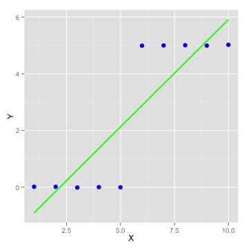 


----

## Logistic Regression
# Motivation
<space>

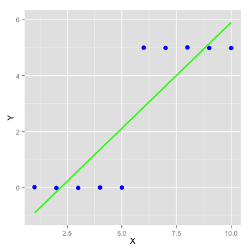 


----

## Logistic Regression
# Motivation
<space>

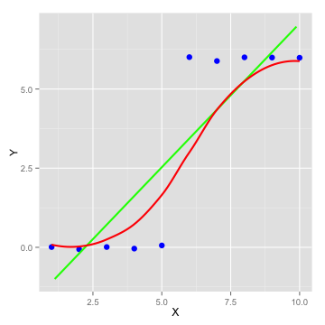 


----

## Logistic Regression
# Motivation
<space>

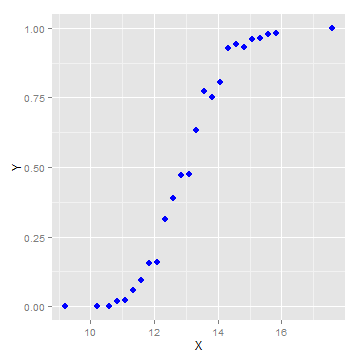 


----

## Logistic Regression
# Motivation
<space>

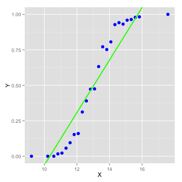 


----

## Logistic Regression
# Motivation
<space>

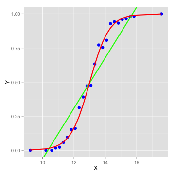 


----

## Logistic Regression
# Notation
<space>

- type of regression to predict the probability of being in a class
  - typical to set threshold to 0.5
- assumes error terms are Binomially distributed
  - which generates 1's and 0's as the error term
- sigmoid or logistic function: $g(z) = \frac{1}{1+e^{-z}}$
  - interpret the output as $P(Y=1 | X)$
  - bounded by 0 and 1

----

## Logistic Regression
# Notation
<space>


```r
curve(1/(1 + exp(-x)), from = -10, to = 10, ylab = "P(Y=1|X)", col = "red", 
    lwd = 3)
abline(a = 0.5, b = 0, lty = 2, col = "blue", lwd = 3)
```

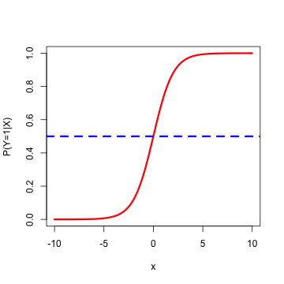 


----

## Logistic Regression
# Find parameters
<space>

- The hypothesis function, $h_{\theta}(x)$, is P(Y=1|X)
- Linear Regression --> $h_{\theta}(x) = \theta x^{T}$
- Logistic Regression --> $h_{\theta}(x) = g(\theta x^{T})$ 
<br>
where $g(z) = \frac{1}{1+e^{-z}}$

----

## Logistic Regression
# Notation
<space>

- Re-arranging $Y = \frac{1}{1+e^{-\theta x^{T}}}$ yields $\log{\frac{Y}{1 - Y}} = \theta x^{T}$<br>
- "log odds"" are linear in X
- this is called the logit of theta
  - links X linearly with some function of Y

----

## Logistic Regression
# Find parameters
<space>

- So $h_{\theta}(x) = \frac{1}{1+e^{-\theta x^{T}}}$
- What is the cost function?
- Why can't we use the same cost function as for the linear hypothesis?
  - logistic residuals are Binomially distributed - not Normal
  - the regression function is not linear in X

----

## Logistic Regression
# Find parameters
<space>

- Define logistic cost function as:

$cost(h_{\theta}(x)):$<br>
&nbsp;&nbsp; $= -\log(x),$ &nbsp;&nbsp;&nbsp;  $y = 1$<br>
&nbsp;&nbsp; $= -\log(1-x),$ &nbsp;   $y = 0$

  


----

## Logistic Regression
# Find parameters
<space>

- using statistics, it can be shown that<br>
$cost(h_{\theta}(x), y) = -y \log(h_{\theta}(x)) + (1-y) \log(1-h_{\theta}(x))$<br>

----

## Logistic Regression
# Find parameters
<space>

- using statistics, it can be shown that<br>
$cost(h_{\theta}(x), y) = -y \log(h_{\theta}(x)) + (1-y) \log(1-h_{\theta}(x))$<br>
- Logistic regression cost function is then<br>
$cost(h_{\theta}(x), y)  = \frac{1}{m} \sum_{i=1}^{m} -y \log(h_{\theta}(x)) + (1-y) \log(1-h_{\theta}(x))$

----

## Logistic Regression
# Find parameters
<space>

- using statistics, it can be shown that<br>
$cost(h_{\theta}(x), y) = -y \log(h_{\theta}(x)) + (1-y) \log(1-h_{\theta}(x))$<br>
- Logistic regression cost function is then<br>
$cost(h_{\theta}(x), y)  = \frac{1}{m} \sum_{i=1}^{m} -y \log(h_{\theta}(x)) + (1-y) \log(1-h_{\theta}(x))$
- Minimize the cost

----

## Logistic Regression
# Newton-Raphson Method
<space>

- efficient
- easier to calculate that gradient descent
- converges on *global* minimum

----

## Logistic Regression
# Newton-Raphson Method
<space>

- assume derivative of $f`(x_{0})$ is zero and $f``(x_{0})$ is positive

----

## Logistic Regression
# Newton-Raphson Method
<space>

- assume derivative of $f`(x_{0})$ is zero and $f``(x_{0})$ is positive
- re-write $f(x)$ as it's Taylor expansion:<br>
$f(x) = f(x_{0}) + (x-x_{0})f` + \frac{1}{2}(x-x_{0})^{2}f``$

----

## Logistic Regression
# Newton-Raphson Method
<space>

- assume derivative of $f`(x_{0})$ is zero and $f``(x_{0})$ is positive
- re-write $f(x)$ as it's Taylor expansion:<br>
$f(x) = f(x_{0}) + (x-x_{0})f` + \frac{1}{2}(x-x_{0})^{2}f``$
- take the derivative w.r.t x and set = 0<br>
$0 = f′(w_{0}) + \frac{1}{2}f′′(w_{0})2(w_{1} − w_{0})$<br>
$w_{1} = w_{0} − \frac{f′(w_{0})}{f′′(w_{0})}$
  - $w_{1}$ is a better approximation for the minimum than $w_{0}$
  - continue iterating

----

## Logistic Regression
# Newton-Raphson Method
<space>

$f(x) = x^{4} - 3\log(x)$


```
## Error: could not find function "fn"
```


----

## Logistic Regression
# Newton-Raphson Method
<space>


```r
fn <- function(x) x^4 - 3 * log(x)
dfn <- function(x) 4 * x^3 - 3/x
d2fn <- function(x) 12 * x^2 + 3/x^2

newton <- function(num.its, dfn, d2fn) {
    theta <- rep(0, num.its)
    theta[1] <- round(runif(1, 0, 100), 0)
    
    for (i in 2:num.its) {
        h <- -dfn(theta[i - 1])/d2fn(theta[i - 1])
        theta[i] <- theta[i - 1] + h
    }
    
    out <- cbind(1:num.its, theta)
    dimnames(out)[[2]] <- c("iteration", "estimate")
    return(out)
}
```


----

## Logistic Regression
# Newton-Raphson Method
<space>


```
     iteration estimate
[1,]         1   25.000
[2,]         2   16.667
[3,]         3   11.111
[4,]         4    7.408
[5,]         5    4.939
```

```
      iteration estimate
[16,]        16   0.9306
[17,]        17   0.9306
[18,]        18   0.9306
[19,]        19   0.9306
[20,]        20   0.9306
```

```
[1] 0.9658
```


----

## Logistic Regression
# Newton-Raphson Method
<space>


```r
optimize(fn, c(-100, 100))  ## built-in R optimization function
```

```
$minimum
[1] 0.9306

$objective
[1] 0.9658
```


----

## Logistic Regression
# Newton-Raphson - summary
<space>

- minimization algorithm
- approximation, non-closed form solution
- good for large number of examples
- hard to select the right $\alpha$
- traditional looping is slow - optimization algorithms are used in practice

----

## Logistic Regression
# Summary
<space>

- very popular classification algorithm
- based on Binomial error terms, i.e. 1's and 0's

----

## Principle Component Analysis
# Motivation
<space>

- used widely in modern data analysis
- not well understood
- intuition: reduce data into only relevant dimensions
- the goal of PCA is to compute the most meaningful was to re-express noisy data, revealing the hidden structure

----

## Principle Component Analysis
# Concepts
<space>

- first big assumption: linearity
- $\bf{PX}=\bf{Y}$
  - $X$ is original dataset, $P$ is a transformation of $X$ into $Y$
- how do we choose $P$?
  - reduce noise
  - maximize variance

----

## Principle Component Analysis
# Concepts
<space>

- covariance matrix
  - $C = X*X^{T}$

- restated goals are
  - minimize covariance and maximize variance
  - the optimizal $C$ is a diagonal matrix, off diagonals are = 0

----

## Principle Component Analysis
# Concepts
<space>

- summary of assumptions
  - linearity (non-linear is a kernel PCA)
  - largest variance indicates most signal, low variance = noise
  - orthogonal components - makes the linear algebra easier
  - assumes data is normally distributed, otherwise PCA might not diagonalize matrix
    - can use ICA
    - but most data is normal and PCA is robust to slight deviance from normality

----

## Principle Component Analysis
# Eigenwhat?
<space>

$Ax = \lambda x$
  - $\lambda$ is an eigenvalue of $A$ and $x$ is an eigenvector of $A$<br>
$Ax - \lambda Ix = 0$<br>
$(A - \lambda I)x = 0$<br>
$\det(A - \lambda I)$ = 0

----

## Principle Component Analysis
# Eigenwhat?
<space>


```r
A = matrix(c(5, 2, 2, 5), nrow = 2)
I = diag(nrow(A))
```


----

## Principle Component Analysis
# Eigenwhat?
<space>


```r
A = matrix(c(5, 2, 2, 5), nrow = 2)
I = diag(nrow(A))
### |A - L*I| = 0 det(c(5-l,2,2,5-l)) (5-l)*(5-l) - 4 = 0 25 - 10l + l^2 - 4 =
### 0 l^2 - 10l + 21 = 0
```


----

## Principle Component Analysis
# Eigenwhat?
<space>


```r
A = matrix(c(5, 2, 2, 5), nrow = 2)
I = diag(nrow(A))
### |A - L*I| = 0 det(c(5-l,2,2,5-l)) (5-l)*(5-l) - 4 = 0 25 - 10l + l^2 - 4 =
### 0 l^2 - 10l + 21 = 0
roots <- Re(polyroot(c(21, -10, 1)))
roots
```

```
## [1] 3 7
```


----

## Principle Component Analysis
# Eigenwhat?
<space>

- when $\lambda = 3$<br>
$Ax = 3x$<br>

----

## Principle Component Analysis
# Eigenwhat?
<space>

- when $\lambda = 3$<br>
$Ax = 3x$<br>
$5x_{1} + 2x_{2} = 3x_{1}$<br>
$2x_{1} + 5x_{2} = 3x_{2}$<br>
$x_{1} = -x_{2}$<br>

----

## Principle Component Analysis
# Eigenwhat?
<space>

- when $\lambda = 7$<br>
$Ax = 7x$<br>
$5x_{1} + 2x_{2} = 7x_{1}$<br>
$2x_{2} + 5x_{2} = 7x_{2}$<br>
$x_{1} = x_{2}$<br>

----

## Principle Component Analysis
# Eigenwhat?
<space>


```r
A %*% c(1, -1) == 3 * as.matrix(c(1, -1))
```

```
##      [,1]
## [1,] TRUE
## [2,] TRUE
```

```r
A %*% c(1, 1) == 7 * as.matrix(c(1, 1))
```

```
##      [,1]
## [1,] TRUE
## [2,] TRUE
```


----

## Principle Component Analysis
# Eigenwhat?
<space>


```r
m <- matrix(c(1, -1, 1, 1), ncol = 2)  ## two eigenvectors
m <- m/sqrt(norm(m))
as.matrix(m %*% diag(roots) %*% t(m))
```

```
##      [,1] [,2]
## [1,]    5    2
## [2,]    2    5
```


----

## Principle Component Analysis
# Motivation
<space>

$PX = Y$<br>
$C_{Y} = \frac{1}{(n-1)}YY^{T}$<br>

----

## Principle Component Analysis
# Motivation
<space>

$PX = Y$<br>
$C_{Y} = \frac{1}{(n-1)}YY^{T}$<br>
$=PX(PX)^{T}$<br>
$=PXX^{T}P^{T}$<br>

----

## Principle Component Analysis
# Motivation
<space>

$PX = Y$<br>
$C_{Y} = \frac{1}{(n-1)}YY^{T}$<br>
$=PX(PX)^{T}$<br>
$=PXX^{T}P^{T}$<br>
$=PAP^{T}$<br>
- $P$ is a matrix with columns that are eigenvectors
- $A$ is a diagonalized matrix of eigenvalues (by linear algebra) and symmetric<br>
$A = EDE^{T}$

----

## Principle Component Analysis
# Motivation
<space>

- each row of $P$ should be an eigenvector of $A$<br>
$P = E^{T}$
- note that $P^{T} = P^{-1}$ (linear algebra)
$A = P^{T}DP$<br>
$C_{Y} = PP^{T}DPP^{T} = \frac{1}{n-1}D$
- $D$ is a diagonal matrix, depending on how we choose $P$
- therefore $C_{Y}$ is diagonalized

----

## Principle Component Analysis
# Example
<space>


```r
data <- read.csv("tennis_data_2013.csv")
```

```
## Warning: cannot open file 'tennis_data_2013.csv': No such file or
## directory
```

```
## Error: cannot open the connection
```

```r
data$Player1 <- as.character(data$Player1)
```

```
## Error: object of type 'closure' is not subsettable
```

```r
data$Player2 <- as.character(data$Player2)
```

```
## Error: object of type 'closure' is not subsettable
```

```r

tennis <- data
m <- length(data)

for (i in 10:m) {
    tennis[, i] <- ifelse(is.na(data[, i]), 0, data[, i])
}
```

```
## Error: object of type 'closure' is not subsettable
```

```r

str(tennis)
```

```
## function (..., list = character(), package = NULL, lib.loc = NULL, 
##     verbose = getOption("verbose"), envir = .GlobalEnv)
```

```r

features <- tennis[, 10:m]
```

```
## Error: object of type 'closure' is not subsettable
```

```r

head(features)
```

```
## Error: object 'features' not found
```

```r
str(features)
```

```
## Error: object 'features' not found
```

```r
dim(features)
```

```
## Error: object 'features' not found
```


----

## Principle Component Analysis
# Example
<space>


```r
scaled_features <- as.matrix(scale(features))
```

```
## Error: object 'features' not found
```

```r
Cx <- cov(scaled_features)
```

```
## Error: object 'scaled_features' not found
```

```r
eigenvalues <- eigen(Cx)$values
```

```
## Error: object 'Cx' not found
```

```r
eigenvectors <- eigen(Cx)$vectors
```

```
## Error: object 'Cx' not found
```

```r
PC <- scaled_features %*% eigenvectors
```

```
## Error: object 'scaled_features' not found
```


----

## Principle Component Analysis
# Example
<space>


```r
Cy <- cov(PC)
```

```
## Error: object 'PC' not found
```

```r
sum(round(diag(Cy) - eigenvalues, 5))
```

```
## Error: object 'Cy' not found
```

```r
sum(round(Cy[upper.tri(Cy)], 5))  ## off diagonals are 0 since PC's are orthogonal
```

```
## Error: object 'Cy' not found
```


----

## Principle Component Analysis
# Example
<space>


```r
var_explained <- round(eigenvalues/sum(eigenvalues) * 100, digits = 2)
```

```
## Error: object 'eigenvalues' not found
```

```r
cum_var_explained <- round(cumsum(eigenvalues)/sum(eigenvalues) * 100, digits = 2)
```

```
## Error: object 'eigenvalues' not found
```

```r

var_explained <- as.data.frame(var_explained)
```

```
## Error: object 'var_explained' not found
```

```r
names(var_explained) <- "variance_explained"
```

```
## Error: object 'var_explained' not found
```

```r
var_explained$PC <- as.numeric(rownames(var_explained))
```

```
## Error: object 'var_explained' not found
```

```r
var_explained <- cbind(var_explained, cum_var_explained)
```

```
## Error: object 'var_explained' not found
```

```r

library(ggplot2)
ggplot(var_explained) + geom_bar(aes(x = PC, y = variance_explained), stat = "identity") + 
    geom_line(aes(x = PC, y = cum_var_explained))
```

```
## Error: object 'var_explained' not found
```


----

## Principle Component Analysis
# Example
<space>


```r
pca.df <- prcomp(scaled_features)
```

```
## Error: object 'scaled_features' not found
```

```r
eigenvalues == (pca.df$sdev)^2
```

```
## Error: object 'eigenvalues' not found
```

```r
eigenvectors[, 1] == pca.df$rotation[, 1]
```

```
## Error: object 'eigenvectors' not found
```

```r
sum((eigenvectors[, 1])^2)
```

```
## Error: object 'eigenvectors' not found
```


----

## Principle Component Analysis
# Example
<space>


```r
rows <- nrow(tennis)
pca.plot <- as.data.frame(pca.df$x[, 1:2])
```

```
## Error: object 'pca.df' not found
```

```r
pca.plot$gender <- data$Gender
```

```
## Error: object of type 'closure' is not subsettable
```

```r
ggplot(data = pca.plot, aes(x = PC1, y = PC2, color = gender)) + geom_point()
```

```
## Error: object 'pca.plot' not found
```


----

## Principle Component Analysis
# Example
<space>

- how accurate is the first PC at dividing the dataset?
gen <- ifelse(pca.df$x[,1] > abs(mean(pca.df$x[,1]))*2,"F","M")
sum(diag(table(gen,as.character(data$Gender))))/rows

----

## Principle Component Analysis
# Summary
<space>

----

## Clustering
# Motivation
<space>

- separate data into meaningful or useful groups
  - capture natural structure of the data
  - starting point for further analysis
- cluster for utility
  - summarizing data for less expensive computation
  - data compression

----

## Clustering
# Types of Clusters
<space>

- data that looks more like other data in that cluster than outside
- each data point is more similar to the prototype (centeroid) of the cluster than the prototype of other clusters
- where the density is highest, that is a cluster

----

## Clustering
# Typical clustering problem
<space>

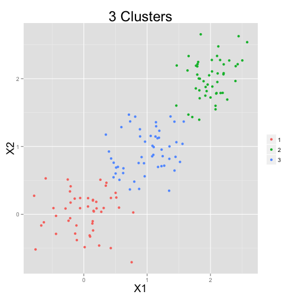 


----

## Clustering
# Density based cluster
<space>


----

## Clustering
# Kmeans algorithm
<space>

- Select K points as initial centroids 
- Do
  - Form K clusters by assigning each point to its closest centroid
  - Recompute the centroid of each cluster 
- Until centroids do not change, or change very minimally, i.e. <1%

----

## Clustering
# Kmeans algorithm
<space>

- Use similarity measures (Euclidean or cosine) depending on the data
- Minimize the squared distance of each point to closest centroid
$SSE(k) = \sum_{i=1}^{m}\sum_{j=1}^{n} (x_{ij} - \bar{x}_{kj})$

----

## Clustering
# Kmeans - notes
<space>

- Choose initial K randomly 
  - can lead to poor centroids - local minimuum
  - Run kmeans multiple times
- Reduce the total SSE by increasing K
- Increase the cluster with largest SSE
- Decrease K and minimize SSE
- Split up a cluster into other clusters
  - The centroid that is split will increase total SSE the least

----

## Clustering
# Kmeans
<space>

- Bisecting K means
  - Split points into 2 clusters
    - Take cluster with largest SSE - split that into two clusters
  - Rerun bisecting K mean on resulting clusters
  - Stop when you have K clusters
- Less susceptible to initialization problems

----

## Clustering
# Kmean fails
<space>


----

## Clustering
# Kmean fails
<space>


----

## Clustering
# Kmean fails
<space>


----

## Clustering
# Kmeans
<space>


```r
wine <- read.csv("http://archive.ics.uci.edu/ml/machine-learning-databases/wine/wine.data")
names(wine) <- c("class", "Alcohol", "Malic", "Ash", "Alcalinity", "Magnesium", 
    "Total_phenols", "Flavanoids", "NFphenols", "Proanthocyanins", "Color", 
    "Hue", "Diluted", "Proline")
str(wine)
```

```
## 'data.frame':	177 obs. of  14 variables:
##  $ class          : int  1 1 1 1 1 1 1 1 1 1 ...
##  $ Alcohol        : num  13.2 13.2 14.4 13.2 14.2 ...
##  $ Malic          : num  1.78 2.36 1.95 2.59 1.76 1.87 2.15 1.64 1.35 2.16 ...
##  $ Ash            : num  2.14 2.67 2.5 2.87 2.45 2.45 2.61 2.17 2.27 2.3 ...
##  $ Alcalinity     : num  11.2 18.6 16.8 21 15.2 14.6 17.6 14 16 18 ...
##  $ Magnesium      : int  100 101 113 118 112 96 121 97 98 105 ...
##  $ Total_phenols  : num  2.65 2.8 3.85 2.8 3.27 2.5 2.6 2.8 2.98 2.95 ...
##  $ Flavanoids     : num  2.76 3.24 3.49 2.69 3.39 2.52 2.51 2.98 3.15 3.32 ...
##  $ NFphenols      : num  0.26 0.3 0.24 0.39 0.34 0.3 0.31 0.29 0.22 0.22 ...
##  $ Proanthocyanins: num  1.28 2.81 2.18 1.82 1.97 1.98 1.25 1.98 1.85 2.38 ...
##  $ Color          : num  4.38 5.68 7.8 4.32 6.75 5.25 5.05 5.2 7.22 5.75 ...
##  $ Hue            : num  1.05 1.03 0.86 1.04 1.05 1.02 1.06 1.08 1.01 1.25 ...
##  $ Diluted        : num  3.4 3.17 3.45 2.93 2.85 3.58 3.58 2.85 3.55 3.17 ...
##  $ Proline        : int  1050 1185 1480 735 1450 1290 1295 1045 1045 1510 ...
```


- set.seed() to make sure results are reproducible
- add nstart to the function call so that it attempts multiple configurations, selecting the best
- use a screeplot to select optimal K

----

## Clustering
# Kmeans
<space>


```r
s.wine <- scale(wine[, -1])
best_k <- 0
num_k <- 20
for (i in 1:num_k) {
    best_k[i] <- sum(kmeans(s.wine, centers = i)$withinss)
}

barplot(best_k, xlab = "Number of clusters", names.arg = 1:num_k, ylab = "Within groups sum of squares", 
    main = "Scree Plot for Wine dataset")
```

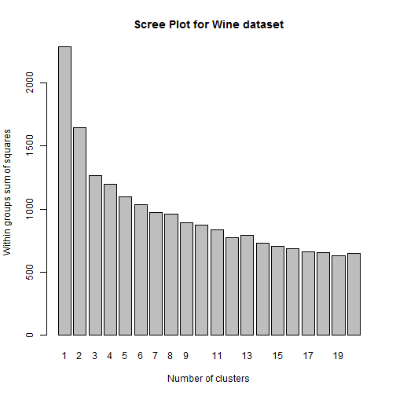 


----

## Clustering
# Kmeans animation
<space>

install.packages('animation')
library(animation)

oopt = ani.options(interval = 1)
ani_ex = rbind(matrix(rnorm(100, sd = 0.3), ncol = 2), 
          matrix(rnorm(100, sd = 0.3), 
          ncol = 2))
colnames(ani_ex) = c("x", "y")

kmeans.an = function(
  x = cbind(X1 = runif(50), X2 = runif(50)), centers = 4, hints = c('Move centers!', 'Find cluster?'),
  pch = 1:5, col = 1:5
) {
  x = as.matrix(x)
  ocluster = sample(centers, nrow(x), replace = TRUE)
  if (length(centers) == 1) centers = x[sample(nrow(x), centers), ] else
    centers = as.matrix(centers)
  numcent = nrow(centers)
  dst = matrix(nrow = nrow(x), ncol = numcent)
  j = 1
  pch = rep(pch, length = numcent)
  col = rep(col, length = numcent)
  
  for (j in 1:ani.options('nmax')) {
    dev.hold()
    plot(x, pch = pch[ocluster], col = col[ocluster], panel.first = grid())
    mtext(hints[1], 4)
    points(centers, pch = pch[1:numcent], cex = 3, lwd = 2, col = col[1:numcent])
    ani.pause()
    for (i in 1:numcent) {
      dst[, i] = sqrt(apply((t(t(x) - unlist(centers[i, ])))^2, 1, sum))
    }
    ncluster = apply(dst, 1, which.min)
    plot(x, type = 'n')
    mtext(hints[2], 4)
    grid()
    ocenters = centers
    for (i in 1:numcent) {
      xx = subset(x, ncluster == i)
      polygon(xx[chull(xx), ], density = 10, col = col[i], lty = 2)
      points(xx, pch = pch[i], col = col[i])
      centers[i, ] = apply(xx, 2, mean)
    }
    points(ocenters, cex = 3, col = col[1:numcent], pch = pch[1:numcent], lwd = 2)
    ani.pause()
    if (all(ncluster == ocluster)) break
    ocluster = ncluster
  }
  invisible(list(cluster = ncluster, centers = centers))
}

kmeans.an(ani_ex, centers = 5, hints = c("Move centers","Cluster found?"))

----

## Clustering
# K-medoid
<space>

- multiple distance metrics
- robust medioids
- computationally expensive
- cluster center is one of the points itself

----

## Clustering
# K-medoid
<space>

- cluster each point based on the closest center
- replace each center by the medioid of points in its cluster

----

## Clustering
# K-medoid
<space>

- Selecting the optimal number of clusters
- For each point p, first find the average distance between p and all other points in the same cluster, $A$
- Then find the average distance between p and all points in the nearest cluster, $B$
- The silhouette coefficient for p is $\frac{A - B}{\max(A,B)}$
  - Values close to 1 mean point clearly belongs to that cluster
  - Values close to 0 mean points might belong in another cluster

----

## Clustering
# K-medoid
<space>


```r
library(cluster)

pam.best <- as.numeric()
for (i in 2:20) {
    pam.best[i] <- pam(s.wine, k = i)$silinfo$avg.width
}
best_k <- which.max(pam.best)
best_k
```

```
## [1] 3
```


----

## Clustering
# K-medoid
<space>


```r
clusplot(pam(s.wine, best_k), main = "K-medoids with K = 3", sub = NULL)
```

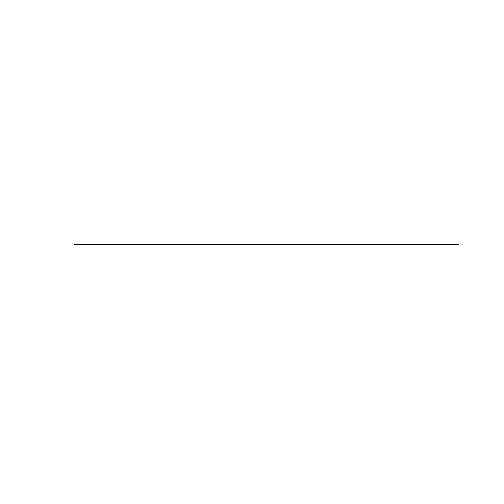 


----

## Clustering
# DBSCAN
<space>

- A cluster is a dense region of points separated by low-density regions
- Group objects into one cluster if they are connected to one another by densely populated area
- Used when the clusters are irregular or intertwined, and when noise and outliers are present

----

## Clustering
# Terminology
<space>

- Core points are located inside a cluster
- Border points are on the borders between two clusters
- Neighborhood of p are all points within some radius of p, Eps

----

## Clustering
# Terminology
<space>

- Core points are located inside a cluster
- Border points are on the borders between two clusters
- Neighborhood of p are all points within some radius of p, Eps


----

## Clustering
# Terminology
<space>

- Core points are located inside a cluster
- Border points are on the borders between two clusters
- Neighborhood of p are all points within some radius of p, Eps
- High density region has at least Minpts within Eps of point p
- Noise points are not within Eps of border or core points

----

## Clustering
# Terminology
<space>

- Core points are located inside a cluster
- Border points are on the borders between two clusters
- Neighborhood of p are all points within some radius of p, Eps
- High density region has at least Minpts within Eps of point p
- Noise points are not within Eps of border or core points
- If p is density connected to q, they are part of the same cluster, if not, then they are not
- If p is not density connected to any other point, its considered noise

----

## Clustering
# DBSCAN
<space>


----

## Clustering
# DBSCAN
<space>


```r
x <- c(2, 2, 8, 5, 7, 6, 1, 4)
y <- c(10, 5, 4, 8, 5, 4, 2, 9)
cluster <- data.frame(X = c(x, 2 * x, 3 * x), Y = c(y, -2 * x, 1/4 * y))
plot(cluster)
```

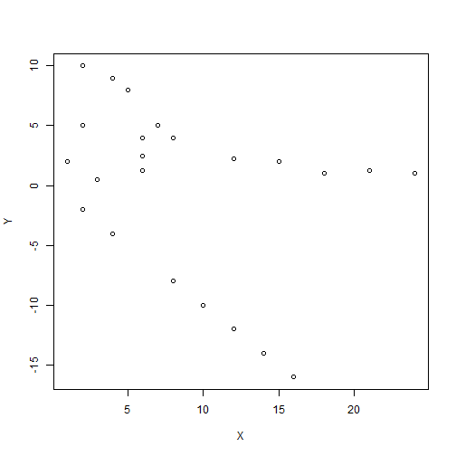 


----

## Clustering
# DBSCAN
<space>


```r
library(fpc)
cluster_DBSCAN <- dbscan(cluster, eps = 3, MinPts = 2, method = "hybrid")
plot(cluster_DBSCAN, cluster, main = "Clustering using DBSCAN algorithm (eps=3, MinPts=3)")
```

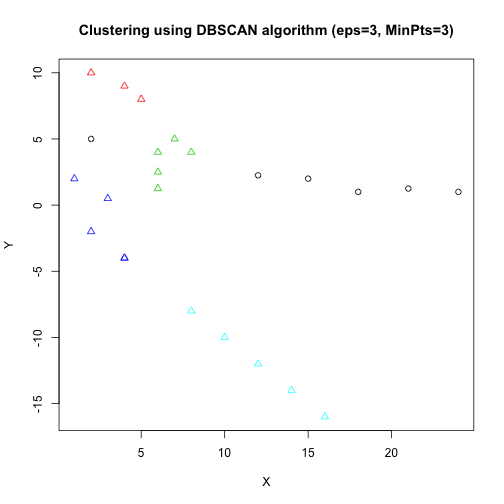 


----

## Clustering
# Summary
<space>

- Unsupervised learning
- Not a perfect science - lots of interpretation
- Hard to define "correct" clustering
- Many types of algorithms

----

## Trees
# Motivation
<space>

- representation of decisions made in order to classify or predict


----

## Trees
# Structure
<space>


----

## Trees
# Structure
<space>

- recursive partitioning -> "divide and conquer"
- going down, choose feature that is most *predictive* of target class
  - split the data according to feature
  - continue...

----

## Trees
# Structure
<space>

until...
- all examples at a node are in same class
- no more features left to distinguish (prone to overfitting)
- tree has grown to some prespecified limit (prune)

----

## Trees
# Algorithms
<space>

- ID3
  - original, popular, DT implementation
- C4.5
  - like ID3 +
  - handles continuous cases
  - imputing missing values
  - weighing costs
  - pruning post creation
- C5.0
  - like C4.5 + 
  - faster, less memory usage
  - boosting

----

## Trees
# Selecting features
<space>

- How does tree decide how to select feature?
  - purity of resulting split
- __Entropy__: amount of information contained in a random variable
  - For a feature with N classes:
    - 0 = purely homogenous
    - $\log_{2}(N)$ = completely mixed

----

## Trees
# Entropy
<space>

$Entropy(S) = \sum_{i=1}^{c} -p_{i}\log_{2}(p_{i})$
  - where $S$ is a dataset
  - $c$ is the number of levels in that data
  - $p_{i}$ is the proportion of values in that level

----

## Trees
# Entropy - example
<space>

What is the entropy of a fair, 6 sided die?


```r
entropy <- function(probs) {
    ent <- 0
    for (i in probs) {
        ent_temp <- -i * log2(i)
        ent <- ent + ent_temp
    }
    return(ent)
}
```


----

## Trees
# Entropy - example
<space>


```r
fair <- rep(1/6, 6)
entropy(fair)
```

```
## [1] 2.585
```

```r
log2(6)
```

```
## [1] 2.585
```


----

## Trees
# Entropy - example
<space>

What is the entropy of a biased, 6 sided die?
- $P(X=1) = P(X=2) = P(X=3) = 1/9$
- $P(X=4) = P(X=5) = P(X=6) = 2/9$


```r
biased <- c(rep(1/9, 3), rep(2/9, 3))
entropy(biased)
```

```
[1] 2.503
```


----

## Trees
# Entropy - example
<space>


```r
more_biased <- c(rep(1/18, 3), rep(5/18, 3))
entropy(more_biased)
```

```
[1] 2.235
```

```r

most_biased <- c(rep(1/100, 5), rep(95/100, 1))
entropy(most_biased)
```

```
[1] 0.4025
```


----

## Trees
# Entropy - example
<space>


```r
curve(-x * log2(x) - (1 - x) * log2(1 - x), col = " red", xlab = "x", ylab = "Entropy", 
    lwd = 4, main = "Entropy of a coin toss")
```

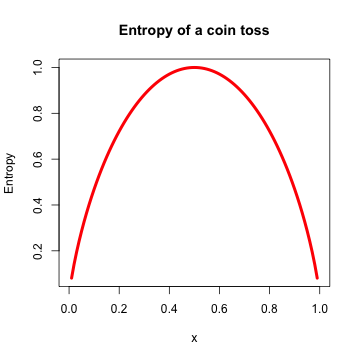 


----

## Trees
# Entropy
<space>

- C5.0 uses the change in entropy to determine the change in purity
- InfoGain = Entropy (pre split) - Entropy (post split)
  - Entropy (pre split) = current Entropy
  - Entropy (post split) is trickier
    - need to consider Entropy of each possible split
  - $E(post) = \sum_{i=1}^{n}w_{i}Entropy(P_{i})$

- Notes:
  - The more a feature splits the data in obvious ways, the less informative it is, entropy is lower
  - The more a feature splits the data - in general - the higher the entropy and hence information gained by splitting at that feature

----

## Trees
# Example
<space>


```r
voting_data <- read.csv("http://archive.ics.uci.edu/ml/machine-learning-databases/voting-records/house-votes-84.data")
names(voting_data) <- c("party", "handicapped-infants", "water-project-cost-sharing", 
    "adoption-of-the-budget-resolution", "physician-fee-freeze", "el-salvador-aid", 
    "religious-groups-in-schools", "anti-satellite-test-ban", "aid-to-nicaraguan-contras", 
    "mx-missile", "immigration", "synfuels-corporation-cutback", "education-spending", 
    "superfund-right-to-sue", "crime", "duty-free-exports", "export-administration-act-south-africa")
```


----

## Trees
# Example
<space>


```r
prop.table(table(voting_data[, 1]))
```

```

  democrat republican 
    0.6152     0.3848 
```

```r
n <- nrow(voting_data)
train_ind <- sample(n, 2/3 * n)
voting_train <- voting_data[train_ind, ]
voting_test <- voting_data[-train_ind, ]
```


----

## Trees
# Example
<space>


```
## Error: object 'voting_train' not found
```


----

## Trees
# Example
<space>


```

 
   Cell Contents
|-------------------------|
|                       N |
|         N / Table Total |
|-------------------------|

 
Total Observations in Table:  145 

 
             | predicted class 
actual class |   democrat | republican |  Row Total | 
-------------|------------|------------|------------|
    democrat |         86 |          6 |         92 | 
             |      0.593 |      0.041 |            | 
-------------|------------|------------|------------|
  republican |          4 |         49 |         53 | 
             |      0.028 |      0.338 |            | 
-------------|------------|------------|------------|
Column Total |         90 |         55 |        145 | 
-------------|------------|------------|------------|

 
```


----

## Trees
# Example
<space>


```r
# most important variables
head(C5imp(tree_model))
```

```
##                                   Overall
## physician-fee-freeze                97.58
## handicapped-infants                  0.00
## water-project-cost-sharing           0.00
## adoption-of-the-budget-resolution    0.00
## el-salvador-aid                      0.00
## religious-groups-in-schools          0.00
```


----

## Trees
# Example
<space>


```r
# in-sample error rate
summary(tree_model)
```

```
## 
## Call:
## C5.0.default(x = voting_train[, -1], y = voting_train[, 1], trials = 1)
## 
## 
## C5.0 [Release 2.07 GPL Edition]  	Tue Aug 19 12:20:12 2014
## -------------------------------
## 
## Class specified by attribute `outcome'
## 
## Read 289 cases (17 attributes) from undefined.data
## 
## Decision tree:
## 
## physician-fee-freeze in {?,n}: democrat (165/0.6)
## physician-fee-freeze = y: republican (124/10.6)
## 
## 
## Evaluation on training data (289 cases):
## 
## 	    Decision Tree   
## 	  ----------------  
## 	  Size      Errors  
## 
## 	     2    9( 3.1%)   <<
## 
## 
## 	   (a)   (b)    <-classified as
## 	  ----  ----
## 	   167     8    (a): class democrat
## 	     1   113    (b): class republican
## 
## 
## 	Attribute usage:
## 
## 	 97.58%	physician-fee-freeze
## 
## 
## Time: 0.0 secs
```


----

## Trees
# Boosting
<space>

- by combining a number of weak performing learners create a team that is much stronger than any one of the learners alone.
- this is where C5.0 improves on C4.5

----

## Trees
# Example - Boosting
<space>


```r
boosted_tree_model <- C5.0(voting_train[, -1], voting_train[, 1], trials = 25)
boosted_tennis_predict <- predict(boosted_tree_model, voting_test[, -1])

boosted_conf <- CrossTable(voting_test[, 1], boosted_tennis_predict, prop.chisq = FALSE, 
    prop.c = FALSE, prop.r = FALSE, dnn = c("actual class", "predicted class"))
```

```
## 
##  
##    Cell Contents
## |-------------------------|
## |                       N |
## |         N / Table Total |
## |-------------------------|
## 
##  
## Total Observations in Table:  145 
## 
##  
##              | predicted class 
## actual class |   democrat | republican |  Row Total | 
## -------------|------------|------------|------------|
##     democrat |         86 |          6 |         92 | 
##              |      0.593 |      0.041 |            | 
## -------------|------------|------------|------------|
##   republican |          4 |         49 |         53 | 
##              |      0.028 |      0.338 |            | 
## -------------|------------|------------|------------|
## Column Total |         90 |         55 |        145 | 
## -------------|------------|------------|------------|
## 
## 
```


----

## Trees
# Example - Boosting
<space>


```r
# in-sample error rate
summary(boosted_tree_model)
```

```
## 
## Call:
## C5.0.default(x = voting_train[, -1], y = voting_train[, 1], trials = 25)
## 
## 
## C5.0 [Release 2.07 GPL Edition]  	Tue Aug 19 12:20:12 2014
## -------------------------------
## 
## Class specified by attribute `outcome'
## 
## Read 289 cases (17 attributes) from undefined.data
## 
## -----  Trial 0:  -----
## 
## Decision tree:
## 
## physician-fee-freeze in {?,n}: democrat (165/0.6)
## physician-fee-freeze = y: republican (124/10.6)
## 
## -----  Trial 1:  -----
## 
## Decision tree:
## 
## physician-fee-freeze in {?,n}: democrat (127.8/3.8)
## physician-fee-freeze = y: republican (161.2/70.8)
## 
## -----  Trial 2:  -----
## 
## Decision tree:
##  democrat (289/84.3)
## 
## *** boosting reduced to 2 trials since last classifier is very inaccurate
## 
## *** boosting abandoned (too few classifiers)
## 
## 
## Evaluation on training data (289 cases):
## 
## 	    Decision Tree   
## 	  ----------------  
## 	  Size      Errors  
## 
## 	     2    9( 3.1%)   <<
## 
## 
## 	   (a)   (b)    <-classified as
## 	  ----  ----
## 	   167     8    (a): class democrat
## 	     1   113    (b): class republican
## 
## 
## 	Attribute usage:
## 
## 	 97.58%	physician-fee-freeze
## 
## 
## Time: 0.0 secs
```


----

## Trees
# Error Cost
<space>

- still getting too many false positives (predict republican but actually democrat)
- introduce higher cost to getting this wrong


```r
error_cost <- matrix(c(0, 1, 2, 0), nrow = 2)
cost_model <- C5.0(voting_train[, -1], voting_train[, 1], trials = 1, costs = error_cost)
```

```
## Warning: 
## no dimnames were given for the cost matrix; the factor levels will be used
```

```r
cost_predict <- predict(cost_model, newdata = voting_test[, -1])
conf <- CrossTable(voting_test[, 1], cost_predict, prop.chisq = FALSE, prop.c = FALSE, 
    prop.r = FALSE, dnn = c("actual class", "predicted class"))
```

```
## 
##  
##    Cell Contents
## |-------------------------|
## |                       N |
## |         N / Table Total |
## |-------------------------|
## 
##  
## Total Observations in Table:  145 
## 
##  
##              | predicted class 
## actual class |   democrat | republican |  Row Total | 
## -------------|------------|------------|------------|
##     democrat |         84 |          8 |         92 | 
##              |      0.579 |      0.055 |            | 
## -------------|------------|------------|------------|
##   republican |          2 |         51 |         53 | 
##              |      0.014 |      0.352 |            | 
## -------------|------------|------------|------------|
## Column Total |         86 |         59 |        145 | 
## -------------|------------|------------|------------|
## 
## 
```


----

## Trees
# Error Cost
<space>


```
## Warning: 
## no dimnames were given for the cost matrix; the factor levels will be used
## 
## Warning: 
## no dimnames were given for the cost matrix; the factor levels will be used
## 
## Warning: 
## no dimnames were given for the cost matrix; the factor levels will be used
## 
## Warning: 
## no dimnames were given for the cost matrix; the factor levels will be used
## 
## Warning: 
## no dimnames were given for the cost matrix; the factor levels will be used
## 
## Warning: 
## no dimnames were given for the cost matrix; the factor levels will be used
## 
## Warning: 
## no dimnames were given for the cost matrix; the factor levels will be used
## 
## Warning: 
## no dimnames were given for the cost matrix; the factor levels will be used
## 
## Warning: 
## no dimnames were given for the cost matrix; the factor levels will be used
## 
## Warning: 
## no dimnames were given for the cost matrix; the factor levels will be used
## 
## Warning: 
## no dimnames were given for the cost matrix; the factor levels will be used
## 
## Warning: 
## no dimnames were given for the cost matrix; the factor levels will be used
## 
## Warning: 
## no dimnames were given for the cost matrix; the factor levels will be used
## 
## Warning: 
## no dimnames were given for the cost matrix; the factor levels will be used
## 
## Warning: 
## no dimnames were given for the cost matrix; the factor levels will be used
## 
## Warning: 
## no dimnames were given for the cost matrix; the factor levels will be used
## 
## Warning: 
## no dimnames were given for the cost matrix; the factor levels will be used
## 
## Warning: 
## no dimnames were given for the cost matrix; the factor levels will be used
## 
## Warning: 
## no dimnames were given for the cost matrix; the factor levels will be used
## 
## Warning: 
## no dimnames were given for the cost matrix; the factor levels will be used
## 
## Warning: 
## no dimnames were given for the cost matrix; the factor levels will be used
## 
## Warning: 
## no dimnames were given for the cost matrix; the factor levels will be used
## 
## Warning: 
## no dimnames were given for the cost matrix; the factor levels will be used
## 
## Warning: 
## no dimnames were given for the cost matrix; the factor levels will be used
## 
## Warning: 
## no dimnames were given for the cost matrix; the factor levels will be used
```

 


----

## Trees
# Pros and Cons
<space>

- trees are non-parametric, rule based classification or regression method
- simple to understand and interpret
- little data preparation
- works well with small or large number of features
<br>
- easy to overfit
- biased towards splits on features with large number of levels
- usually finds local optimum
- difficult concepts are hard to learn
- avoid pre-pruning
- hard to know optimal length of tree without growing it there first

----

## Summary
# ML - Part II
<space>

- Logistic regression
- Math behind PCA
- 3 types of clusters
- Trees and improvements

----

## Resources
<space>

- [Machine Learning with R](http://www.packtpub.com/machine-learning-with-r/book)
- [Machine Learning for Hackers](http://shop.oreilly.com/product/0636920018483.do)
- [Elements of Statistical Learning](http://web.stanford.edu/~hastie/local.ftp/Springer/OLD/ESLII_print4.pdf)

----
